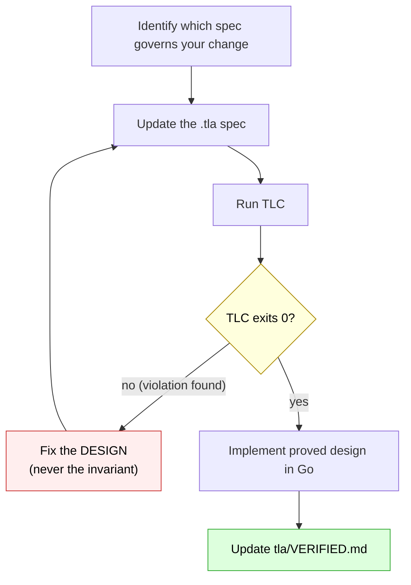

# CLAUDE.md — Hazmat

## What this is

Hazmat is a macOS CLI tool that runs AI agents (Claude Code, etc.) inside containment: dedicated system user, seatbelt sandboxing, pf firewall, DNS blocklist, and automatic snapshots. Written in Go, single binary + cgo helper.

## Before you change anything

**Read `tla/VERIFIED.md` first.** Four subsystems are under formal verification with TLA+. Changes to these areas MUST update the TLA+ spec and pass TLC before the Go implementation changes. This is not optional — CI enforces it.

| Spec | What it governs | Key invariant |
|------|----------------|---------------|
| `MC_SetupRollback` | Init step ordering, rollback ordering | `AgentContained` — sudoers never without firewall |
| `MC_SeatbeltPolicy` | Seatbelt policy structure, credential denies | `CredentialReadDenied` — credential dirs always denied |
| `MC_BackupSafety` | Snapshot/restore lifecycle | `RestoreReversible` — every overwrite has a prior snapshot |
| `MC_Migration` | Version upgrades, rollback from any state | `AgentContained` across 44,795 states including partial migrations |

**The workflow: spec first, prove, then implement.**



```
1. Identify which spec governs your change (see table above)
2. Update the .tla spec to model your intended design
3. Run TLC — must exit 0 ("No error has been found")
4. If TLC finds a violation, fix the DESIGN (not the invariant)
5. Implement the proved design in Go
6. Update tla/VERIFIED.md with the result
```

Running TLC:
```bash
cd tla
java -XX:+UseParallelGC -jar ~/workspace/tla2tools.jar -workers auto \
  -lncheck final -config MC_SetupRollback.cfg MC_SetupRollback.tla
java -XX:+UseParallelGC -jar ~/workspace/tla2tools.jar -workers auto \
  -config MC_SeatbeltPolicy.cfg MC_SeatbeltPolicy.tla
java -XX:+UseParallelGC -jar ~/workspace/tla2tools.jar -workers auto \
  -lncheck final -config MC_Migration.cfg MC_Migration.tla
```

## Repository layout

```
hazmat/                  Go source (package main, module hazmat)
  cmd/hazmat-launch/     Privileged helper binary (cgo, calls sandbox_init)
  packs/                 Built-in stack pack manifests (YAML, embedded in binary)
  Makefile               Build targets: hazmat, hazmat-launch
.hazmat/packs.yaml       Repo-recommended packs for developing hazmat itself
tla/                     TLA+ formal verification specs
  VERIFIED.md            Authoritative record of what's proved
  MC_SetupRollback.*     Init/rollback state machine
  MC_SeatbeltPolicy.*    Seatbelt policy structure
  MC_BackupSafety.*      Backup/restore safety
  MC_Migration.*         Version migration + rollback from any state
scripts/                 release.sh, e2e.sh, e2e-vm.sh
docs/                    User-facing documentation
  usage.md               Complete user guide
  stack-packs.md         Stack packs reference
  cve-audit.md           How hazmat defends against every known Claude Code CVE
  design-assumptions.md  Every non-obvious design decision
  brief-supply-chain-hardening.md  Supply chain attack analysis
  research/              Internal research and reference material
art/                     Homer-in-hazmat ASCII art generator
assets/                  Brand images
```

## Build and test

```bash
cd hazmat
make all                 # builds hazmat + hazmat-launch (cgo) with version from git
go test ./...            # unit tests
./hazmat check           # integration tests
./hazmat check --full    # include live network probes
```

## When to update TLA+ specs

### Adding or reordering init/rollback steps
→ Update `MC_SetupRollback.tla` first, run TLC, then implement.

### Changing the seatbelt policy (credential denies, path rules)
→ Update `MC_SeatbeltPolicy.tla` first, run TLC, then implement.

### Adding a new hazmat version or changing what init creates
→ Update `MC_Migration.tla`: add the version to `Versions`, define `Expected(v)`,
add `HasMigration` pair. Run TLC. The spec verifies `AgentContained` holds during
migration from every older version AND during rollback from any intermediate state
(44,795 states checked).

### Adding or changing backup/restore paths
→ Update `MC_BackupSafety.tla` first, run TLC, then implement.

## Key conventions

- **Apple sandbox-exec references stay as-is.** `sandbox-exec`, `sandbox_init`, `sandboxed`, `same-sandbox`, `SANDBOX_*` env vars — these are Apple API names, not our tool.
- **Agent system identity is separate from tool name.** User `agent`, group `dev`, pf anchor `agent`, sudoers file `agent`.
- **`hazmat init` is the single entry point for all setup.** Subcommands: `check`, `cloud`. `rollback` is top-level.
- **Pre-flight checks run before any mutations.** `preflightChecks()` validates prerequisites before the first `dscl` call.
- **Seatbelt policies are per-session.** Generated in `generateSBPL()`, written to `/private/tmp/hazmat-<pid>.sb`, cleaned up on exit.
- **hazmat-launch uses sandbox_init() via cgo.** Not `sandbox-exec`. Direct kernel sandbox API, one fewer process in the chain.
- **No sudo in daily commands.** `hazmat claude/exec/shell` use the NOPASSWD sudoers rule for hazmat-launch. `hazmat config agent` writes directly via dev group. Project ACLs are applied by the file owner (no sudo).
- **Stack packs are pure data, never executable.** Pack manifests are YAML with strict field validation (`KnownFields`). They may add read-only dirs, env passthrough from a fixed safe set, backup excludes, and warnings. They cannot widen write scope, expose credentials, or change network policy.
- **Repo-recommended packs require host approval.** `.hazmat/packs.yaml` in a repo declares pack names; hazmat prompts once for approval, keyed by canonical path + file hash. Approval is stored outside the repo in `~/.hazmat/approvals.yaml`.

## When making security-relevant changes

**Update docs/design-assumptions.md** if you change:
- The seatbelt credential deny list
- Network policy (pf rules or DNS blocklist)
- The trust model or containment boundaries
- Credential storage or handling
- Supply chain hardening (npmrc, pip.conf)

## Commit message style

```
<area>: <what changed>

<why, in 1-3 lines>
```

Areas: `cloud`, `ux`, `privilege`, `docker`, `docs`, `rename`, `test`, `tla`, `pack`
