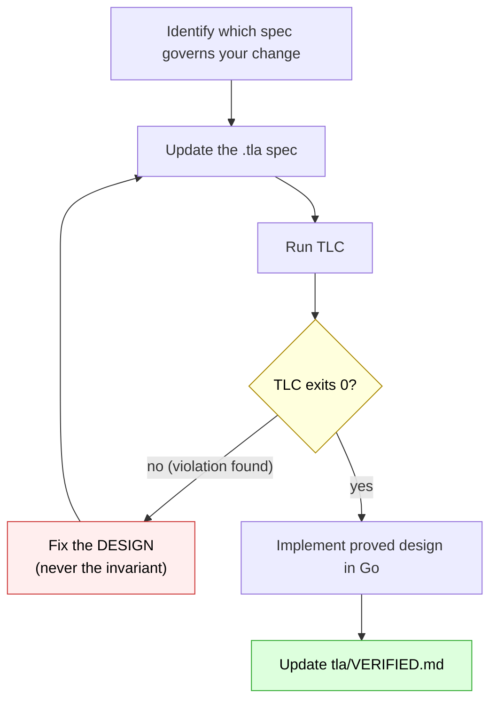

# CLAUDE.md — Hazmat

## What this is

Hazmat is a macOS CLI tool that runs AI agents (Claude Code, etc.) inside containment: dedicated system user, seatbelt sandboxing, pf firewall, DNS blocklist, and automatic snapshots. Written in Go, single binary + cgo helper.

## Before you change anything

**Read `tla/VERIFIED.md` first.** `tla/VERIFIED.md` is the authoritative record of Hazmat's formal verification scope and proof boundaries. Changes in verified areas MUST update the TLA+ spec and pass TLC before the Go implementation changes. This is not optional.

| Spec | What it governs | Key invariant |
|------|----------------|---------------|
| `MC_SetupRollback` | Init step ordering, rollback ordering | `AgentContained` — sudoers never without firewall |
| `MC_SeatbeltPolicy` | Seatbelt policy structure, credential denies | `CredentialReadDenied` — credential dirs always denied |
| `MC_BackupSafety` | Snapshot/restore lifecycle | `RestoreReversible` — every overwrite has a prior snapshot |
| `MC_Migration` | Version upgrades, rollback from any state | `AgentContained` through migration and rollback states |
| `MC_Tier3LaunchContainment` | Tier 3 host-side launch boundary | `CredentialPathsNeverMounted` — Tier 3 never mounts credential zones |
| `MC_TierPolicyEquivalence` | Tier 2 vs Tier 3 core policy contract | `CanonicalCoreContainmentEquivalent` — canonical core containment matches across both backends |
| `MC_SessionPermissionRepairs` | Session-time host permission repair planning and rollback persistence | `RollbackPreservesSessionRepairs` — core rollback never reverts an applied session repair |
| `MC_HarnessLifecycle` | Built-in harness state recording and rollback cleanup | `RollbackClearsMetadata` — rollback removes the host-owned harness metadata record |
| `MC_LaunchFDIsolation` | Native helper fd-table hygiene before `sandbox_init()` | `AgentFDTableAllowlisted` — final agent exec sees stdio only |
| `MC_GitSSHRouting` | Multi-key per-project Git-SSH routing | `DeterministicRouting` — every host maps to at most one key in a ready config |
| `MC_GitHookApproval` | Repo-local Git hook approval, pinning, and drift refusal | `ApprovedContentOnly` — approved hook execution uses the immutable approved snapshot |
| `MC_SecretStoreRecovery` | File-backed harness auth crash recovery | `LatestValueNeverSilentlyLost` — recovery never drops the newest host-owned secret value |
| `MC_CredentialCapabilityLifecycle` | Registry-level credential delivery and cleanup | `DeliveryMatchesRegistry` — delivery mode follows the registered credential capability |
| `MC_LinuxNativeLaunch` | Future Linux native helper launch ordering | `ExecAfterMetadata` — exec happens only after enforcement and metadata emission |
| `MC_BeadpostBrokerBoundary` | Beadpost broker attestation membrane | `NoAuthorityFromAgent` — authority is derived host-side, never accepted from the contained agent |
| `MC_AppleContainerLaunch` | Apple Container backend launch boundary | `CredentialPathsNeverMounted` — credential deny zones and their parents are never in the mount plan |
| `MC_ServiceHarnessLifecycle` | OpenHands-style service harness lifecycle | `AttachOnlyAfterReady` — service attach waits for readiness evidence |

**The workflow: spec first, prove, then implement.**


```mermaid
flowchart TD
    A[Identify which spec governs your change] --> B[Update the .tla spec]
    B --> C[Run TLC]
    C --> D{TLC exits 0?}
    D -- "no (violation found)" --> E["Fix the DESIGN\n(never the invariant)"]
    E --> B
    D -- yes --> F[Implement proved design in Go]
    F --> G[Update tla/VERIFIED.md]

    style E fill:#fee,stroke:#c33,color:#000
    style D fill:#ffd,stroke:#a80,color:#000
    style G fill:#dfd,stroke:#3a3,color:#000
```

```
1. Identify which spec governs your change (see table above)
2. Update the .tla spec to model your intended design
3. Run TLC — must exit 0 ("No error has been found")
4. If TLC finds a violation, fix the DESIGN (not the invariant)
5. Implement the proved design in Go
6. Update tla/VERIFIED.md with the result
```

Running TLC:
```bash
cd tla
bash check_suite.sh
```

## Repository layout

```
hazmat/                  Go source (package main, module hazmat)
  cmd/hazmat-launch/     Privileged helper binary (cgo, calls sandbox_init)
  integrations/          Built-in integration manifests (YAML, embedded in binary)
  Makefile               Build targets: hazmat, hazmat-launch
.hazmat/integrations.yaml Repo-recommended integrations for developing hazmat itself
tla/                     TLA+ formal verification specs
  VERIFIED.md            Authoritative record of what's proved
  MC_SetupRollback.*     Init/rollback state machine
  MC_SeatbeltPolicy.*    Seatbelt policy structure
  MC_BackupSafety.*      Backup/restore safety
  MC_Migration.*         Version migration + rollback from any state
  MC_Tier3LaunchContainment.* Tier 3 launch boundary
  MC_TierPolicyEquivalence.* Tier 2 vs Tier 3 effective-policy contract
  MC_SessionPermissionRepairs.* Session-time permission repair contract
  MC_HarnessLifecycle.* Harness state recording + rollback cleanup
  MC_LaunchFDIsolation.* Native helper fd isolation contract
  MC_GitSSHRouting.*      Git-SSH routing contract
  MC_GitHookApproval.*    Repo-local Git hook approval contract
  MC_SecretStoreRecovery.* Harness auth crash recovery contract
  MC_CredentialCapabilityLifecycle.* Credential delivery/cleanup contract
  MC_LinuxNativeLaunch.* Linux native launch ordering contract
  MC_BeadpostBrokerBoundary.* Beadpost broker boundary contract
  MC_AppleContainerLaunch.* Apple Container launch boundary contract
  MC_ServiceHarnessLifecycle.* Service harness lifecycle contract
  check_suite.sh         Run the verified TLA+ suite
scripts/                 release.sh, e2e.sh, e2e-vm.sh
docs/                    User-facing documentation
  usage.md               Complete user guide
  integrations.md        Session integrations reference
  cve-audit.md           How hazmat defends against every known Claude Code CVE
  design-assumptions.md  Every non-obvious design decision
  brief-supply-chain-hardening.md  Supply chain attack analysis
  research/              Internal research and reference material
art/                     Homer-in-hazmat ASCII art generator
assets/                  Brand images
```

## Build and test

```bash
make all                 # builds hazmat + hazmat-launch (cgo) with version from git
make test                # unit tests
./hazmat/hazmat check    # approval-gated local install diagnostics
./hazmat/hazmat doctor --dry-run   # approval-gated repair-plan preview
./hazmat/hazmat check --full    # approval-gated live network probes
```

## Approval-gated commands

Ask the user for explicit approval before running any sudo-adjacent command,
and name the exact command you want to run. This applies to more than literal
`sudo`: `hazmat check`, `hazmat doctor --fix`, native helper-backed smokes,
live harness probes, Codex desktop attach probes, `launchctl`/`pf` paths,
DTrace/dtruss-style probes, and `git push` when hooks may invoke these gates.
If approval is needed, ask first; do not try the command speculatively.

## When to update TLA+ specs

### Adding or reordering init/rollback steps
→ Update `MC_SetupRollback.tla` first, run TLC, then implement.

### Changing the seatbelt policy (credential denies, path rules)
→ Update `MC_SeatbeltPolicy.tla` first, run TLC, then implement.

### Adding a new hazmat version or changing what init creates
→ Update `MC_Migration.tla`: add the version to `Versions`, define `Expected(v)`,
add `HasMigration` pair. Run TLC. The spec verifies `AgentContained` holds during
migration from every older version AND during rollback from any intermediate state
within the current model bounds recorded in `tla/VERIFIED.md`.

### Adding or changing backup/restore paths
→ Update `MC_BackupSafety.tla` first, run TLC, then implement.

### Changing Tier 3 launch planning, gating, or env passthrough
→ Update `MC_Tier3LaunchContainment.tla` first, run TLC, then implement.

### Changing Tier 2/Tier 3 path normalization or cross-backend contract claims
→ Update `MC_TierPolicyEquivalence.tla` first, run TLC, then implement.

### Changing session-time host permission repair planning or rollback persistence
→ Update `MC_SessionPermissionRepairs.tla` first, run TLC, then implement.

### Changing harness bootstrap/import state recording or rollback cleanup
→ Update `MC_HarnessLifecycle.tla` first, run TLC, then implement.

### Changing native helper fd cleanup, policy-file fd handling, or pre-sandbox exec hygiene
→ Update `MC_LaunchFDIsolation.tla` first, run TLC, then implement.

### Changing Git-SSH routing, per-key host allowlists, or identity-agent socket binding
→ Update `MC_GitSSHRouting.tla` first, run TLC, then implement.

### Changing repo-local Git hook approval, wrapper pinning, or drift handling
→ Update `MC_GitHookApproval.tla` first, run TLC, then implement.

### Changing file-backed harness auth harvest, residue cleanup, or crash recovery
→ Update `MC_SecretStoreRecovery.tla` first, run TLC, then implement.

### Changing credential capability registration, delivery modes, or session cleanup
→ Update `MC_CredentialCapabilityLifecycle.tla` first, run TLC, then implement.

### Changing Linux native helper launch ordering, namespace setup, LSM decisions, or exec gating
→ Update `MC_LinuxNativeLaunch.tla` first, run TLC, then implement.

### Changing Beadpost broker attestation, authority derivation, or per-session request membrane
→ Update `MC_BeadpostBrokerBoundary.tla` first, run TLC, then implement.

### Changing Apple Container mount planning, admission gating, network policy, or credential artifact cleanup
→ Update `MC_AppleContainerLaunch.tla` first, run TLC, then implement.

### Changing service harness lifecycle, readiness, attach, or cleanup behavior
→ Update `MC_ServiceHarnessLifecycle.tla` first, run TLC, then implement.

## Key conventions

- **Beads are local-only in this repo.** Hazmat intentionally has no Dolt
  remote for `bd`; use local `bd` state and `bd remember` memories, and skip
  `bd dolt pull` / `bd dolt push` unless a remote is explicitly configured
  later.
- **Apple sandbox-exec references stay as-is.** `sandbox-exec`, `sandbox_init`, `sandboxed`, `same-sandbox`, `SANDBOX_*` env vars — these are Apple API names, not our tool.
- **Agent system identity is separate from tool name.** User `agent`, group `dev`, pf anchor `agent`, sudoers file `agent`.
- **`hazmat init` is the single entry point for all setup.** Subcommands: `check`, `cloud`. `rollback` is top-level.
- **Pre-flight checks run before any mutations.** `preflightChecks()` validates prerequisites before the first `dscl` call.
- **Seatbelt policies are per-session.** Generated in `generateSBPL()`, written to `/private/tmp/hazmat-<pid>.sb`, cleaned up on exit.
- **hazmat-launch uses sandbox_init() via cgo.** Not `sandbox-exec`. Direct kernel sandbox API, one fewer process in the chain.
- **Hazmat-owned agent maintenance stays on the narrow sudoers rule.** Session launches and helper-routed maintenance use the NOPASSWD rule for `hazmat-launch`. Generic manual `sudo -u agent` flows are a separate, broader opt-in via `hazmat config sudoers --enable-agent-maintenance`.
- **Integrations are pure data, never executable.** Integration manifests are YAML with strict field validation (`KnownFields`). They may add read-only dirs, env passthrough from a fixed safe set, backup excludes, and warnings. They cannot widen write scope, expose credentials, or change network policy. See [docs/integrations.md](docs/integrations.md).
- **Repo-recommended integrations require host approval.** `.hazmat/integrations.yaml` in a repo declares integration names; hazmat prompts once for approval, keyed by canonical path + file hash. Approval is stored outside the repo in `~/.hazmat/integration-approvals.yaml`.

## When making security-relevant changes

**Update docs/design-assumptions.md** if you change:
- The seatbelt credential deny list
- Network policy (pf rules or DNS blocklist)
- The trust model or containment boundaries
- Credential storage or handling
- Supply chain hardening (npmrc, pip.conf)

## Commit message style

```
<area>: <what changed>

<why, in 1-3 lines>
```

Areas: `cloud`, `ux`, `privilege`, `docker`, `docs`, `rename`, `test`, `tla`, `integration`
