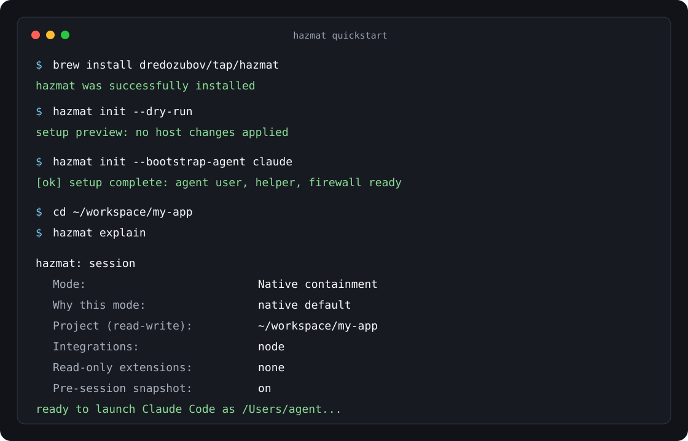

<p align="center">
  <a href="https://github.com/dredozubov/hazmat/stargazers">
    <picture>
      <source media="(prefers-color-scheme: dark)" srcset="assets/readme-hero-dark.png">
      
    </picture>
  </a>
</p>

<h1 align="center">Hazmat</h1>

<p align="center">
  <strong>Run AI coding agents as a separate macOS user.</strong><br>
  Open-source macOS containment for Claude, Codex, OpenCode, Antigravity, Hermes, Qwen, Cursor Agent, Pi, and shell loops
</p>

---

Hazmat lets an agent edit your repo without running as your real system user
account.

It shows the session contract first, then launches the agent as a dedicated
`agent` macOS user inside OS-level containment. Your project can be writable.
Your real home directory, SSH keys, cloud credentials, and global dev state do
not become the agent's default world.

Use it when you want the productive version of Claude Code, Codex, OpenCode, or
a custom loop: fewer approval interruptions, more autonomy, and a smaller host
blast radius.

The loop is simple: preview what the agent can reach, run it, then inspect what
changed.

## Try It

Fast path for Claude Code on macOS. The dry run previews setup; it does not
launch an agent.

```bash
brew install dredozubov/tap/hazmat
hazmat init --dry-run
hazmat init --bootstrap-agent claude
cd your-project
hazmat explain -C .
hazmat claude
```

Replace the last command for another supported harness:

```bash
hazmat codex
hazmat opencode
hazmat antigravity
hazmat exec -- ./my-agent-loop.sh
```

After a session:

```bash
hazmat diff
hazmat snapshots
hazmat restore
```

Using Hermes, Qwen, Cursor Agent, Pi, or a custom script instead? Start with
[docs/harnesses.md](docs/harnesses.md).

## What You Get

On the first real run, Hazmat gives you:

- **A separate user:** the agent runs as `agent`, not as your login account.
- **A readable session contract:** project access, integrations, network mode,
  and service access are printed before launch.
- **Scoped filesystem access:** project writes are explicit; common secret paths
  are denied.
- **Network hardening:** `pf` firewall rules and DNS blocks reduce common
  exfiltration paths.
- **Recovery evidence:** Hazmat snapshots before launch so you can diff and
  restore after the agent exits.
- **The same agent workflow:** use Claude, Codex, OpenCode, Antigravity, Hermes,
  Qwen, Cursor Agent, Pi, or `hazmat exec`.

Recent shipped work is in [CHANGELOG.md](CHANGELOG.md). Read
[docs/testing.md](docs/testing.md) for what is automated, approval-gated, and
formally modeled. Read [docs/overview.md](docs/overview.md) before stretching
native containment into Docker-heavy or hostile-repo workflows.

## When It Fits

Hazmat is a fit when:

- you run agents with broad permissions, long tasks, or low supervision
- you want repo writes without handing over your real system user account
- you need a contract you can review before the agent starts
- you want a diff and rollback path after autonomous edits

It is not a magic prompt shield. If an agent gets prompt-injected, runs a
poisoned dependency, or follows malicious repo instructions, the useful question
is what the process can reach. Hazmat lowers that authority boundary.

## What a Session Looks Like

Every session starts with a contract. No hidden widening, no vague "secure mode"
label.

<p align="center">
  
</p>

```
hazmat: session
  Mode:                 Native containment
  Why this mode:        using native containment by default (Docker routing: none)
  Project (read-write): /Users/dr/workspace/my-app
  Integrations:         go
  Auto read-only:       /Users/dr/go/pkg/mod
  Read-only extensions: none
  Read-write extensions: none
  Service access:       none
  Pre-session snapshot: on
  Snapshot excludes:    vendor/
```

This is the screen to read before you let an agent run. It tells you what can
change, what is read-only, and what is not available in the session.

## Small Proof

Want proof before using it on a real repo? Run the small path: preview setup,
preview a session, write one contained file, block one host-secret read, then
inspect the diff.

```bash
hazmat init --dry-run
PROJECT=/tmp/hazmat-proof-demo
mkdir -p "$PROJECT"
printf '%s\n' '# Hazmat proof demo' >"$PROJECT/README.md"
hazmat explain -C "$PROJECT"
SECRET="${HAZMAT_PROOF_STACK_SECRET_PATH:-$HOME/.ssh/id_ed25519}"
test -r "$SECRET"
hazmat exec --docker=none --network none -C "$PROJECT" -- \
  /bin/sh -eu -c 'printf "%s\n" contained >proof.txt; ! cat "$1" >/dev/null 2>&1' sh "$SECRET"
(cd "$PROJECT" && hazmat diff)
```

The live README smoke captures the same shape without printing secret bytes.
In the contained session, the project write succeeds and the host secret probe
fails closed:

```text
proof-stack: project write ok
proof-stack: host secret unreadable from contained session: <host-secret-fixture>
```

The recovery pointer comes from the same demo repo:

```text
Comparing <scratch-project> against snapshot from <timestamp>

Only in <scratch-project>: proof.txt
```

The saved redacted snippets are in [docs/proofs](docs/proofs). If Claude is not
your harness, use the same containment path through [docs/harnesses.md](docs/harnesses.md).
For project health and breadth, see [docs/compatibility.md](docs/compatibility.md),
[docs/recipes/README.md](docs/recipes/README.md),
[docs/public-roadmap.md](docs/public-roadmap.md), and
[docs/testing.md](docs/testing.md).

## Why Prompts Are Not Enough

Approval prompts are workflow controls, not an authority boundary. If a process
can read secrets, modify global state, or call out to the network, a bad
instruction can use that authority.

That is not theoretical:

- **Agents actively reason about escaping.** Ona showed Claude Code [bypassing its own denylist](https://ona.com/stories/how-claude-code-escapes-its-own-denylist-and-sandbox) via `/proc/self/root`, then trying to disable bubblewrap when that path was closed.
- **The CVEs are not hypothetical.** Hazmat tracks [16 Claude Code CVEs](docs/cve-audit.md), including [CVE-2025-59536](https://nvd.nist.gov/vuln/detail/CVE-2025-59536) and [CVE-2026-21852](https://nvd.nist.gov/vuln/detail/CVE-2026-21852).
- **Supply chain attacks are fast enough to beat human supervision.** The 2026 axios compromise delivered a RAT through a `postinstall` hook in about two seconds.

The design goal is not "make the agent behave." The design goal is "make
autonomous failure less catastrophic."

## Commands And Controls

```bash
hazmat claude
hazmat codex
hazmat opencode
hazmat antigravity
hazmat hermes
hazmat qwen
hazmat cursor-agent
hazmat pi -- --mode rpc
hazmat exec ./my-agent-loop.sh
hazmat shell
```

| Layer | What it does |
|-------|--------------|
| **User isolation** | Runs the agent as a dedicated `agent` macOS user, so your real home directory is structurally out of reach |
| **Kernel sandbox** | Generates a per-session [seatbelt](https://developer.apple.com/documentation/security) policy with explicit read-write and read-only scope |
| **Credential deny** | Blocks common secret paths at the kernel level, including credential paths inside agent home |
| **Network firewall** | Uses `pf` to block common exfiltration and tunneling protocols |
| **DNS blocklist** | Redirects known tunnel, paste, and capture domains to localhost |
| **Supply chain hardening** | Applies conservative defaults such as npm `ignore-scripts=true` |
| **Snapshots and restore** | Takes a pre-session Kopia snapshot so you can diff or roll back |

## Current Status

Current state, not aspirational state:

- **macOS agent-user native containment is the default supported path.** Hazmat ships release artifacts for `darwin/arm64` and `darwin/amd64`.
- **macOS current-user Seatbelt launch is experimental.** `HAZMAT_EXPERIMENTAL_MACOS_CURRENT_USER=1 hazmat exec --provider=macos-current-user ...` runs same-UID contract sandboxing without the agent-user setup path; it is weaker than the dedicated-user boundary and is exec-only.
- **Eight harnesses are supported in containment.** Claude Code, Codex, OpenCode, Antigravity, Hermes, Qwen Code, Cursor Agent, and Pi. Details, tested versions, auth flows, and Phase 1 limits live in [docs/harnesses.md](docs/harnesses.md).
- **Linux native support is plan-only.** Hazmat has Linux platform probes, a `linux-native` launch-spec compiler, Linux package tests, and Linux CI coverage. It does not yet have the native Linux launch helper, setup, rollback, or release artifacts needed to run agents directly on Linux.
- **Experimental Apple Container exec exists for Linux workloads on macOS.** `HAZMAT_EXPERIMENTAL_APPLE_CONTAINER=1 hazmat exec --backend=apple-container --image ... -- <command>` runs a command in a short-lived Linux VM on macOS 26 Apple silicon. It is exec-only, gated, and uses Hazmat-planned mounts; host file IO still occurs as the invoking macOS user, so it is not the same boundary as native dedicated-user containment.
- **Harness lifecycle is managed.** `hazmat harness status|update|uninstall` inspects agent-owned harness code, refreshes it through the bootstrap paths, and removes Hazmat-owned code artifacts without deleting auth/profile/session state by default.
- **Docker support is real, but selective.** Private-daemon Docker workflows can use Docker Sandbox mode through every harness entrypoint, plus `hazmat shell` and `hazmat exec`. Shared host-daemon workflows stay code-only by default. See [docs/tier3-docker-sandboxes.md](docs/tier3-docker-sandboxes.md) and [docs/shared-daemon-projects.md](docs/shared-daemon-projects.md).
- **27 built-in stack integrations.** Full table in [docs/STACKS.md](docs/STACKS.md); schema and trust-model rules in [docs/integrations.md](docs/integrations.md). Quick groupings:
  - Python: `python-uv`, `python-pip`, `python-poetry`. JS/TS: `node`, `pnpm`, `yarn`, `bun`, `deno`.
  - JVM and mobile: `java-gradle`, `java-maven`, `tla-java`, `android-gradle`, `swift`, `flutter`.
  - Systems: `go`, `rust`, `cmake`, `haskell-cabal`, `elixir-mix`, `ruby-bundler`, `php-composer`, `dotnet`.
  - Infra and build: `docker`, `kubernetes-render` (render/lint only), `terraform-plan`, `opentofu-plan`, `beads`.
- **Repo-local Git hooks have a Hazmat-managed approval path.** Repos can declare `pre-commit`, `commit-msg`, and `pre-push` in `.hazmat/hooks/hooks.yaml`; approval, install, drift review, and uninstall flow through `hazmat hooks ...`.
- **Core behavior is tested and partially formally verified.** The exact proof boundary is explicit in [tla/VERIFIED.md](tla/VERIFIED.md). If something is not listed there, do not assume a proof exists.

## Limits

Hazmat is useful because the boundaries are concrete. That also means the limitations should be concrete.

- **No Linux-native launch yet.** Linux support is real but bounded: plan/spec generation, platform reporting, tests, and experimental Apple Container exec. Native Linux agent launch is still blocked on the launch helper plus setup/rollback model work. See [docs/testing.md](docs/testing.md).
- **This is not a total network allowlist.** HTTPS exfiltration to a brand-new domain is still not fully solved by Tier 2. See [docs/threat-matrix.md](docs/threat-matrix.md).
- **The DNS blocklist is exact-domain, not wildcard.** It is based on `/etc/hosts`, not a full DNS filtering stack. See [docs/design-assumptions.md](docs/design-assumptions.md).
- **Shared `/tmp` stays shared.** Hazmat does not pretend macOS temp space suddenly became private.
- **MCP env inheritance and `SSH_AUTH_SOCK` abuse are still category-wide problems.** Some of the hardest issues here are operational, not just architectural. They are called out directly in [docs/threat-matrix.md](docs/threat-matrix.md).

If you are dealing with hostile repos, long unattended runs, or shared-daemon Docker workflows, the honest answer may be Tier 4, not stretching Tier 2 past what it does well. Start with [docs/overview.md](docs/overview.md).

## Community Map

I want community help here, but I do not want to pretend every part of Hazmat is equally easy or equally safe to crowdsource.

### Best Places to Help

- **Integrations and stack coverage** - new manifests, detection fixes, better snapshot excludes, compatibility reports
- **Harness usability** - bootstrap friction, auth/import bugs, first-run UX, docs for real setups
- **Docs and onboarding** - quickstart clarity, explain-mode examples, screenshots, diagrams, troubleshooting
- **Research and evidence** - CVE tracking, incident writeups, comparative analysis, drift checks
- **Test matrix expansion** - real repo validation, macOS version coverage, harness regression repros

### Areas That Need Deeper Review

- **Seatbelt policy changes**
- **`pf` firewall behavior**
- **setup / rollback ordering**
- **credential delivery and capability brokering**
- **anything covered by the TLA+ governance rules**

If you want to contribute, [CONTRIBUTING.md](CONTRIBUTING.md) is the starting point. If you want to understand which claims are modeled versus just tested, read [tla/VERIFIED.md](tla/VERIFIED.md) and [docs/design-assumptions.md](docs/design-assumptions.md) first.

## Daily Use

```bash
# Claude Code
hazmat claude
hazmat claude -p "refactor the auth module"

# Other supported harnesses
hazmat codex
hazmat opencode
hazmat antigravity
hazmat hermes
hazmat qwen
hazmat cursor-agent
hazmat pi -- --mode rpc

# Harness lifecycle
hazmat harness status
hazmat harness update codex
hazmat harness uninstall codex --dry-run

# Any command in containment
hazmat exec -- make test
hazmat exec -- /bin/zsh -lc 'uv run pytest -q'

# Interactive shell
hazmat shell

# Review and recovery
hazmat diff
hazmat snapshots
hazmat restore
```

You can expose more paths explicitly when you need them:

```bash
hazmat claude -R ~/reference-docs
hazmat claude -W ~/.venvs/my-app
hazmat config access add -C ~/workspace/my-app --read ~/reference-docs --write ~/.venvs/my-app
```

And if the repo needs integration hints:

```bash
hazmat integration list
hazmat integration show node
hazmat claude --integration node
hazmat config set integrations.pin "~/workspace/my-app:node,go"

# Repo-local Git hooks
hazmat hooks status
hazmat hooks install
hazmat hooks review
hazmat hooks uninstall
```

## Architecture In One Screen

For the full module graph, invariants, and data/user-flow diagrams, read
[docs/architecture.md](docs/architecture.md).

```
  You (dr)                          Agent (agent)
  --------                          -------------
  ~/                                /Users/agent/
  ~/.ssh, ~/.aws  <- denied ->      ~/.claude/
  ~/workspace/    <- shared ->      ~/workspace/ (symlink)

  hazmat claude
       |
       |- snapshot project (Kopia)
       |- generate per-session seatbelt policy
       |- sudo -u agent hazmat-launch <policy>
       |    |- apply sandbox-exec
       |    `- exec harness
       |
       `- pf firewall already active
```

The important property is structural separation. The agent is not "forbidden from reading your SSH key while still running as you." It runs as a different user entirely.

## Read Next

| Doc | Why you would read it |
|-----|------------------------|
| [docs/usage.md](docs/usage.md) | Full user guide once you are past the first session |
| [docs/overview.md](docs/overview.md) | Which tier to use, and when |
| [docs/architecture.md](docs/architecture.md) | Module graph, authority pipeline, invariants, and data/user-flow diagrams |
| [docs/threat-matrix.md](docs/threat-matrix.md) | Risk-by-risk coverage and documented caveats |
| [docs/harnesses.md](docs/harnesses.md) | Harness setup matrix for Claude, Codex, OpenCode, Antigravity, Hermes, Qwen, Cursor Agent, and Pi |
| [docs/integrations.md](docs/integrations.md) | How integrations work, and what they are not allowed to do |
| [docs/integration-contributor-flow.md](docs/integration-contributor-flow.md) | How users discover integrations and turn missing stack support into PR-shaped work |
| [docs/integration-author-kit.md](docs/integration-author-kit.md) | How to propose integrations without turning them into policy escapes |
| [docs/community.md](docs/community.md) | Support tiers, ownership model, sponsor lanes, and contribution surfaces |
| [docs/discussions.md](docs/discussions.md) | GitHub Discussions categories, routing rules, and security-report boundaries |
| [docs/incident-to-control-bulletin.md](docs/incident-to-control-bulletin.md) | Repeatable incident-to-control bulletin format and first control mapping |
| [docs/public-roadmap.md](docs/public-roadmap.md) | Curated public roadmap exported from beads issues |
| [docs/compatibility.md](docs/compatibility.md) | Compatibility status meanings, matrix shape, and reporting flow |
| [docs/recipes/README.md](docs/recipes/README.md) | Community-expandable recipes for common harness + stack workflows |
| [docs/testing.md](docs/testing.md) | What is tested locally, in CI, and in destructive VM-backed flows |
| [docs/git-hooks.md](docs/git-hooks.md) | Why Hazmat's repo-local hook flow is stricter than plain Git hooks |
| [docs/manual-testing.md](docs/manual-testing.md) | Human-driven verification checklist (run before releases / after harness or seatbelt changes) |
| [docs/design-assumptions.md](docs/design-assumptions.md) | Non-obvious design decisions and known tradeoffs |
| [docs/cve-audit.md](docs/cve-audit.md) | How Hazmat maps against known Claude Code CVEs |
| [tla/VERIFIED.md](tla/VERIFIED.md) | Exact formal verification scope and governance rules |

## Background

[How I Made --dangerously-skip-permissions Safe in Claude Code](https://codeofchange.io/how-i-made-dangerously-skip-permissions-safe-in-claude-code/)

## Security

If you find a containment bypass, credential leak, sandbox escape, or other security issue, please use the private reporting path in [SECURITY.md](SECURITY.md).

## License

MIT

---

<sub>The Simpsons and all related characters are property of 20th Television and The Walt Disney Company. The Claude logo is property of Anthropic. We do not claim any rights to these properties. Their use here is purely for entertainment purposes.</sub>
