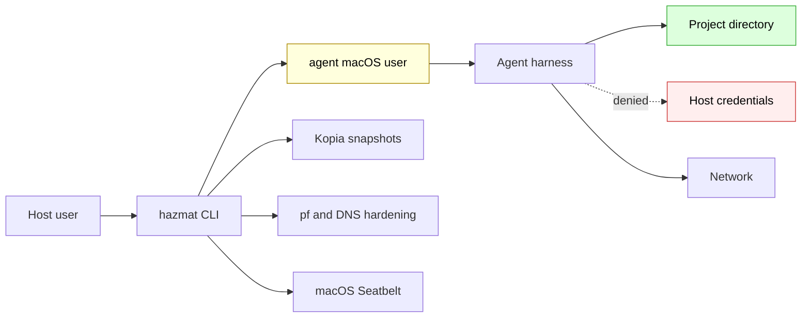
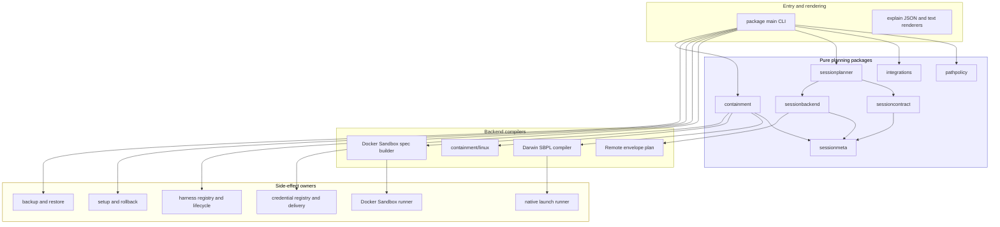
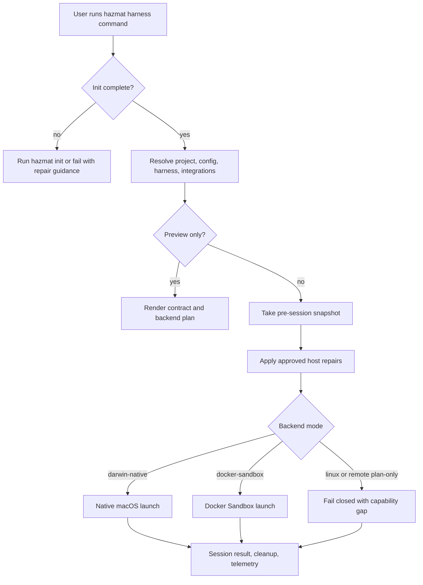
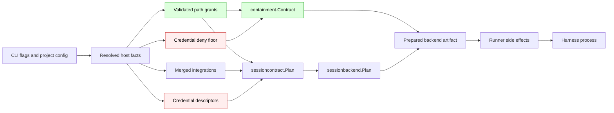
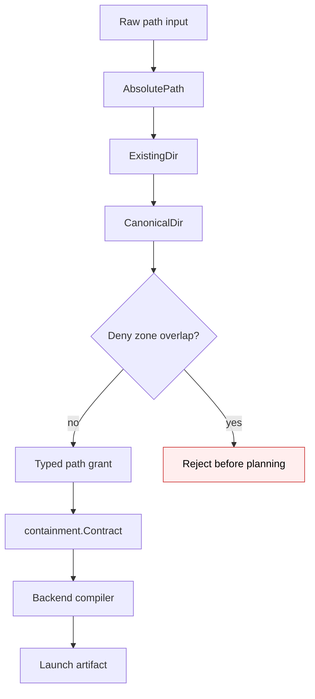
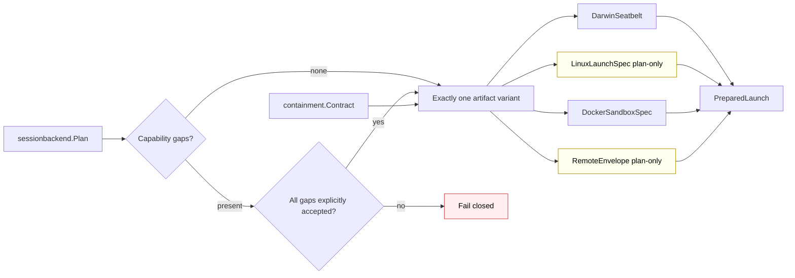
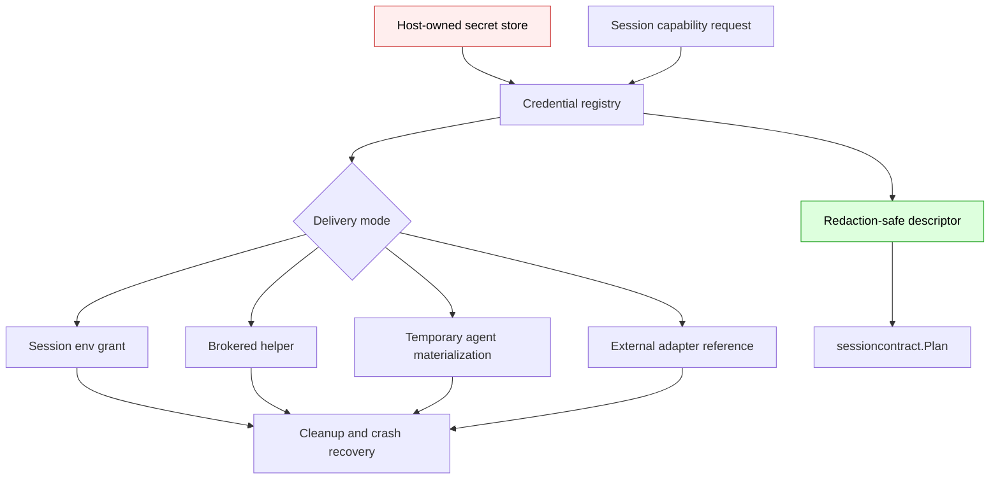
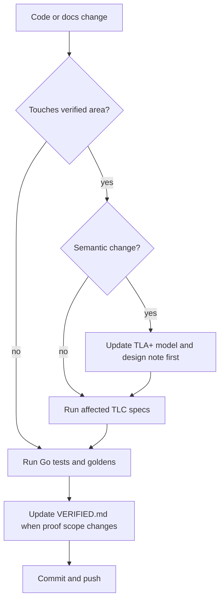
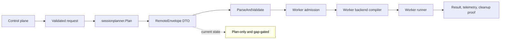
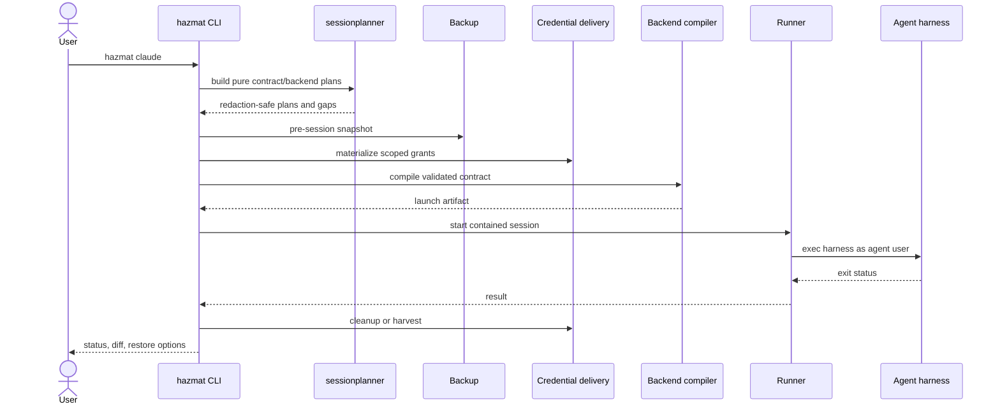

# Hazmat Architecture

This document describes Hazmat's current module shape, authority boundaries,
and safety invariants. It is the stable architecture map for readers who want
to understand how a request becomes a contained agent session.

For formal proof scope and governance rules, read
[../tla/VERIFIED.md](../tla/VERIFIED.md). For non-obvious product assumptions,
read [design-assumptions.md](design-assumptions.md). For the historical Phase 1
direction, read
[plans/2026-06-02-modular-architecture-direction.md](plans/2026-06-02-modular-architecture-direction.md).
For the proposed next package split, read
[plans/2026-06-02-package-split-architecture.md](plans/2026-06-02-package-split-architecture.md).

## Current State

Hazmat is a Go CLI plus a growing set of reusable planning packages. The CLI is
still the product entrypoint and still owns many host-side effects: setup,
rollback, harness lifecycle, credential materialization, backup, native launch,
Docker routing, and user-facing rendering.

The modular architecture work moved the central containment decisions into
smaller packages:

- `pathpolicy` validates and canonicalizes path authority.
- `sessioncontract` builds redaction-safe session contract plans.
- `sessionbackend` selects backends, reports capability gaps, and validates
  prepared artifact variants.
- `sessionplanner` composes pure contract and backend plans.
- `containment` owns the backend-neutral authority contract and structural
  credential-deny floor.
- `containment/linux` compiles the same contract into a plan-only Linux launch
  spec.
- `sessionmeta` owns stable mode, network, and launch metadata labels.
- `integrations` owns declarative integration manifests and merge rules.

macOS native containment is executable today. Docker Sandbox mode is executable
for supported private-daemon workflows. Linux native launch specs and remote
launch envelopes are plan-only until their runner/admission models and
implementations land.

## System Context

The important product boundary is structural. The agent is not your normal
account with a polite denylist. It runs as the dedicated `agent` user, inside
per-session policy, with explicit project and read-only grants.

## Module Topology

The dependency rule is one-way. Pure planning packages may describe authority,
but they do not prompt, mutate files, run commands, create sandboxes, or launch
agents. Side-effect owners consume validated plans and are responsible for the
host operations they perform.

## Module Responsibilities

| Module | Owns | Must not own |
| --- | --- | --- |
| `pathpolicy` | Absolute, existing, canonical path types; deny-zone predicates; overlap checks; typed `ProjectRoot`, `ReadOnlyGrant`, and `ReadWriteGrant`. | Session rendering, backend compilation, credential delivery. |
| `sessionmeta` | Mode labels, network mode normalization, launch metadata, network policy metadata. | Security decisions beyond stable metadata rendering. |
| `sessioncontract` | Redaction-safe session contract plan and preview JSON shape. | Host mutation execution, SBPL, Docker calls, process launch. |
| `sessionbackend` | Backend kind selection, capability gaps, lifecycle artifacts, prepared artifact variant validation. | Launch execution and worker admission. |
| `sessionplanner` | Pure composition of contract and backend plan artifacts. | Filesystem inspection, process execution, network calls, prompts. |
| `containment` | Backend-neutral authority contract, path grants, agent home/temp policy, network/process policy, service grants, structural credential floor. | OS-specific syscall behavior or CLI UI. |
| `containment/linux` | Plan-only Linux launch spec compilation from a validated containment contract. | Creating namespaces, mounts, helpers, or seccomp/Landlock rules at runtime. |
| `integrations` | Manifest schema, merge rules, safe env passthrough rejection, read-dir validation, warnings. | Adding write scope, credential env, unsafe paths, or caller-specific callbacks. |
| `package main` | CLI parsing, compatibility behavior, host setup, rollback, harness lifecycle, credentials, backup, launch, rendering. | Long-term ownership of policy semantics that reusable packages can enforce. |

## User Flow

The preview path and launch path share the same planning core where possible.
The preview path is read-only for planned host mutations. The launch path is the
only path that may apply repairs, materialize credentials, create launch
artifacts, or start a harness.

## Session Data Flow

Redaction-safe descriptors can appear in plans and JSON output. Raw secret
bytes stay behind the credential registry and delivery code. Backend compilers
receive a validated containment contract with a structural credential-deny
floor, not raw CLI strings.

## Authority Pipeline

The path constructors are the first authority boundary. A project/read/write
grant cannot be constructed for a credential or host-state deny zone. The
containment contract is the second boundary: it rejects empty credential floors,
mismatched floors, invalid project access, and path grants that overlap
credential deny paths.

## Backend Compilation Flow

`sessionbackend.NewPreparedLaunch` enforces that a prepared launch carries
exactly one artifact variant and that every capability gap is deliberately
accepted. Future runners must construct prepared launches through that
constructor instead of hand-assembling the public JSON fields.

## Backend Status

| Backend | Status | Artifact | Execution owner | Current fail-closed condition |
| --- | --- | --- | --- | --- |
| `darwin-native` | Executable | SBPL policy plus `hazmat-launch` | Native runner in `package main` and `cmd/hazmat-launch` | Invalid containment contract or launch helper fd precondition. |
| `docker-sandbox` | Executable for supported private-daemon workflows | Docker Sandbox spec/profile | Docker Sandbox runner in `package main` | Unsupported shared-daemon workflows and integration env passthrough gaps. |
| `linux-native` | Plan-only | Linux launch spec | None yet | `native-launch` capability gap. |
| `remote-envelope` | Plan-only | Remote envelope placeholder | None yet | `remote-launch` capability gap and no worker admission implementation. |
| `unsupported-native` | Not executable | None | None | `native-launch` capability gap. |

## Credential Flow

Plans may contain credential IDs, env var names, source labels, and redaction
flags. They must not contain raw provider keys, file contents, broker socket
paths, or host secret-store paths. Remote envelopes must remain
credential-free until a remote credential-handle model is proved.

## Invariant Ownership

| Invariant | Owner | Gate |
| --- | --- | --- |
| Project/read/write paths cannot overlap credential or host-state deny zones. | `pathpolicy` constructors and `resolveSessionConfig` compatibility shims. | `pathpolicy` tests, session config tests, `MC_TierPolicyEquivalence`, `MC_Tier3LaunchContainment`. |
| Credential-deny floor is non-omittable. | `containment.NewCredentialFloor`, `containment.NewContract`, backend compiler validation. | `containment` tests, golden SBPL tests, `MC_SeatbeltPolicy`. |
| SBPL credential denies remain the final broad credential boundary. | Darwin SBPL compiler and native session policy construction. | Golden SBPL fixtures, `MC_SeatbeltPolicy`. |
| Backend exact identity is not claimed beyond the comparable core. | `sessionbackend`, Docker planning, native planning. | `MC_TierPolicyEquivalence`. |
| Capability gaps are explicit and accepted before prepared launch. | `sessionbackend.NewPreparedLaunch`. | `sessionbackend` tests and backend plan goldens. |
| Integration env passthrough cannot carry credential-shaped keys. | `integrations` package and registry-backed credential descriptors. | Integration tests and credential-regression hook. |
| Preview is read-only for host mutations. | Session mutation planning and explain path. | `MC_SessionPermissionRepairs`, explain goldens. |
| Launch helper starts sandboxed code without inherited credential-bearing fds. | `cmd/hazmat-launch`. | `MC_LaunchFDIsolation`, launch helper tests. |
| Harness lifecycle rollback removes Hazmat-owned metadata and preserves user state where documented. | Harness registry and lifecycle code. | `MC_HarnessLifecycle`, harness tests. |
| Remote envelopes are not executable authority. | `sessionbackend` gap reporting and remote-envelope plan docs. | `GapRemoteLaunch`, remote plan doc, future remote model before code. |

## Verification Flow

Pure refactors in governed areas still need TLC confirmation. Semantic changes
must update the model first. Goldens prove byte-level output equivalence; TLC
proves the abstract invariants still hold inside the modeled scope. They answer
different questions.

## Remote And Orchestrated Flow

This flow is intentionally not executable today. Any remote runner must first
add a model for schema versioning, canonical serialization, integrity, replay
defense, worker identity, path mapping, capability gaps, cleanup, telemetry,
and any credential handles. Until then, `RemoteEnvelope` is a typed placeholder
and `KindRemoteEnvelope` reports a `remote-launch` capability gap.

## Lifecycle Sequence

If preview mode is selected, the sequence stops after the planner and renderer.
No snapshot, credential materialization, host mutation, backend artifact
creation, or launch occurs.

## Reading Map

| Need | Read |
| --- | --- |
| User-facing tier choice | [overview.md](overview.md) |
| Daily commands | [usage.md](usage.md) |
| Harness support | [harnesses.md](harnesses.md) |
| Integration rules | [integrations.md](integrations.md) |
| Docker private-daemon boundary | [tier3-docker-sandboxes.md](tier3-docker-sandboxes.md) |
| Threat and CVE mapping | [threat-matrix.md](threat-matrix.md), [cve-audit.md](cve-audit.md) |
| Design assumptions and remote-worker scope | [design-assumptions.md](design-assumptions.md) |
| Formal verification scope | [../tla/VERIFIED.md](../tla/VERIFIED.md) |
