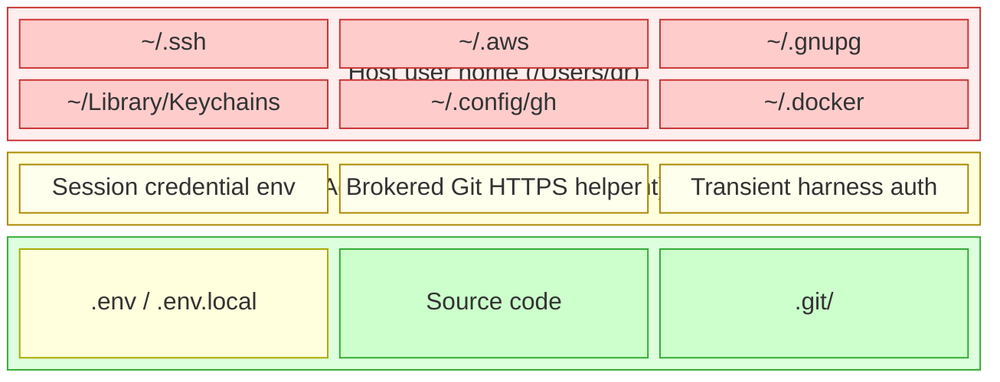

# Hazmat Design Assumptions

Every design decision that isn't obvious from reading `hazmat --help`.

## Platform

**macOS only.** Requires `sandbox-exec`, `dscl`, `pfctl`, `launchctl`. No Linux support, no WSL, no Docker-based alternative. This is intentional — the whole value proposition is native macOS containment without VMs.

**No minimum version specified.** Works on Sequoia. Probably works on Ventura+. Untested on older. We don't check `sw_vers` — if the required binaries exist, it runs.

**Both Intel and Apple Silicon.** PATH includes `/opt/homebrew` (ARM) and `/usr/local` (x86). Both are always present; the wrong one is harmless dead entries. This PATH block refers to the **agent-side** `.zshrc` that `hazmat init` writes, not to hazmat's own tool resolution — see "Tool resolution" below.

## Tool resolution

**Hazmat resolves macOS system utilities by absolute path, not through PATH.** `chmod`, `chown`, `ls`, `sudo`, `dscl`, `pfctl`, `launchctl`, `uname`, `script`, `diff`, `tee` — every invocation goes through path constants defined in `hazmat/hostexec.go` (`/bin/chmod`, `/usr/bin/sudo`, etc.). The guard script `scripts/check-hostexec.sh` (run in CI) forbids bare `exec.Command("chmod"/"sudo"/...)` anywhere else in the source.

**Why absolute paths and not a sanitized PATH.** Process-wide `os.Setenv("PATH", "/usr/bin:/bin:/usr/sbin:/sbin")` would silently break intentional PATH-dependent behavior: `$EDITOR` for config editing, `docker` lookup for sandbox mode, `brew` fallback for stack detection, and the host user's preferred `git`. Absolute-path resolution at each call site makes the trust boundary visible in every diff and keeps the PATH-dependent paths authentically PATH-dependent.

**Git uses a fixed allowlist, not `/usr/bin/git`.** On macOS Sequoia, `/usr/bin/git` is the Xcode Command Line Tools shim, which routes to Apple-shipped Git — *not* to a Homebrew installation. Apple Git lags Homebrew git by several minor versions, and features like protocol v2 defaults differ. Hazmat picks the first existing executable from `[ /opt/homebrew/bin/git, /usr/local/bin/git, /usr/bin/git ]` and caches that choice for the process lifetime. The Xcode shim is a fallback, not the preferred path.

**The `secure_path` contract does the rest.** Once `/usr/bin/sudo` is entered, macOS's default `/etc/sudoers` sets `secure_path="/usr/bin:/bin:/usr/sbin:/sbin"` for the elevated command. Tools invoked as `sudo <tool>` therefore resolve under sudo's secure PATH, not the controlling user's. Fixing `/usr/bin/sudo` absolutely is the only load-bearing fix for the sudo-wrapped call sites.

**Agent-side PATH is separate.** The PATH block that `hazmat init` writes into the agent's `.zshrc` is about what commands the agent can run inside a contained session. That is a session-policy decision and is deliberately permissive of Homebrew installations. Hazmat's own tool-resolution PATH (governed by `hostexec.go`) is about what binaries hazmat itself trusts when running with the controlling user's privileges.

## The Agent User

**One agent user, period.** Username `agent`, UID 599, home `/Users/agent`. These are hardcoded constants, not configuration. You can override UID/GID at setup time (`--agent-uid`, `--group-gid`), but the username and home path are fixed.

**One human controller.** Setup creates ACLs for the user who runs `hazmat init`. A second human user on the same Mac cannot co-manage the workspace without manual ACL changes.

**Concurrent sessions are possible but racy.** Each `hazmat claude`, `hazmat opencode`, `hazmat shell`, or `hazmat exec` session gets a unique seatbelt policy (PID-based filename). But all sessions share the same agent home and harness state. Two harness instances writing to shared state like `~/.claude/` or `~/.config/opencode/` simultaneously is undefined behavior. We don't prevent it.

## Shell

**Agent shell is zsh; host PATH setup supports zsh, bash, and fish.** The agent user's shell is `/bin/zsh`, and the agent bootstrap writes to the agent's `.zshrc`. On the controlling user side, hazmat detects zsh, bash, and fish and writes the PATH block to the matching rc file. Unsupported shells are warned and left for manual setup.

## Network Security Model

**Allow by default, block known bad.** This is the core security tradeoff. The agent can make any HTTPS request to any host. We block specific dangerous protocols:

| Blocked | Why |
|---------|-----|
| SMTP (25, 465, 587) | Email exfiltration |
| IRC (6660-6669, 6697) | C2 channels |
| FTP (20, 21), Telnet (23) | Legacy insecure protocols |
| SMB (445), RDP (3389), VNC (5900-5901) | Lateral movement |
| Tor (9050, 9150), SOCKS (1080) | Anonymous exfiltration |
| VPN (1194, 1723, 4500) | Tunnel escape |
| XMPP (5222, 5269) | Messaging exfiltration |
| ICMP | Tunnel/covert channel |

**What's NOT blocked:** HTTP (80), HTTPS (443), DNS (53), WebSockets on 80/443, any custom protocol on an unblocked port. The agent can `curl` any URL, push to any git remote, or call any API.

**DNS blocklist is domain-exact, not wildcard.** `/etc/hosts` blocks `ngrok.io` but not `*.ngrok.io`. Subdomains pass through. For wildcard blocking, you need dnsmasq or NextDNS (documented, not automated).

**DNS blocklist is system-wide.** It modifies `/etc/hosts`, which affects ALL users on the machine, not just the agent. This is the only system-wide side effect that isn't scoped to the agent user.

## Credential Storage

- **Red zone** — host user credentials. Denied by seatbelt + user isolation. Agent cannot read or write these.
- **Yellow zone** — session-local credentials and compatibility state. Plain text within the session when a capability is actively granted; durable provider keys, GitHub API tokens, file-backed harness auth, cloud backup credentials, provisioned Git SSH identities, and Git HTTPS credentials live in `~/.hazmat/secrets`.
- **Green zone** — project directory. Fully readable and writable by the agent. `.env` files with secrets are exposed by design.

**Mixed state today.** API keys configured through `hazmat config agent`, GitHub API tokens configured through `hazmat config github`, file-backed harness auth imported or harvested from sessions, cloud backup secrets, typed provisioned Git SSH identities, and Git HTTPS credentials now live in `~/.hazmat/secrets/`. Materialized harness files are copied into `/Users/agent` only for matching sessions and harvested back out on normal exit. GitHub API tokens are delivered only to sessions launched with `--github`. Git HTTPS uses a per-session brokered helper so git's built-in plaintext store is not durable agent-home state. Gemini's macOS Keychain OAuth item is an adapter-required external boundary.

**GitHub API access is an explicit session capability.** Hazmat denies host GitHub CLI state such as `~/.config/gh` and rejects ambient `GH_TOKEN`/`GITHUB_TOKEN` passthrough from integrations and repo setup. The only supported GitHub API token path is host-owned storage at `~/.hazmat/secrets/github/token`, activated per launch with `--github`, delivered as `GH_TOKEN`, and shown as a redacted `github.api-token` grant. Docker Sandbox sessions currently fail closed for this grant because that backend does not yet deliver session env credentials with equivalent semantics.

**General SSH inside sessions is intentionally unsupported.** The seatbelt denies `/Users/agent/.ssh`, and hazmat deliberately does not export the host user's `SSH_AUTH_SOCK` into the stripped session environment. A readable private key would violate the credential-deny model; a forwarded agent socket would reintroduce an SSH signing oracle. Hazmat may still grant an explicit per-project Git-over-SSH capability by selecting one host-owned key from a chosen directory, loading it into a fresh session-local `ssh-agent`, and forcing Git through a constrained wrapper. Arbitrary SSH shells remain unsupported.

**`hazmat config ssh test` is a host-side helper, not a session capability.** The test command deliberately runs as the invoking host user, not inside the contained agent environment. That lets it reuse the host user's real OpenSSH routing semantics from `~/.ssh/config` such as aliases, `HostName`, `Port`, `Include`, and `ProxyJump`, while still forcing the Hazmat-selected private key and `known_hosts` for authentication. This is a UX aid for validating that a selected project key works against the user's existing SSH topology; it does not widen the session-time capability boundary, and the in-session Git wrapper remains stricter than the test helper.

**Seatbelt protects the host user's credentials.** The deny list blocks common host credential roots. The agent cannot read the host user's SSH keys, AWS tokens, GitHub CLI tokens, keychain material, or common cloud/tooling credentials unless a narrower capability explicitly re-allows something.

**The deny list is not exhaustive.** Native sessions deny common host credential locations including `~/.ssh`, `~/.aws`, `~/.gnupg`, `~/Library/Keychains`, `~/.config/gh`, `~/.docker`, `~/.kube`, `~/.netrc`, `~/.m2/settings.xml`, `~/.config/gcloud`, `~/.azure`, and `~/.oci`. Less common credential stores may still need explicit review before adding read scope.

**Credentials in the project directory are exposed.** If your project has `.env`, `.env.local`, or embedded secrets, the agent can read them — the project directory is read-write by design.

## Seatbelt (sandbox-exec) Containment

**Defense in depth, not a security boundary.** The seatbelt is a soft sandbox. Apple's SBPL enforcement is undocumented, has known bypasses via mach services, and is not designed as a security jail. It prevents accidental damage and blocks obvious credential access, but a determined adversary in the agent session could likely escape.

**sandbox-exec is deprecated but not going away.** Both `sandbox-exec(1)` and `sandbox_init(3)` have carried deprecation notices since ~2012-2017, but remain fully functional as of macOS 26 Tahoe (26.4). Apple's own system services (Safari, Mail, Quick Look, dozens of daemons) depend on the same kernel enforcement. Every major AI agent sandbox on macOS uses it: Claude Code, Codex CLI, Gemini CLI, Cursor. No WWDC session has discussed removal or a CLI sandboxing replacement. App Sandbox (entitlements-based) cannot sandbox arbitrary binaries at runtime. Apple's Containerization framework (WWDC 2025) runs Linux VMs, not macOS processes. The real risk is silent SBPL behavioral changes, not API removal. `hazmat check` validates sandbox behavior at runtime, and the architecture degrades gracefully: user isolation and pf contain the agent even if seatbelt weakens. See [research/macos-sandboxing-internals.md](research/macos-sandboxing-internals.md) for the full deprecation analysis with references.

**Mach services are broadly allowed.** The policy permits `mach-host*` (all host-level mach services), plus `logger`, `coreservicesd`, `notification_center`, `mDNSResponder`. These are necessary for normal operation but expand the attack surface. We allow them because blocking them breaks basic tooling (git, node, python).

**Command Line Tools SDK is readable.** The seatbelt allows file-read and process-exec from `/Library/Developer/CommandLineTools`. This is required for CGO compilation (clang needs SDK headers at `.../SDKs/MacOSX.sdk/usr/include/`). The directory contains only the compiler toolchain and system headers — no credentials, no user data. Without this, any Go project using cgo (including hazmat's own `hazmat-launch` binary) cannot compile within containment.

**Per-session policies with literal paths.** Each session generates a fresh SBPL file with absolute paths embedded as string literals. This means:
- Symlink resolution happens once at session start
- If the filesystem changes during a session, the policy doesn't update
- Policy files are written to `/private/tmp/hazmat-<pid>.sb` and cleaned up on exit

**Seatbelt path denies assume a clean helper fd table.** `hazmat-launch`
closes every inherited fd `>= 3` before calling `sandbox_init()`, then opens
its own policy file with `CLOEXEC` before the final `exec`. This matters
because SBPL rules do not revoke access granted by an already-open file
descriptor. The path-based credential-deny story therefore depends on two
layers together: helper-side fd cleanup before sandboxing, then Seatbelt path
enforcement after sandboxing. That precondition is now part of the verified
TLA+ suite, not just an implementation assumption.

**/tmp is shared.** The agent can read and write `/private/tmp` and `/private/var/folders`. These are shared with all users on the system. Sensitive temp files from other processes are accessible.

## Workspace Model

**Projects are arbitrary directories.** Any existing directory can be a Hazmat project via `-C` or the current working directory. Sessions are not confined to a managed workspace root.

**Cloud backup still has a canonical root.** `hazmat backup --cloud` and `hazmat restore --cloud` target `~/workspace`. That path is a backup scope convention, not a session boundary.

**Project = read-write, everything else = read-only.** The `-C` flag selects the writable project directory. `-R` adds extra read-only paths. This is enforced by the seatbelt, not advisory.

**No special workspace read shortcut exists.** If you want broad read access, you must pass that path explicitly with `-R`. Hazmat does not reserve a separate workspace flag anymore.

**Some sessions make persistent host-side changes.** Before launch, Hazmat may
repair collaborative ACLs on the project tree, `.git` metadata, or ancestor
paths needed to traverse explicitly exposed directories. With Homebrew-backed
integration resolution enabled, Hazmat may also plan a narrow toolchain
permission repair under a Homebrew Cellar path when local mode bits would
otherwise block the agent user. For external repos, Hazmat may also add the
active repository root to the agent user's Git `safe.directory` list so
agent-side build tools can read version metadata. These changes are shown in
the session contract under `Host changes`. The verified TLA+ suite models the
permission-repair classes, preview-vs-launch behavior, and rollback
persistence for that subset of the contract; agent Git trust remains governed
by tests and documentation.

**`hazmat explain` is a pure preview for these mutations.** It computes and
shows the same planned host changes that a real launch may apply, but it does
not execute them.

## Claude Code Coupling

**Harnesses are explicit, and init no longer installs one by default.** `hazmat init` sets up containment first, then optionally bootstraps a supported harness such as Claude Code, Codex, or OpenCode when the operator selects one. The seatbelt still includes explicit support for Claude state in `~/.claude/`, but harness installation itself is now an opt-in step rather than an automatic side effect of init.

**Only explicitly implemented harnesses work.** Hazmat now has a harness boundary, but it is still a built-in registry, not a plugin system. To use Cursor, aider, or OpenAI's tools, you'd still need code changes for install/config/import behavior and, where necessary, seatbelt-visible state paths.

**The vision is agent-agnostic containment.** The current implementation has explicit harness support because containment (user isolation, pf, seatbelt) is generic, while harness bootstrapping and portable-import scope remain harness-specific.

## Backup

**Two modes, one config file.** Local Kopia repo (`~/.local/share/hazmat/repo/`) for automatic per-session project snapshots. Optional cloud Kopia repo (S3-compatible) for offsite workspace backup. Both configured via `~/.hazmat/config.yaml`.

**Snapshots are automatic.** Every `hazmat claude/exec/shell` snapshots the project directory before launching. The snapshot covers only the write-target directory — not the whole workspace, not read-only dirs. Skip with `--no-backup`.

**Project snapshots do not roll back host permission repairs.** The automatic
pre-session snapshot protects project contents, not host permission metadata
outside the snapshot boundary. Session-time ACL or Homebrew permission repairs
are persistent host changes.

**Retention is configurable.** Default: 20 latest, 7 daily, 4 weekly per project. Change via `hazmat config set backup.retention.keep_latest N` or edit `config.yaml` directly.

**Excludes are for common web/Python/Rust/Node projects.** Default excludes: `node_modules/`, `.venv/`, `__pycache__/`, `.next/`, `dist/`, `build/`, `target/`. Add more via `hazmat config set backup.excludes.add PATTERN` or edit `config.yaml`.

**Integrations can extend snapshot excludes per session.** Active integrations
may add more excludes such as `.terraform/` or `.turbo/` for the current
session only. They affect what goes into automatic pre-session snapshots, not
the seatbelt allow rules.

**Cloud credentials are host-secret-store entries.** The config file (`~/.hazmat/config.yaml`, 0600) stores the S3 endpoint and bucket. The S3 access key ID, S3 secret key, and Kopia recovery key live under `~/.hazmat/secrets/cloud/` and are loaded through the credential registry. `HAZMAT_CLOUD_SECRET_KEY` and `HAZMAT_CLOUD_PASSWORD` remain explicit runtime/import sources, but they are not written back into `config.yaml`. Older `backup.cloud.access_key`, `backup.cloud.recovery_key`/`password`, and `~/.hazmat/cloud-credentials` values migrate into the secret store.

**Credentials may be in snapshots.** Hazmat-managed provider keys, GitHub API tokens, and file-backed harness auth are outside the project and should not be in project snapshots; `hazmat check` reports legacy agent-home residue such as old `.zshrc` exports or Git HTTPS credentials. If your project has `.env` files, those ARE snapshotted unless excluded.

**Integrations are ergonomic overlays, not policy escapes.** Integrations may
add read-only paths, snapshot excludes, safe env passthrough, warnings, and
command hints. They cannot add write scope, expose denied credential paths, or
modify the firewall model.

**Repo-recommended integrations require explicit host approval.** A
`.hazmat/integrations.yaml` in the project directory may list integration
names, but it is a hint, not authority. Hazmat prompts the user once, then
stores approval in `~/.hazmat/integration-approvals.yaml` keyed by canonical
project path + SHA-256 of the file. If the file changes, approval is
invalidated. This prevents the agent (which can write to the project
directory) from silently escalating its own session config: any change to the
recommendations file triggers a re-prompt.

**Integration approval is an informed-consent mechanism, not a security
boundary.** The approval prompt protects against the sandboxed agent writing a
`.hazmat/integrations.yaml` and having it auto-activate on the next session:
the agent can modify the file (project dir is writable) but cannot write to
`~/.hazmat/integration-approvals.yaml` (different UID, 0600). An attacker
with host-user code execution could pre-fill the approvals file, but the blast
radius is minimal: even with forged approvals, integration validation still
enforces credential deny checks, the safe env allowlist, and the prohibition
on executable content. The security boundary is integration validation, not
the approval record. See `docs/threat-matrix.md` footnotes 9 and 10 for the
full analysis.

**`~/workspace` as a global read dir is a security tradeoff.** If
`session.read_dirs` includes `~/workspace`, every hazmat session can read
every repo and artifact under that tree. This is appropriate for
single-developer machines where all workspace content is at the same trust
level. For multi-tenant or mixed-trust workspaces, use per-session `-R` flags
or explicit integration read dirs instead.

**Cloud backup encrypts at rest.** Both local and cloud snapshots use Kopia's encrypted repository format. The local repository relies on a fixed local-only password plus filesystem permissions; the cloud repository relies on the configured repository password.

## Rollback

**Rollback does not delete your files.** `hazmat rollback` removes system configuration (users, firewall, sudoers, wrappers) but does not delete any project files the agent created or modified. Back up first if needed.

**Rollback does not revert session-time permission repairs.** `hazmat rollback`
does not remove collaborative ACLs added to project trees, `.git`, or exposed
ancestor paths during later sessions, and it does not revert Homebrew toolchain
permission repairs. That non-reversion is now an explicit part of the TLA+
proof bar for session mutation behavior, even though the exact ACL/chmod
filesystem operations are still covered by tests and docs rather than the model.

**Agent user persists by default.** Rollback leaves the agent account unless you pass `--delete-user`. This means `/Users/agent` and all its contents, including harness state such as Claude and OpenCode config, auth, and imported basics, survive rollback.

**pf.conf restoration depends on backup.** Setup creates a timestamped backup of `/etc/pf.conf` before modifying it. Rollback restores from this backup. If the backup is missing or was modified after setup, rollback strips the anchor lines in-place, which is fragile.
