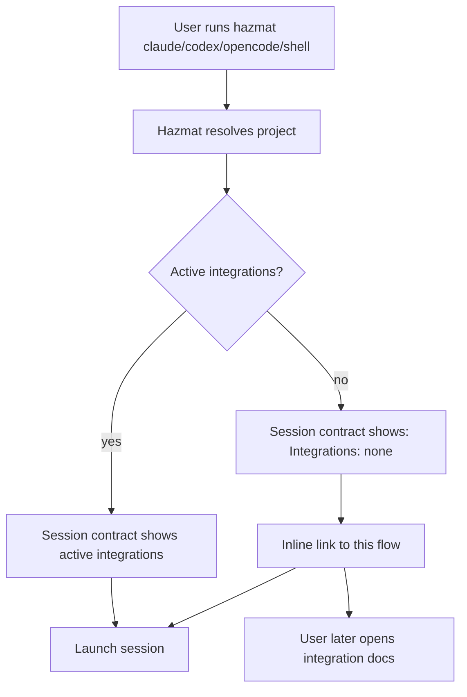
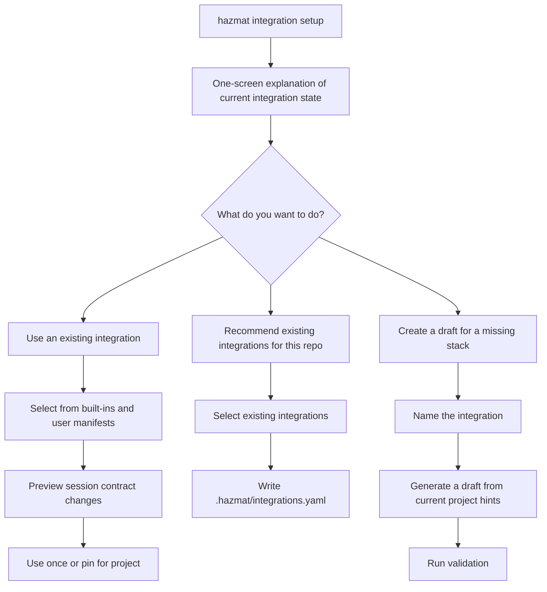
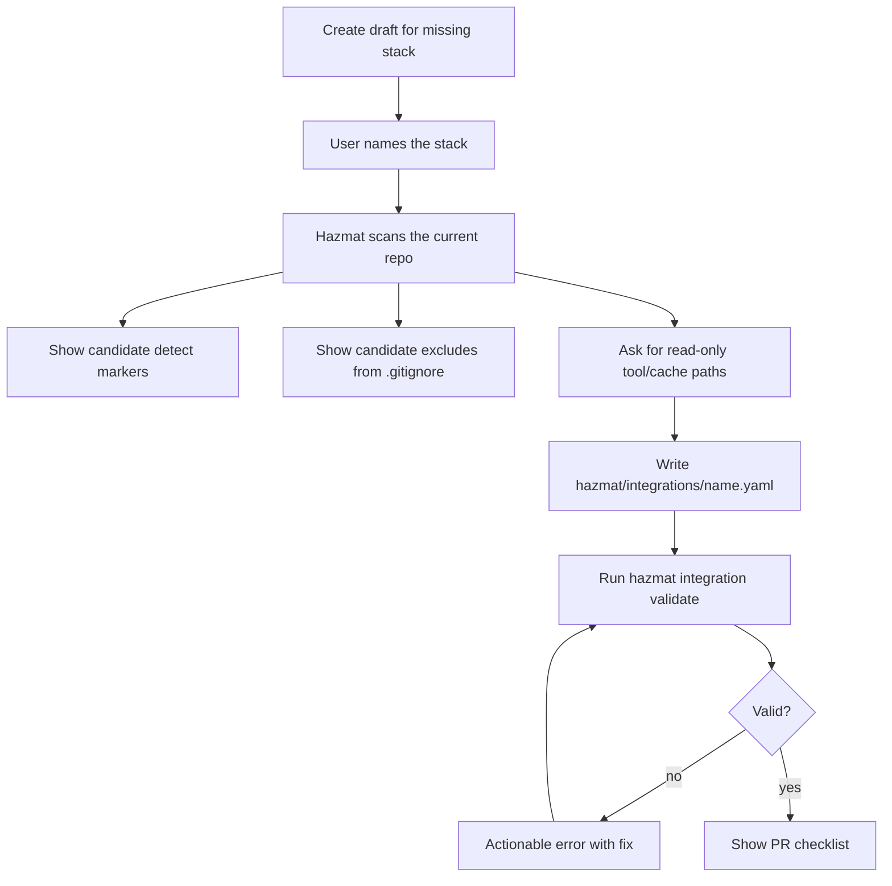
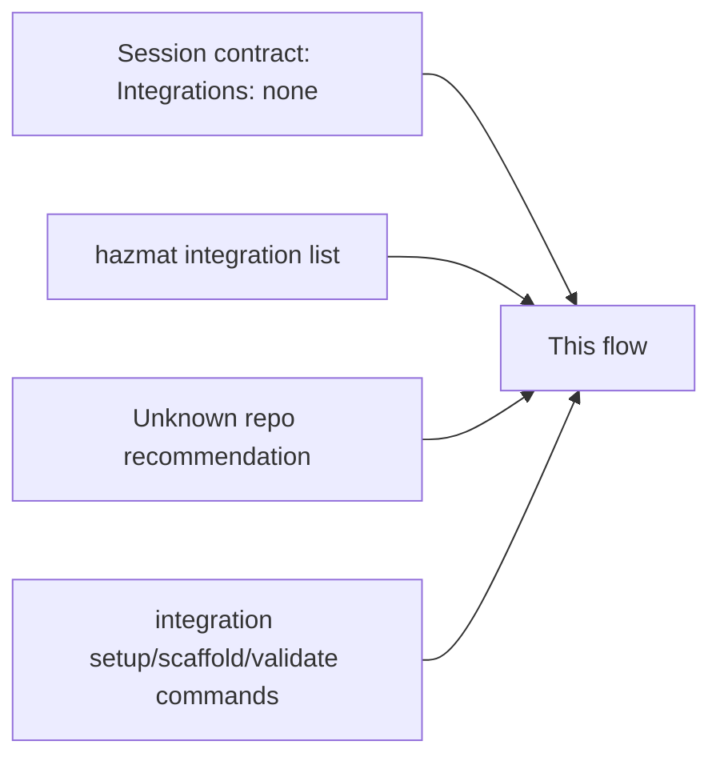
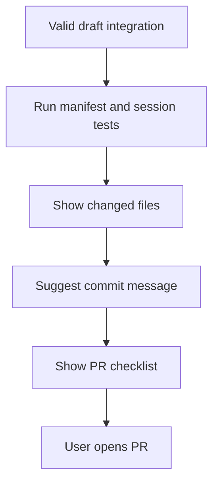

# Integration Contributor Flow

Hazmat integrations should be easy to discover from normal use, but Hazmat
should not pretend it can recognize every possible technology stack.

The contribution path starts from what Hazmat can know safely:

- whether a session has active integrations
- which built-in integrations already exist
- whether a repo recommends an unknown integration name
- which project files the user chooses to treat as evidence

It does not require an exhaustive list of ecosystems.

## First Session Flow

Every harness launch prints a session contract. That is the right place to
make integrations discoverable because new users already pass through it.



The important constraint is tone. `Integrations: none` is not an error. It
only means Hazmat has not added stack-specific read-only paths, backup
excludes, or safe environment passthrough for this session.

## Setup Flow

`hazmat integration setup` is the main doorway for normal users, repo
maintainers, and contributors.



This avoids requiring users to discover `--integration` on their own. The
session contract points to integrations, and the setup flow shows commands for
using an existing integration, recommending integrations in the repo, or
creating a draft manifest.

## Missing Integration Flow

Hazmat should not say "this looks like Bun" unless it has a maintained detector
for Bun. Instead, it should ask the user to name the missing stack and then help
turn the current project into evidence.



The user supplies the semantic claim: "this is a Bun integration", "this is a
SwiftPM integration", or "this is a repo-specific user integration." Hazmat
supplies guardrails: schema validation, safe environment keys, credential deny
checks, and a small PR checklist.

## Current Command Path

Create a draft from the current project:

```bash
hazmat integration setup
hazmat integration scaffold <name> --from-current-project
$EDITOR ~/.hazmat/integrations/<name>.yaml
hazmat integration validate ~/.hazmat/integrations/<name>.yaml
```

When run inside the Hazmat source tree, `scaffold` writes to
`hazmat/integrations/<name>.yaml` by default so the result is PR-shaped. When
run from another project, it writes to `~/.hazmat/integrations/<name>.yaml` by
default for local experimentation. Use `--output` or `--user` to choose
explicitly.

Recommend existing integrations for a repo:

```bash
hazmat integration setup --recommend node,go
```

That writes `.hazmat/integrations.yaml` with existing integration names only.
Hazmat still asks the host user to approve the repo recommendation on first
use.

A good first PR usually contains:

- one manifest under `hazmat/integrations/`
- one focused test or fixture update when behavior changes
- one docs or compatibility note if the integration changes user-visible behavior

For the exact manifest contract, read
[integration-author-kit.md](integration-author-kit.md).

## CLI Touchpoints

Hazmat should link here from places where users already see integration state:



Keep the link quiet and consistent. Integrations are optional ergonomics, not a
required trust boundary.

## PR-Ready Flow



The goal is a small, reviewable contribution. If an integration needs broad
policy changes, credential access, network behavior, or executable hooks, it
does not belong in the bounded integration manifest system.
