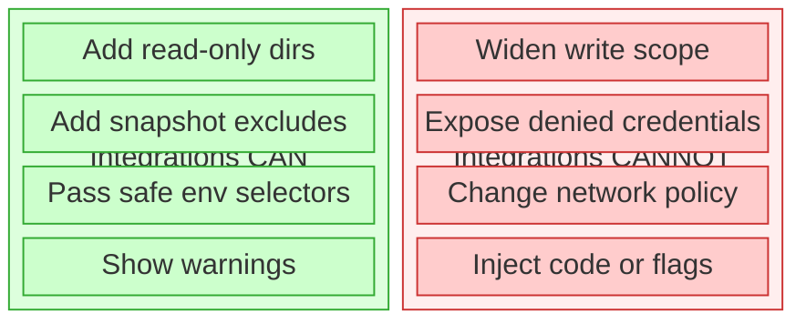
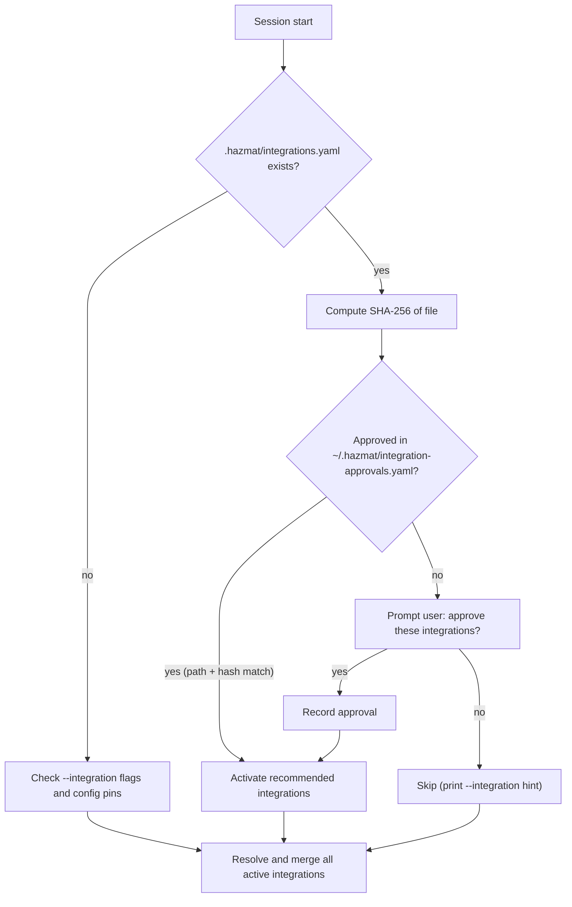

# Session Integrations

Session integrations are optional ergonomics overlays for common technology
stacks. They let Hazmat carry a small amount of stack-specific convenience
into a session without weakening the containment model.

`hazmat integration` is the command surface for this feature.

## What Integrations Can Do

- Add read-only directories that are useful for a stack, such as toolchains or caches
- Add snapshot exclude patterns for reproducible build artifacts
- Pass through a small safe set of environment selectors and path pointers from the invoker environment
- Show warnings or suggested commands for the stack

## What Integrations Cannot Do

- Widen project write scope
- Bypass the seatbelt credential deny list
- Change network policy
- Inject arbitrary flags or preload-style environment variables
- Reconfigure Claude/OpenCode runtime settings



This is the core design rule: integrations may reduce friction, but they may not
weaken Hazmat's trust boundary.

## Inspecting Integrations

```bash
hazmat integration list
hazmat integration show node
```

`hazmat integration list` shows built-in integrations, user-installed manifests under
`~/.hazmat/integrations/`, and any project pinning currently configured.

`hazmat integration show <name>` shows the integration's detect files,
read-only paths, env passthrough keys, snapshot excludes, warnings, and
command hints.

If the built-ins do not cover your stack, start with
[integration-contributor-flow.md](integration-contributor-flow.md). It shows how
normal Hazmat output should lead users toward existing integrations, repo
recommendations, or a small PR-shaped integration draft without relying on an
exhaustive list of ecosystems.

Manifest `session.read_dirs` and `session.env_passthrough` are common to every
platform. Platform-owned entries live under `session.platforms.<platform>`, so
Darwin-specific Homebrew, Command Line Tools, `java_home`, `/opt/homebrew`, and
`/Library` paths stay out of future Linux FHS or distro-package-manager rules.
Only the current platform's overlay is merged into a session.

## Activating Integrations

Activate an integration for a single session:

```bash
hazmat claude --integration node
hazmat opencode --integration go
hazmat shell --integration rust
hazmat exec --integration python-poetry -- poetry run pytest
hazmat exec --integration python-uv -- uv run pytest
```

If no integrations are active, Hazmat may suggest built-in integrations based
on files in the project tree, such as `go.mod`, a nested `frontend/package.json`,
or a `*.cfg` model file beside its `.tla` spec.

## Explicit Project Access Extensions

Integrations are not the only way to shape a session. If you need additional
directories, declare them directly:

```bash
hazmat claude -R ~/reference-docs
hazmat claude -W ~/.venvs/my-app
hazmat config access add -C ~/workspace/my-app --read ~/reference-docs --write ~/.venvs/my-app
hazmat config access remove -C ~/workspace/my-app --write ~/.venvs/my-app
```

Use this path-based access model when the directory is specific to your
machine, writable, or too environment-specific to belong in a reusable
integration.

## Project Pinning

Pin integrations so they auto-activate for a specific project:

```bash
hazmat config set integrations.pin "~/workspace/my-app:node,go"
hazmat config set integrations.unpin ~/workspace/my-app
```

Hazmat canonicalizes the project path (`Abs` + `EvalSymlinks`) before storing
the pin. At session start, the session's project path is resolved the same way
and compared for exact equality. This means `~/workspace/my-app` and
`/Users/dr/workspace/my-app` both resolve to the same canonical pin. Re-running
`integrations.pin` for the same project replaces the existing pin set.

## Built-In Integrations

| Integration | Detects | Read dirs | Env passthrough | Snapshot excludes |
|------|---------|-----------|-----------------|-------------------|
| `beads` | `.beads/` (root dir) | — (bd and dolt resolved via `PATH`; Homebrew permission repair on their Cellars when installed 0700) | — | `.beads/dolt/`, `.beads/backup/`, `.beads/dolt-server.*`, `.beads/daemon.*`, `.beads/bd.sock*`, `.beads/*-lock`, `.beads/interactions.jsonl`, `.beads/ephemeral.sqlite3*`, `.beads/sync-state.json`, `.beads/push-state.json`, `.beads/export-state*`, `.beads/last-touched`, `.beads/.beads-credential-key`, `.beads/redirect`, `.beads/.local_version`, `.beads/.env` |
| `go` | `go.mod` | resolved `GOROOT` | `GOPATH`, `GOPROXY`, `GOPRIVATE`, `CGO_ENABLED` | `vendor/` |
| `haskell-cabal` | `cabal.project`, `*.cabal`, `stack.yaml` | resolved GHC and Cabal prefixes | — | `dist-newstyle/`, `.stack-work/` |
| `node` | `package.json` | resolved Node prefix; Darwin declares `/opt/homebrew/lib/node_modules` | `NODE_ENV` | `node_modules/`, `.next/`, `.turbo/`, `.nuxt/`, `out/`, `.vercel/` |
| `python-poetry` | `poetry.lock` | `~/.local/share/pypoetry` | `VIRTUAL_ENV` | `.venv/`, `__pycache__/`, `.pytest_cache/`, `.mypy_cache/`, `.ruff_cache/`, `*.pyc`, `dist/`, `*.egg-info/` |
| `python-uv` | `uv.lock` | `~/.local/share/uv` | `VIRTUAL_ENV` | `.venv/`, `__pycache__/`, `.pytest_cache/`, `.mypy_cache/`, `.ruff_cache/`, `*.pyc`, `dist/`, `*.egg-info/` |
| `rust` | `Cargo.toml` | resolved Rust sysroot | `RUSTUP_HOME`, `CARGO_HOME`, `CARGO_TARGET_DIR` | `target/` |
| `java-gradle` | `build.gradle`, `build.gradle.kts`, `settings.gradle`, `settings.gradle.kts` | resolved JDK home and Gradle prefix | `JAVA_HOME` | `.gradle/`, `build/`, `out/`, `target/`, `*.class` |
| `java-maven` | `pom.xml` | resolved JDK home and Maven prefix | `JAVA_HOME` | `target/`, `*.class` |
| `ruby-bundler` | `Gemfile`, `Gemfile.lock` | resolved Ruby prefix | — | `vendor/bundle/`, `.bundle/`, `tmp/`, `log/` |
| `elixir-mix` | `mix.exs`, `mix.lock` | resolved Elixir and Erlang prefixes | — | `_build/`, `deps/`, `erl_crash.dump` |
| `terraform-plan` | `*.tf` | — | — | `.terraform/`, `*.tfstate`, `*.tfstate.backup` |
| `opentofu-plan` | manual activation | resolved OpenTofu prefix | — | `.terraform/`, `*.tfstate`, `*.tfstate.backup` |
| `tla-java` | `*.cfg` files with sibling `*.tla` | resolved JDK home; Darwin declares `/Library/Java` and `/opt/homebrew/opt/openjdk` | `JAVA_HOME`, `TLA2TOOLS_JAR` | `tla/states/`, `*.dot` |

Integrations influence three parts of session setup:

1. **Read-only access** — toolchain and cache directories
2. **Pre-session snapshot excludes** — reproducible build artifacts
3. **Safe environment passthrough** — passive selectors from the invoker's environment

Hazmat prints integration-derived paths, snapshot excludes, registry redirect
keys, and warnings at session start so the behavior stays visible.

For automation and compatibility checks, `hazmat explain --json` exposes the
same integration state in machine-readable form. Use that instead of parsing
the human-oriented contract text.

For some built-in integrations, Hazmat may also show a `Host permission
changes` section in the session contract. This is used for narrowly-scoped,
host-owned repairs such as a Homebrew toolchain permission fix that is required
to make an already-approved read-only toolchain path executable by the agent.
`hazmat explain` previews these repairs; it does not execute them.

Homebrew-backed resolution is therefore no longer purely observational. With
host consent enabled, it may plan a persistent permission repair outside the
project tree. Those repairs are visible in the contract before launch and are
governed by tests and documentation rather than the current TLA+ suite.

## Safe Environment Passthrough

Integrations may only request env keys from Hazmat's allowlist. The intent is to allow
passive selectors and path pointers, not code-injection knobs.

Examples of allowed keys:

- `GOPATH`
- `GOPROXY`
- `RUSTUP_HOME`
- `CARGO_HOME`
- `VIRTUAL_ENV`
- `JAVA_HOME`

Examples of intentionally forbidden keys:

- `NODE_OPTIONS`
- `PYTHONPATH`
- `GOFLAGS`
- `LD_PRELOAD`
- `DYLD_INSERT_LIBRARIES`
- credential variables such as `AWS_ACCESS_KEY_ID` or `GITHUB_TOKEN`

Registry redirect keys like `GOPROXY` and `NPM_CONFIG_REGISTRY` are allowed but
surfaced explicitly at session start because they change where downloads come
from.

## Repo-Recommended Integrations

A repo can declare which integrations it needs in `.hazmat/integrations.yaml`:

```yaml
integrations:
  - go
  - tla-java
```

This file is pure data: a list of existing integration names. No inline
definitions, no custom paths, no env keys, no executable hooks.

**Repo owns intent; host owns trust.** Hazmat reads the file as a hint, not
authority.



On first encounter, it prompts:

```
hazmat: this repo recommends integrations: go, tla-java
hazmat: source: /Users/dr/workspace/hazmat/.hazmat/integrations.yaml
hazmat: approve these integrations for this repo? [y/N]
```

Approval is stored outside the repo in `~/.hazmat/integration-approvals.yaml`, keyed by
canonical project path + SHA-256 of the file contents:

- Same repo + same file = no prompt (approved)
- File changes (integration added or removed) = re-approve
- Repo cloned to a different path = re-approve

If the user declines, integrations are not activated. They can still use `--integration`
manually.

## For Project Maintainers

To recommend integrations for your repo, add `.hazmat/integrations.yaml`:

```yaml
integrations:
  - python-uv
  - go
  - node
  - tla-java
```

The file only lists names of existing built-in or user-installed manifests. It
cannot define custom paths, env vars, or any session config inline.

Tell your contributors which integrations the repo needs, and note any prerequisites
(runtimes, tools) in the project README. When a contributor runs `hazmat claude`
for the first time, they'll see the approval prompt with the exact integration list.

If you want to add or improve an integration, start with
[integration-contributor-flow.md](integration-contributor-flow.md), then use
[integration-author-kit.md](integration-author-kit.md) for the exact manifest
contract.

If your project needs an integration that doesn't exist as a built-in,
contributors can create a matching user manifest on their machines (see
below). The `.hazmat/integrations.yaml` should still reference the integration name
— it resolves through the same loader.

## User Manifests

User-installed manifests live in:

```text
~/.hazmat/integrations/<name>.yaml
```

Hazmat resolves names by checking built-ins first, then user manifests. This
means you can extend or replace a built-in by creating a user manifest with
the same name, or create entirely new integrations for stacks that Hazmat
doesn't ship.

### When to create a user manifest

- A built-in integration is close but your environment differs (e.g., SDKMAN Java
  instead of Homebrew, or a custom Cargo registry)
- Your project uses a stack that has no built-in integration
- You need read-only access to a toolchain path specific to your machine

### Writing a user manifest

An integration manifest is YAML with strict field validation. Unknown fields are
rejected at load time.

```yaml
integration:
  name: java-sdkman
  version: 1
  description: Java via SDKMAN (instead of Homebrew)

detect:
  files: [pom.xml, build.gradle]

session:
  read_dirs:
    - ~/.sdkman/candidates/java
  env_passthrough: [JAVA_HOME]
  platforms:
    darwin:
      read_dirs:
        - /Library/Java

backup:
  excludes:
    - .gradle/
    - build/
    - target/
    - "*.class"

warnings:
  - "Using SDKMAN Java. Ensure JAVA_HOME points to the correct version."

commands:
  build: ./gradlew build
  test: ./gradlew test
```

**Fields reference:**

| Field | Required | Description |
|-------|----------|-------------|
| `integration.name` | yes | Lowercase alphanumeric + hyphens |
| `integration.version` | yes | Must be `1` |
| `integration.description` | no | One-line description |
| `detect.files` | no | Filenames (no paths) that suggest this integration |
| `detect.root_dirs` | no | Project-root-only directory markers (checked via `os.Stat` at `projectDir/<name>`, never recursed). Single path components only — no `/`, `.`, `..`, or whitespace. Use this for tools that only leave a top-level directory as a marker, such as `.beads/` |
| `session.read_dirs` | no | Paths added read-only (`~` expands to invoker home) |
| `session.env_passthrough` | no | Env var names from the safe allowlist only |
| `session.platforms.darwin.read_dirs` | no | Darwin-only read dirs merged after common `session.read_dirs` |
| `session.platforms.linux.read_dirs` | no | Linux-only read dirs for future Linux support |
| `session.platforms.<platform>.env_passthrough` | no | Platform-only env var names from the same safe allowlist |
| `backup.excludes` | no | Glob patterns for snapshot exclusion |
| `warnings` | no | Messages shown at session start |
| `commands` | no | Name-to-command hints (informational, not executed) |

**Validation rules:**

- Read-only paths are canonicalized (`Abs` + `EvalSymlinks`) and checked
  against the credential deny list. Paths that resolve to `~/.ssh`, `~/.aws`,
  or other denied zones are rejected.
- Env passthrough keys must be in the safe set (passive pointers like `GOPATH`,
  `JAVA_HOME`, `VIRTUAL_ENV`). Keys that accept arbitrary flags or preload code
  (`NODE_OPTIONS`, `PYTHONPATH`, `GOFLAGS`, `LD_PRELOAD`) are rejected.
- Platform overlays are fail-closed. The schema currently accepts only
  `darwin` and `linux`, and Linux overlays remain inert until Linux sessions are
  implemented.
- No negation in exclude patterns.
- Manifest size limit: 8KB.

If any validation fails, hazmat rejects the entire manifest rather than partially
applying it.

### Combining multiple integrations

Activate multiple integrations in one session:

```bash
hazmat claude --integration node --integration python-uv
```

Or pin a combination:

```bash
hazmat config set integrations.pin "~/workspace/fullstack:node,python-uv"
```

Integrations merge additively. Read dirs, excludes, env passthrough, and warnings are
unioned and deduplicated. If two integrations add the same read dir or exclude, it
appears once.

## Validation Matrix

The table below is the public-repo regression matrix for built-in session
integrations. Use it when changing detection, runtime resolution, or
Homebrew-backed read-only path derivation.

This is still a point-in-time snapshot as of April 4, 2026. Refresh it when
repo layouts, popularity, or Homebrew formula availability shift.
The checked-in source of truth for automation is
`testdata/stack-matrix/repos.yaml`; keep this table and that manifest aligned.

| Repo | Stack | Expected integration(s) | Key markers | Relevant Homebrew formulas | Validation notes |
|------|-------|-------------------------|-------------|----------------------------|------------------|
| [vercel/next.js](https://github.com/vercel/next.js) | Node / TypeScript / Rust | `node`, `rust` | `package.json`, nested `Cargo.toml` | `node`, `pnpm`, local Rust toolchain | High-signal mixed-stack target with `.next` output and real Rust crates in the build graph |
| [pydantic/pydantic-ai](https://github.com/pydantic/pydantic-ai) | Python / uv | `python-uv` | `uv.lock` | `uv` | Exercises `uv run`, virtualenv resolution, and Python toolchain traversal |
| [python-poetry/poetry](https://github.com/python-poetry/poetry) | Python / Poetry | `python-poetry` | `poetry.lock` | `poetry` | Validates Poetry-specific detection stays narrow |
| [ollama/ollama](https://github.com/ollama/ollama) | Go | `go` | `go.mod` | `go` | Good Go regression repo for `go env GOROOT` resolution |
| [astral-sh/ruff](https://github.com/astral-sh/ruff) | Rust | `rust` | `Cargo.toml` | local Rust toolchain | Fast Rust smoke-test target |
| [jgm/pandoc](https://github.com/jgm/pandoc) | Haskell / Cabal | `haskell-cabal` | `cabal.project`, `*.cabal` | `ghc`, `cabal-install` | Canonical Haskell repo for Cabal detection and toolchain path derivation |
| [PostgREST/postgrest](https://github.com/PostgREST/postgrest) | Haskell service | `haskell-cabal` | `cabal.project`, `*.cabal` | `ghc`, `cabal-install`, `libpq` | Second Haskell shape with a service footprint rather than a CLI |
| [spring-projects/spring-boot](https://github.com/spring-projects/spring-boot) | Java / Gradle | `java-gradle`, `node` | `build.gradle(.kts)`, `settings.gradle(.kts)`, `package.json` | `openjdk`, `gradle` | Primary Gradle validation target |
| [apache/maven](https://github.com/apache/maven) | Java / Maven | `java-maven` | `pom.xml` | `openjdk`, `maven` | Canonical Maven validation target |
| [rails/rails](https://github.com/rails/rails) | Ruby / Bundler | `ruby-bundler`, `node` | `Gemfile`, `Gemfile.lock`, `package.json` | `ruby` | Canonical Bundler repo with a common mixed-stack layout |
| [phoenixframework/phoenix](https://github.com/phoenixframework/phoenix) | Elixir / Mix | `elixir-mix`, `node` | `mix.exs`, `mix.lock`, `package.json` | `elixir`, `erlang` | Canonical Phoenix target for Mix detection |
| [terraform-aws-modules/terraform-aws-vpc](https://github.com/terraform-aws-modules/terraform-aws-vpc) | Terraform / HCL | `terraform-plan` | `*.tf` | `terraform` or `opentofu` | Useful Terraform-module shape for passive detection and formatter/validate flows |
| [opentofu/opentofu](https://github.com/opentofu/opentofu) | OpenTofu / IaC | `opentofu-plan` | explicit `--integration opentofu-plan` | `opentofu` | Manual-activation target that reflects current Homebrew reality better than Terraform core |
| [tlaplus/Examples](https://github.com/tlaplus/Examples) | TLA+ corpus | `tla-java` | `*.cfg` with sibling `*.tla` | `openjdk` | Canonical corpus for the broadened TLA+ detector |
| [Hazmat itself](https://github.com/dredozubov/hazmat) | Go + TLA+ | `go`, `tla-java` | `go.mod`, `*.cfg` with sibling `*.tla` | `go`, `openjdk` | Self-hosting target that should stay green |

Suggested smoke tests:

- Node repos: dependency install plus the repo's main build command
- Python repos: `pytest` through the repo's package manager
- Haskell repos: `cabal build` or a narrower package-level target
- Java repos: wrapper-based build or test commands where present
- Ruby repos: `bundle exec` test or console entrypoints
- Elixir repos: `mix test` or `mix compile`
- Terraform / OpenTofu repos: detection plus `fmt` or `validate` first; avoid apply in sandboxed runs
- TLA+ repos: `java -jar ... tla2tools.jar` against a small model

The April 4, 2026 expansion items for Haskell, Java, Ruby, Elixir, OpenTofu,
and broader TLA+ detection are now part of the built-in regression set. The
next unsupported stacks worth evaluating are Bun-specific Node flows, Deno,
SwiftPM, and OCaml/Dune.

## Self-Hosting: Developing Hazmat Under Hazmat

Hazmat's own repo includes `.hazmat/integrations.yaml` recommending `go` and
`tla-java`. On first `hazmat claude` in this repo, approve the recommended
integrations and the session gets Go toolchain support plus Java paths for TLC model
checking.

Prerequisites:
- Go installed locally
- Java 17+ installed locally (Homebrew: `brew install openjdk`)
- `~/workspace/tla2tools.jar` downloaded (see `tla/VERIFIED.md`)
- `~/workspace` as the sole entry in `session.read_dirs`

## Further Reading

- [design-assumptions.md](design-assumptions.md) — credential storage zones, integration trust model, approval trust boundaries
- [threat-matrix.md](threat-matrix.md) — footnotes 9 and 10 cover repo recommendation approval threat analysis
- [usage.md](usage.md) — daily workflow including integrations
- [overview.md](overview.md) — tier selection and where integrations fit in the containment model
