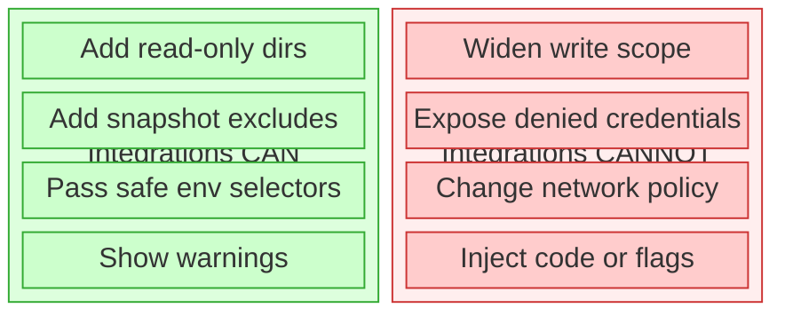
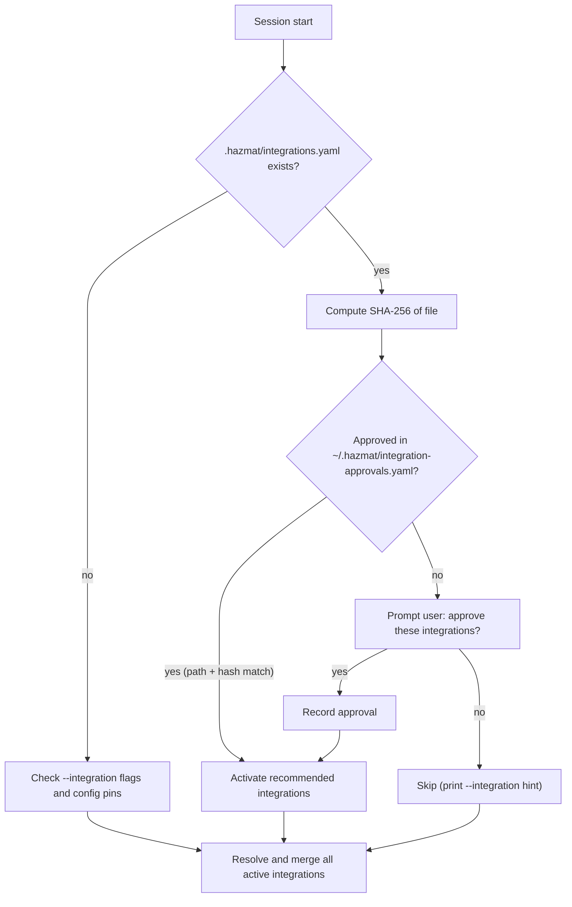

# Session Integrations

Session integrations are optional ergonomics overlays for common technology
stacks. They let Hazmat carry a small amount of stack-specific convenience
into a session without weakening the containment model.

`hazmat integration` is the command surface for this feature.

## What Integrations Can Do

- Add read-only directories that are useful for a stack, such as toolchains or caches
- Add snapshot exclude patterns for reproducible build artifacts
- Pass through a small safe set of environment selectors and path pointers from the invoker environment
- Show warnings or suggested commands for the stack

## What Integrations Cannot Do

- Widen project write scope
- Bypass the seatbelt credential deny list
- Change network policy
- Inject arbitrary flags or preload-style environment variables
- Reconfigure Claude/OpenCode runtime settings



This is the core design rule: integrations may reduce friction, but they may not
weaken Hazmat's trust boundary.

## Inspecting Integrations

```bash
hazmat integration list
hazmat integration show node
```

`hazmat integration list` shows built-in integrations, user-installed manifests under
`~/.hazmat/integrations/`, and any project pinning currently configured.

`hazmat integration show <name>` shows the integration's detect files,
read-only paths, env passthrough keys, snapshot excludes, warnings, and
command hints.

## Activating Integrations

Activate an integration for a single session:

```bash
hazmat claude --integration node
hazmat opencode --integration go
hazmat shell --integration rust
hazmat exec --integration python-poetry -- poetry run pytest
hazmat exec --integration python-uv -- uv run pytest
```

If no integrations are active, Hazmat may suggest built-in integrations based
on files in the project tree, such as `go.mod`, a nested `frontend/package.json`,
or `tla/MC_*.cfg`.

## Explicit Project Access Extensions

Integrations are not the only way to shape a session. If you need additional
directories, declare them directly:

```bash
hazmat claude -R ~/reference-docs
hazmat claude -W ~/.venvs/my-app
hazmat config access add -C ~/workspace/my-app --read ~/reference-docs --write ~/.venvs/my-app
hazmat config access remove -C ~/workspace/my-app --write ~/.venvs/my-app
```

Use this path-based access model when the directory is specific to your
machine, writable, or too environment-specific to belong in a reusable
integration.

## Project Pinning

Pin integrations so they auto-activate for a specific project:

```bash
hazmat config set integrations.pin "~/workspace/my-app:node,go"
hazmat config set integrations.unpin ~/workspace/my-app
```

Hazmat canonicalizes the project path (`Abs` + `EvalSymlinks`) before storing
the pin. At session start, the session's project path is resolved the same way
and compared for exact equality. This means `~/workspace/my-app` and
`/Users/dr/workspace/my-app` both resolve to the same canonical pin. Re-running
`integrations.pin` for the same project replaces the existing pin set.

## Built-In Integrations

| Integration | Detects | Read dirs | Env passthrough | Snapshot excludes |
|------|---------|-----------|-----------------|-------------------|
| `go` | `go.mod` | — | `GOPATH`, `GOPROXY`, `GOPRIVATE`, `CGO_ENABLED` | `vendor/` |
| `node` | `package.json` | `/opt/homebrew/lib/node_modules` | `NODE_ENV` | `node_modules/`, `.next/`, `.turbo/`, `.nuxt/`, `out/`, `.vercel/` |
| `python-poetry` | `poetry.lock` | `~/.local/share/pypoetry` | `VIRTUAL_ENV` | `.venv/`, `__pycache__/`, `.pytest_cache/`, `.mypy_cache/`, `.ruff_cache/`, `*.pyc`, `dist/`, `*.egg-info/` |
| `python-uv` | `uv.lock` | `~/.local/share/uv` | `VIRTUAL_ENV` | `.venv/`, `__pycache__/`, `.pytest_cache/`, `.mypy_cache/`, `.ruff_cache/`, `*.pyc`, `dist/`, `*.egg-info/` |
| `rust` | `Cargo.toml` | `~/.cargo/registry`, `~/.rustup/toolchains` | `RUSTUP_HOME`, `CARGO_HOME`, `CARGO_TARGET_DIR` | `target/` |
| `terraform-plan` | `main.tf`, `terraform.tf` | — | — | `.terraform/`, `*.tfstate`, `*.tfstate.backup` |
| `tla-java` | `MC_*.cfg` files | `/opt/homebrew/opt/openjdk`, `/Library/Java` | `JAVA_HOME` | `tla/states/`, `*.dot` |

Integrations influence three parts of session setup:

1. **Read-only access** — toolchain and cache directories
2. **Pre-session snapshot excludes** — reproducible build artifacts
3. **Safe environment passthrough** — passive selectors from the invoker's environment

Hazmat prints integration-derived paths, snapshot excludes, registry redirect
keys, and warnings at session start so the behavior stays visible.

## Safe Environment Passthrough

Integrations may only request env keys from Hazmat's allowlist. The intent is to allow
passive selectors and path pointers, not code-injection knobs.

Examples of allowed keys:

- `GOPATH`
- `GOPROXY`
- `RUSTUP_HOME`
- `CARGO_HOME`
- `VIRTUAL_ENV`
- `JAVA_HOME`

Examples of intentionally forbidden keys:

- `NODE_OPTIONS`
- `PYTHONPATH`
- `GOFLAGS`
- `LD_PRELOAD`
- `DYLD_INSERT_LIBRARIES`
- credential variables such as `AWS_ACCESS_KEY_ID` or `GITHUB_TOKEN`

Registry redirect keys like `GOPROXY` and `NPM_CONFIG_REGISTRY` are allowed but
surfaced explicitly at session start because they change where downloads come
from.

## Repo-Recommended Integrations

A repo can declare which integrations it needs in `.hazmat/integrations.yaml`:

```yaml
integrations:
  - go
  - tla-java
```

This file is pure data: a list of existing integration names. No inline
definitions, no custom paths, no env keys, no executable hooks.

**Repo owns intent; host owns trust.** Hazmat reads the file as a hint, not
authority.



On first encounter, it prompts:

```
hazmat: this repo recommends integrations: go, tla-java
hazmat: source: /Users/dr/workspace/hazmat/.hazmat/integrations.yaml
hazmat: approve these integrations for this repo? [y/N]
```

Approval is stored outside the repo in `~/.hazmat/integration-approvals.yaml`, keyed by
canonical project path + SHA-256 of the file contents:

- Same repo + same file = no prompt (approved)
- File changes (integration added or removed) = re-approve
- Repo cloned to a different path = re-approve

If the user declines, integrations are not activated. They can still use `--integration`
manually.

## For Project Maintainers

To recommend integrations for your repo, add `.hazmat/integrations.yaml`:

```yaml
integrations:
  - python-uv
  - go
  - node
  - tla-java
```

The file only lists names of existing built-in or user-installed manifests. It
cannot define custom paths, env vars, or any session config inline.

Tell your contributors which integrations the repo needs, and note any prerequisites
(runtimes, tools) in the project README. When a contributor runs `hazmat claude`
for the first time, they'll see the approval prompt with the exact integration list.

If your project needs an integration that doesn't exist as a built-in,
contributors can create a matching user manifest on their machines (see
below). The `.hazmat/integrations.yaml` should still reference the integration name
— it resolves through the same loader.

## User Manifests

User-installed manifests live in:

```text
~/.hazmat/integrations/<name>.yaml
```

Hazmat resolves names by checking built-ins first, then user manifests. This
means you can extend or replace a built-in by creating a user manifest with
the same name, or create entirely new integrations for stacks that Hazmat
doesn't ship.

### When to create a user manifest

- A built-in integration is close but your environment differs (e.g., SDKMAN Java
  instead of Homebrew, or a custom Cargo registry)
- Your project uses a stack that has no built-in integration
- You need read-only access to a toolchain path specific to your machine

### Writing a user manifest

An integration manifest is YAML with strict field validation. Unknown fields are
rejected at load time.

```yaml
integration:
  name: java-sdkman
  version: 1
  description: Java via SDKMAN (instead of Homebrew)

detect:
  files: [pom.xml, build.gradle]

session:
  read_dirs:
    - ~/.sdkman/candidates/java
  env_passthrough: [JAVA_HOME]

backup:
  excludes:
    - .gradle/
    - build/
    - target/
    - "*.class"

warnings:
  - "Using SDKMAN Java. Ensure JAVA_HOME points to the correct version."

commands:
  build: ./gradlew build
  test: ./gradlew test
```

**Fields reference:**

| Field | Required | Description |
|-------|----------|-------------|
| `integration.name` | yes | Lowercase alphanumeric + hyphens |
| `integration.version` | yes | Must be `1` |
| `integration.description` | no | One-line description |
| `detect.files` | no | Filenames (no paths) that suggest this integration |
| `session.read_dirs` | no | Paths added read-only (`~` expands to invoker home) |
| `session.env_passthrough` | no | Env var names from the safe allowlist only |
| `backup.excludes` | no | Glob patterns for snapshot exclusion |
| `warnings` | no | Messages shown at session start |
| `commands` | no | Name-to-command hints (informational, not executed) |

**Validation rules:**

- Read-only paths are canonicalized (`Abs` + `EvalSymlinks`) and checked
  against the credential deny list. Paths that resolve to `~/.ssh`, `~/.aws`,
  or other denied zones are rejected.
- Env passthrough keys must be in the safe set (passive pointers like `GOPATH`,
  `JAVA_HOME`, `VIRTUAL_ENV`). Keys that accept arbitrary flags or preload code
  (`NODE_OPTIONS`, `PYTHONPATH`, `GOFLAGS`, `LD_PRELOAD`) are rejected.
- No negation in exclude patterns.
- Manifest size limit: 8KB.

If any validation fails, hazmat rejects the entire manifest rather than partially
applying it.

### Combining multiple integrations

Activate multiple integrations in one session:

```bash
hazmat claude --integration node --integration python-uv
```

Or pin a combination:

```bash
hazmat config set integrations.pin "~/workspace/fullstack:node,python-uv"
```

Integrations merge additively. Read dirs, excludes, env passthrough, and warnings are
unioned and deduplicated. If two integrations add the same read dir or exclude, it
appears once.

## Validation And Expansion Matrix

The table below is the current public-repo comparison matrix for Hazmat session
integrations. It serves two purposes:

- regression-test built-in integrations against repos we realistically expect users to bring
- choose the next integrations to add based on popular, active repos with clear Homebrew-backed toolchains

This is a point-in-time prioritization snapshot as of April 4, 2026. Repo
layouts, popularity, and Homebrew formula availability change over time, so
refresh the list periodically rather than treating it as permanent truth.

### Current built-ins: regression targets

| Repo | Selection signal | Stack | Expected integration | Key markers | Relevant Homebrew formulas | Why this repo matters |
|------|------------------|-------|----------------------|-------------|----------------------------|-----------------------|
| [vercel/next.js](https://github.com/vercel/next.js) | flagship framework repo | Node / TypeScript | `node` | `package.json` | `node`, `pnpm` | Strong real-world Node target with `.next` output, package-manager wrappers, and modern frontend build behavior |
| [pydantic/pydantic-ai](https://github.com/pydantic/pydantic-ai) | active popular `uv` project | Python / uv | `python-uv` | `uv.lock` | `uv` | Good `uv` target for native containment because it exercises `uv run`, virtualenv resolution, and Python toolchain traversal |
| [python-poetry/poetry](https://github.com/python-poetry/poetry) | canonical Poetry repo | Python / Poetry | `python-poetry` | `poetry.lock` | `poetry` | Canonical Poetry repo for validating that Poetry-specific detection is neither too broad nor too narrow |
| [ollama/ollama](https://github.com/ollama/ollama) | very high-traffic Go target | Go | `go` | `go.mod` | `go` | High-signal Go target with enough popularity and activity to catch resolver and cache assumptions early |
| [astral-sh/ruff](https://github.com/astral-sh/ruff) | popular fast-moving Rust repo | Rust | `rust` | `Cargo.toml` | none required beyond local Rust toolchain | Fast, popular Rust repo for repeated detection and native-session smoke tests |
| [terraform-aws-modules/terraform-aws-vpc](https://github.com/terraform-aws-modules/terraform-aws-vpc) | common Terraform module shape | Terraform / HCL | `terraform-plan` | `*.tf` | `terraform` or `opentofu` | Useful real Terraform-module shape for detection and no-surprises session contract checks, even when full plan/apply requires external credentials |
| [Hazmat itself](https://github.com/dredozubov/hazmat) | always-available self-host target | Go + TLA+ | `go`, `tla-java` | `go.mod`, `MC_*.cfg` | `go`, `openjdk` | Self-hosting target that should always stay green because it validates the exact contract Hazmat advertises |

Suggested smoke-test commands per row:

- `vercel/next.js`: dependency install + `next build`
- `pydantic/pydantic-ai`: `uv run pytest ...`
- `python-poetry/poetry`: `poetry run pytest ...`
- `ollama/ollama`: `go test ./...`
- `astral-sh/ruff`: `cargo test` or a narrower crate-level check
- Terraform modules: detection + formatter/validate paths first, full plan only with intentionally provided local credentials

### Expansion targets: widen the integration surface

| Repo | Selection signal | Candidate stack | Likely markers | Relevant Homebrew formulas | Why this repo matters | Follow-up |
|------|------------------|-----------------|----------------|----------------------------|-----------------------|-----------|
| [jgm/pandoc](https://github.com/jgm/pandoc) | canonical Haskell target | Haskell / Cabal | `*.cabal`, `cabal.project` | `ghc`, `cabal-install`, `pandoc` | Canonical Haskell repo with broad community usage and a clear Cabal workflow | `sandboxing-gw2` |
| [PostgREST/postgrest](https://github.com/PostgREST/postgrest) | popular Haskell service | Haskell service | `*.cabal`, `cabal.project` | `ghc`, `cabal-install`, `postgrest`, `libpq` | Strong Haskell service target that also pressures future service-aware local workflows | `sandboxing-gw2` |
| [koalaman/shellcheck](https://github.com/koalaman/shellcheck) | popular Haskell CLI | Haskell / Cabal | `*.cabal` | `ghc`, `cabal-install`, `shellcheck` | Smaller Haskell CLI target for faster iteration than Pandoc or PostgREST | `sandboxing-gw2` |
| [hadolint/hadolint](https://github.com/hadolint/hadolint) | widely used Haskell linter | Haskell / Cabal | `*.cabal` | `ghc`, `cabal-install`, `hadolint` | Another Haskell CLI shape with a distinct packaging footprint | `sandboxing-gw2` |
| [spring-projects/spring-boot](https://github.com/spring-projects/spring-boot) | flagship Java framework | Java / Gradle | `build.gradle`, `build.gradle.kts`, `settings.gradle` | `openjdk`, `gradle` | Best high-signal Java repo for a future Gradle-oriented integration | `sandboxing-8j7` |
| [gradle/gradle](https://github.com/gradle/gradle) | canonical Gradle repo | Java / Gradle | `build.gradle.kts`, `settings.gradle.kts` | `openjdk`, `gradle` | Good second Java target because it is the build tool itself, not just an app using it | `sandboxing-8j7` |
| [rails/rails](https://github.com/rails/rails) | flagship Ruby framework | Ruby / Bundler | `Gemfile`, `Gemfile.lock` | `ruby` | Canonical Bundler repo and the right anchor for a future Ruby integration | `sandboxing-bm3` |
| [phoenixframework/phoenix](https://github.com/phoenixframework/phoenix) | flagship Elixir framework | Elixir / Mix | `mix.exs`, `mix.lock` | `elixir`, `erlang` | Canonical Phoenix target for a future Elixir/Mix integration | `sandboxing-6sl` |
| [opentofu/opentofu](https://github.com/opentofu/opentofu) | current Homebrew-friendly IaC tool | OpenTofu / IaC | `*.tf` plus repo-owned OpenTofu workflow files | `opentofu` | Important because Homebrew core has a current `opentofu` formula while `terraform` is frozen at 1.5.7 | `sandboxing-48p` |
| [tlaplus/Examples](https://github.com/tlaplus/Examples) | canonical public TLA+ corpus | TLA+ corpus | generic `*.cfg` files, `.tla` specs | `openjdk` | Canonical public TLA+ corpus that exposes the current `MC_*.cfg` detection bias | `sandboxing-qt8` |

### Follow-up Work Seeded By This Matrix

The matrix above generated these concrete backlog items:

- `sandboxing-gw2` — implement a Haskell/Cabal integration and validate it against Pandoc, PostgREST, ShellCheck, and Hadolint
- `sandboxing-8j7` — implement Java build integrations for Gradle and Maven-style repos
- `sandboxing-bm3` — implement a Ruby/Bundler integration for Rails-style repos
- `sandboxing-6sl` — implement an Elixir/Mix integration for Phoenix-style repos
- `sandboxing-48p` — add an OpenTofu-aware IaC integration path alongside or instead of Terraform-only assumptions
- `sandboxing-qt8` — broaden TLA+ auto-detection so `tlaplus/Examples`-style repos are suggested correctly

Known adjacent work:

- `sandboxing-5nk` already tracks optional Bun bootstrap for Node repos that advertise Bun-specific workflows
- the research tasks under `sandboxing-06s`, `sandboxing-8ji`, and `sandboxing-nwz` remain useful inputs, but the follow-up issues above are the implementation-oriented slices to prefer next

## Self-Hosting: Developing Hazmat Under Hazmat

Hazmat's own repo includes `.hazmat/integrations.yaml` recommending `go` and
`tla-java`. On first `hazmat claude` in this repo, approve the recommended
integrations and the session gets Go toolchain support plus Java paths for TLC model
checking.

Prerequisites:
- Go installed locally
- Java 17+ installed locally (Homebrew: `brew install openjdk`)
- `~/workspace/tla2tools.jar` downloaded (see `tla/VERIFIED.md`)
- `~/workspace` as the sole entry in `session.read_dirs`

## Further Reading

- [design-assumptions.md](design-assumptions.md) — credential storage zones, integration trust model, approval trust boundaries
- [threat-matrix.md](threat-matrix.md) — footnotes 9 and 10 cover repo recommendation approval threat analysis
- [usage.md](usage.md) — daily workflow including integrations
- [overview.md](overview.md) — tier selection and where integrations fit in the containment model
