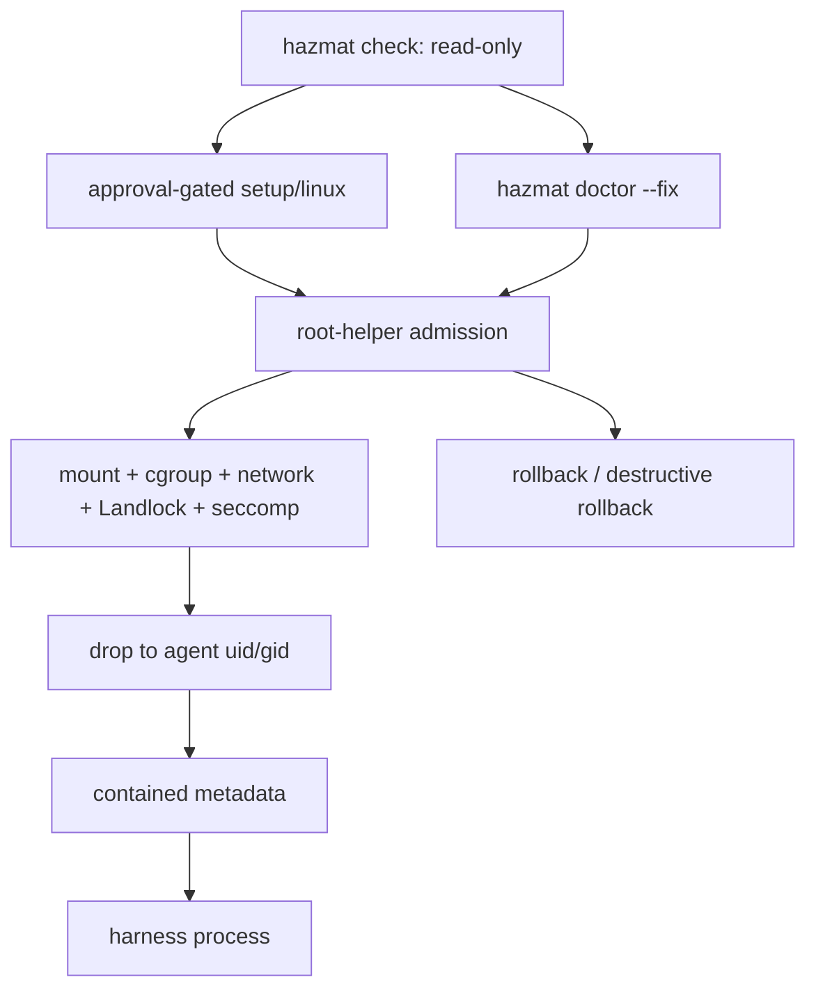

# Linux Agent-User VM Lifecycle Matrix

Status: pending execution. This document is the auditable manual lifecycle
matrix for `sandboxing-xuar.4.5`; it is not evidence that Linux agent-user
launch is supported. The lane remains `setup-required` until completed
transcripts satisfy every required row below.

Design sources:

- [Reusable Runtime Core And Experimental User Isolation Design](plans/2026-06-27-reusable-runtime-core-user-isolation-design.md)
- [Linux Support Two-Lane Design](plans/2026-06-27-linux-support-two-lane-design.md)
- [Linux Run-Agent Readiness Gates](plans/2026-06-13-linux-run-agent-readiness-gates.md)
- [TLA+ verified ledger](../tla/VERIFIED.md)

## Scope

This matrix covers only the agent-user Linux lane:

- `linux.identity=agent-user`
- `linux.helper_strategy=root-helper`
- persistent setup resources: agent user, shared group, agent home, workspace
  access, cgroup root, helper, sudoers, and managed policy roots
- no fallback to `current-user` or `rootless-userns`
- default rollback preserves the agent user/group/home; destructive rollback
  deletes only with explicit flags

The current-user Linux lane has a separate VM smoke matrix. Do not use that
matrix as evidence for this lane.

## Flow



The `contained` metadata event is valid only after helper validation,
descriptor closing, namespace/mount/cgroup/network enforcement, privilege drop,
`no_new_privs`, Landlock, and seccomp policy steps have completed.

## Required Hosts

Each host row needs a completed transcript before the lane can move beyond
`setup-required`.

| Row | Distro | Required evidence |
| --- | --- | --- |
| U1 | Ubuntu LTS | setup, doctor, run-agent, rollback, destructive rollback transcript |
| D1 | Debian stable | setup, doctor, run-agent, rollback, destructive rollback transcript |
| F1 | Fedora current | setup, doctor, run-agent, rollback, destructive rollback transcript |
| A1 | Arch current | setup, doctor, run-agent, rollback, destructive rollback transcript |
| X1 | unknown distro fixture | parser/report fixture proves unknown distro reports `linux.distro-unsupported` |

The current unknown-distro fixture evidence lives in
`hazmat/platform/linux/report_test.go` under
`TestInspectReportsAgentUserSetupAndStrategyGaps`. It is fixture evidence only;
it does not replace VM execution for known distros.

## Transcript Header

Every transcript must record these fields before scenario output:

| Field | Required value |
| --- | --- |
| Date | UTC date of the run |
| Commit | exact git commit under test |
| Runner | VM provider or CI runner name |
| Distro | `/etc/os-release` or `/usr/lib/os-release` ID and version fields |
| Kernel | `uname -srvmo` |
| Arch | `uname -m` |
| Invoking UID | host user running Hazmat |
| Agent UID/GID | dedicated agent account and shared group |
| Identity lane | `agent-user` |
| Helper strategy | `root-helper` |
| Helper | path, owner, mode, digest, version |
| Sudoers | exact managed rule or absent after rollback |
| Cgroup v2 | controller/delegation facts |
| Workspace access | managed ACL/group entries |
| Exact commands | every command run, with approval context when live/sudo-adjacent |
| Result | pass, fail, skipped, or gap with reason |

## Required Scenarios

Each known-distro VM transcript must include these scenarios.

| ID | Scenario | Required observation |
| --- | --- | --- |
| A1 | Fresh setup | creates only modeled Linux setup resources and records receipts |
| A2 | Idempotent setup | second setup converges without broadening authority |
| A3 | Drift diagnostics | default check is read-only; drift points to `hazmat doctor --fix`, with dry-run as preview |
| A4 | Helper admission | `agent-user` + `root-helper` admitted; `current-user` and `rootless-userns` are refused |
| A5 | Run metadata | metadata phases are `planned`, `launched`, `contained`, terminal; `contained` arrives after enforcement |
| A6 | Filesystem policy | project write succeeds, read-only write fails, credential deny read fails |
| A7 | Network policy | `network=none` is enforced before `contained` metadata |
| A8 | Cancellation cleanup | caller cancellation writes an atomic cancelled result and removes disposable sidecars |
| A9 | Default rollback | sudoers/helper/cgroup access is removed first; agent user/group/home/tool roots are preserved |
| A10 | Destructive rollback | user/group/home/tool deletion requires explicit flags and leaves no privileged residue |
| A11 | Unsupported host | missing cgroup/helper/setup/distro support returns typed gaps before side effects |

A1 through A10 require concrete Linux setup resources, a real root-helper, and
live rollback execution on the target host. Non-live unit, model, and
prepared-host runtime evidence must not be counted as lifecycle passes.

## Non-Live Evidence

These commands are useful preconditions, but they are not VM lifecycle evidence:

```bash
go test ./platform/linux ./containment/linux ./internal/runtime/linux
scripts/check-import-boundaries.sh
scripts/check-linux-compile.sh
scripts/check-linux-vm-matrix-transcript.sh --mode agent-user --run --skip-preflight
```

The `check-linux-vm-matrix-transcript.sh` command emits the required transcript
shape, host facts, capability facts, passive setup-resource facts, and explicit
pending A1-A11 rows. It is scaffolding for VM operators, not proof that setup,
helper-backed launch, rollback, or destructive rollback passed.

The current non-live evidence covers model-first setup ordering, diagnostics,
root-helper admission planning, structured gaps, fake-helper metadata handling,
resource-specific setup/rollback callbacks, Linux rollback command dispatch,
and no current-user fallback. It does not prove live account creation, sudoers,
cgroup delegation, helper install, or rollback on a Linux host.

Live setup, doctor repair, helper-backed launch, rollback, destructive
rollback, disposable VM lanes, and `hazmat check --full` are approval-gated in
this repository. Agents must ask for exact-command approval before running
them.

## Guarded Prepared-Host Harness

Inside a disposable Linux VM where agent-user setup resources already exist,
this approval-gated command runs prepared-host root-helper launch rows for A4,
A5, A6, A7, A8, and A11:

```bash
scripts/check-linux-agent-user-live-smoke.sh --run --i-understand-this-runs-linux-agent-user-live-smoke
```

This is runtime evidence only. It does not run setup, doctor repair, default
rollback, or destructive rollback, so A1, A2, A3, A9, and A10 still require
separate lifecycle transcripts before the lane can move beyond
`setup-required`.

## Guarded Disposable Lifecycle Harness

Inside a disposable Linux VM or disposable CI runner, this approval-gated
command runs the modeled setup graph, the prepared-host root-helper launch
smoke, default rollback, and destructive rollback:

```bash
scripts/check-linux-agent-user-lifecycle-smoke.sh --run --i-understand-this-runs-linux-agent-user-lifecycle-smoke
```

It records A1, A2, A3, A4, A5, A6, A7, A8, A9, A10, and A11 for the current
host. It uses sudo and removes the dedicated `agent` user, `dev` group,
`/home/agent`, root helper, sudoers entry, cgroup root, and Linux policy roots
during cleanup. Run it only on disposable hosts.

The Linux evidence workflow can collect a GitHub-hosted Ubuntu scaffold on
demand or on release tags:

```bash
gh workflow run linux-evidence.yml -f lane=agent-user-scaffold -f run_live=false
```

That artifact is useful for host facts and transcript shape only. It is not
agent-user lifecycle evidence until setup, doctor repair, root-helper launch,
default rollback, and destructive rollback run inside a disposable Linux VM.

The same workflow also has an explicit manual Ubuntu lifecycle lane:

```bash
gh workflow run linux-evidence.yml -f lane=agent-user-live -f run_live=false
```

That artifact can satisfy only the Ubuntu lifecycle row at the target commit.
It is not a substitute for Debian, Fedora, or Arch VM lifecycle transcripts.

## Pass Criteria

The Linux agent-user VM lifecycle matrix passes only when all of the following
are true:

- U1, D1, F1, and A1 have completed transcripts at the same commit or an
  explicitly compatible descendant commit.
- A1 through A11 pass on every known distro or produce a documented typed gap
  that keeps the release checklist at `setup-required`.
- X1 fixture evidence proves unknown distro facts stay explicit and
  conservative.
- The transcript records `linux.identity=agent-user` and
  `linux.helper_strategy=root-helper`; silent fallback or downgrade fails the
  matrix.
- `linuxSudoers` is created last during setup and removed first during
  rollback.
- `contained` metadata is emitted only after identity, cgroup, mount, network,
  Landlock, and seccomp enforcement complete.
- Default rollback preserves data-bearing agent resources; destructive
  rollback deletes them only under explicit flags.
- Support claim remains `setup-required` until every row passes.

## Transcript Template

Use this shape for each sanitized transcript:

```text
Linux agent-user VM lifecycle transcript
Date:
Commit:
Runner:
Distro:
Kernel:
Arch:
Invoking UID:
Agent UID/GID:
linux.identity:
linux.helper_strategy:

Capability report:
- distro:
- cgroup v2:
- service manager:
- mount namespace:
- network namespace:
- Landlock:
- seccomp:

Setup resources:
- linuxAgentUser:
- linuxSharedGroup:
- linuxAgentHome:
- linuxWorkspaceAccess:
- linuxLaunchHelper:
- linuxSudoers:
- linuxCgroupRoot:
- linuxDistroProfile:
- linuxToolHome:

Commands:
1. <exact command>

Scenario results:
A1 fresh setup:
A2 idempotent setup:
A3 drift diagnostics:
A4 helper admission:
A5 run metadata:
A6 filesystem policy:
A7 network policy:
A8 cancellation cleanup:
A9 default rollback:
A10 destructive rollback:
A11 unsupported host:

Remaining gaps:
Support claim:
```

The `Support claim` field must remain `setup-required` unless the pass criteria
above are satisfied.
