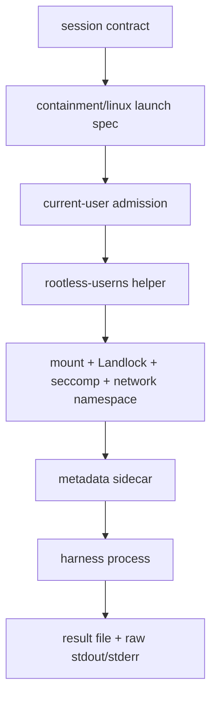

# Linux Current-User VM Smoke Matrix

Status: pending execution. This document is the auditable manual smoke matrix
for `sandboxing-xuar.3.5`; it is not evidence that Linux current-user launch is
supported. Linux native run-agent support remains experimental until completed
transcripts satisfy every required row below.

Design sources:

- [Reusable Runtime Core And Experimental User Isolation Design](plans/2026-06-27-reusable-runtime-core-user-isolation-design.md)
- [Linux Support Two-Lane Design](plans/2026-06-27-linux-support-two-lane-design.md)
- [Linux Run-Agent Readiness Gates](plans/2026-06-13-linux-run-agent-readiness-gates.md)
- [TLA+ verified ledger](../tla/VERIFIED.md)

## Scope

This matrix covers only the current-user Linux lane:

- `linux.identity=current-user`
- `linux.helper_strategy=rootless-userns`
- no persistent users, groups, sudoers, systemd units, helper installs, cgroup
  delegation, firewall rules, resolver changes, or rollback resources
- no claim of same-uid host-user identity isolation

The agent-user Linux lane has separate setup, rollback, lifecycle, and VM smoke
gates. Do not use this matrix as evidence for that lane.

## Flow



The `contained` metadata event is valid only after the namespace, mount,
network, no-new-privs, Landlock, and seccomp policy steps have completed.

## Required Hosts

Each host row needs a completed transcript before the lane can move beyond
experimental status.

| Row | Distro | Required evidence |
| --- | --- | --- |
| U1 | Ubuntu LTS | distro facts, kernel facts, capability report, scenario results |
| D1 | Debian stable | distro facts, kernel facts, capability report, scenario results |
| F1 | Fedora current | distro facts, kernel facts, capability report, scenario results |
| A1 | Arch current | distro facts, kernel facts, capability report, scenario results |
| X1 | unknown distro fixture | parser/report fixture proves unknown distro stays explicit and conservative |

The current unknown-distro fixture evidence lives in
`hazmat/platform/linux/report_test.go` under `TestInspectReportsDistroVariants`.
It is fixture evidence only; it does not replace VM execution for known distros.

## Transcript Header

Every transcript must record these fields before scenario output:

| Field | Required value |
| --- | --- |
| Date | UTC date of the run |
| Commit | exact git commit under test |
| Runner | VM provider or CI runner name |
| Distro | `/etc/os-release` or `/usr/lib/os-release` ID and version fields |
| Kernel | `uname -srvmo` |
| Arch | `uname -m` |
| UID mode | invoking uid, no dedicated agent user |
| Identity lane | `current-user` |
| Helper strategy | `rootless-userns` |
| User namespace | available/unavailable plus source |
| Mount namespace | available/unavailable plus source |
| Network namespace | available/unavailable plus source |
| Landlock | available/unavailable plus source |
| Seccomp | available/unavailable plus source |
| Cgroup v2 | available/unavailable plus source |
| Exact commands | every command run, with approval context when live/sudo-adjacent |
| Result | pass, fail, skipped, or gap with reason |

## Required Scenarios

Each known-distro VM transcript must include these scenarios.

| ID | Scenario | Required observation |
| --- | --- | --- |
| S1 | Project write | writes inside the declared project grant succeed |
| S2 | Read-only denial | writes under a read-only grant fail closed |
| S3 | Credential denial | reads under credential deny roots fail closed |
| S4 | `network=none` | network namespace is enforced before `contained` metadata |
| S5 | Cancellation cleanup | caller cancellation writes an atomic cancelled result and removes disposable sidecar state |
| S6 | Missing primitive | unavailable userns, mount ns, Landlock, seccomp, or netns returns a typed gap before side effects |
| S7 | Raw streams | raw stdout/stderr contain harness bytes only; helper diagnostics stay out of raw stdout |

S1 through S7 require the current-user runner plus VM-smoke-proven Linux kernel
enforcement. Until namespace, mount, Landlock, seccomp, and exec handoff pass on
a real Linux host, transcripts must mark those rows as failed or skipped with a
typed reason; they must not be counted as smoke passes.

## Non-Live Evidence

These commands are useful preconditions, but they are not VM smoke evidence:

```bash
go test ./platform/linux ./containment/linux ./internal/runtime/linux
scripts/check-linux-compile.sh
scripts/check-linux-vm-matrix-transcript.sh --mode current-user --run --skip-preflight
scripts/check-linux-apple-container-smoke.sh --check-packages
scripts/check-linux-apple-container-smoke.sh --compile-tests
```

The `check-linux-vm-matrix-transcript.sh` command emits the required transcript
shape, host facts, capability facts, and explicit pending S1-S7 rows. It is
scaffolding for VM operators, not proof that those scenarios passed.

The Apple Container live modes, disposable VM lanes, `hazmat check --full`, and
real helper-backed launches are approval-gated in this repository. Agents must
ask for exact-command approval before running them.

## Guarded Live Harness

Inside a disposable Linux VM, this approval-gated command runs S1-S7 through
fresh child test processes so namespace, mount, Landlock, and seccomp mutations
do not leak back into the test parent:

```bash
scripts/check-linux-current-user-live-smoke.sh --run --i-understand-this-runs-linux-current-user-live-smoke
```

The harness records passes and typed gaps, but it does not promote support by
itself. The matrix still requires Ubuntu, Debian, Fedora, and Arch transcripts
at the target commit before `linux-current-user` can move beyond experimental.

GitHub-hosted Ubuntu evidence can be collected on demand or on release tags via
the Linux evidence workflow:

```bash
gh workflow run linux-evidence.yml -f lane=current-user -f run_live=true
```

That workflow uploads `linux-current-user-ubuntu-evidence`. It can satisfy the
Ubuntu current-user row when the transcript passes at the target commit, but it
does not replace Debian, Fedora, or Arch VM evidence.

Supplemental Debian, Fedora, and Arch container transcripts can be collected on
demand via the same workflow:

```bash
gh workflow run linux-evidence.yml -f lane=distro-container -f run_live=false
```

That workflow uploads `linux-distro-container-{debian,fedora,arch}-evidence`.
Those artifacts are useful for package-manager, distro-fact, transcript-shape,
and live-run drift checks, but they are CI/container evidence only. They do not
replace the D1, F1, or A1 disposable VM transcript rows.

## Pass Criteria

The Linux current-user VM smoke matrix passes only when all of the following
are true:

- U1, D1, F1, and A1 have completed transcripts at the same commit or an
  explicitly compatible descendant commit.
- S1 through S7 pass on every known distro or produce a documented typed gap
  that the release checklist keeps experimental.
- X1 fixture evidence proves unknown distro facts stay explicit and
  conservative.
- The transcript records `linux.identity=current-user` and
  `linux.helper_strategy=rootless-userns`; silent fallback or downgrade fails
  the matrix.
- `network=default` makes no egress-filtering claim, and `network=none` is
  enforced before `contained` metadata.
- No persistent setup resources are created by the current-user lane.

## Transcript Template

Use this shape for each sanitized transcript:

```text
Linux current-user VM smoke transcript
Date:
Commit:
Runner:
Distro:
Kernel:
Arch:
UID mode:
linux.identity:
linux.helper_strategy:

Capability report:
- user namespace:
- mount namespace:
- network namespace:
- Landlock:
- seccomp:
- cgroup v2:

Commands:
1. <exact command>

Scenario results:
S1 project write:
S2 read-only denial:
S3 credential denial:
S4 network none:
S5 cancellation cleanup:
S6 missing primitive:
S7 raw streams:

Remaining gaps:
Support claim:
```

The `Support claim` field must remain `experimental` unless the pass criteria
above are satisfied.
