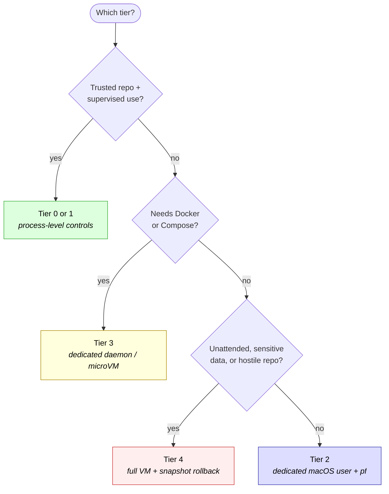

# Overview: Sandboxing Claude Code Auto Mode on macOS

Use this file to answer three questions quickly:

1. Which boundary should I choose?
2. Why does Docker change the answer?
3. Which deeper doc should I read next?

## The Core Problem

Claude Code in auto mode (`--dangerously-skip-permissions`) bypasses all interactive permission checks. A single prompt injection, malicious repository file, compromised MCP server, or bad dependency can execute shell commands and make network calls with the privileges of whatever environment Claude is running in.

The point of sandboxing is not to make the agent "behave." It is to limit the blast radius when it does not.

## Recommended Defaults

| Situation | Recommended tier | Why |
|-----------|------------------|-----|
| Trusted repo, interactive use, low stakes | Tier 0 or Tier 1 | Lowest friction; enough when you are watching closely |
| Need strong isolation without a VM and the repo does not need Docker | Tier 2 | Separate macOS user gives the biggest jump in blast-radius reduction |
| Repo needs `docker build`, `docker run`, or `docker compose` | Tier 3 | Docker changes the boundary question; use a dedicated daemon or microVM |
| Unfamiliar repo, heavy autonomy, or sensitive environment | Tier 4 | Full VM plus rollback is the strongest practical answer |

## Risk Surface Layers

Think about the design in layers. Each tier covers some layers better than others.

### 1. Project and Agent Runtime Surface

This is the immediate surface: repo files, `CLAUDE.md`, hidden prompts in documents, hooks, local tooling, and shell execution. Tier 0 and Tier 1 mainly operate here.

### 2. User and Credential Surface

This is everything reachable from the user account running the agent: `~/.ssh`, `~/.aws`, `~/.claude`, shell config, Keychain-adjacent paths, and browser/session material. Tier 2 is the first tier that changes this meaningfully by switching to a different macOS user.

### 3. Network and Localhost Surface

This is outbound exfiltration, localhost service abuse, and what the agent can reach on the LAN or internet. `pf`, proxying, deny-by-default networking, and isolated networks all matter here.

### 4. Privileged Helper and Daemon Surface

This includes Docker daemons, host services, shared sockets, hypervisors, and anything else that lets the agent ask a more privileged component to act on its behalf. This is why Docker is not just "another binary." If a project needs Docker, the design should usually move from Tier 2 to Tier 3.

### 5. Persistence and Recovery Surface

This is what happens after compromise: modified shell rc files, LaunchAgents, poisoned caches, resource exhaustion, and whether you have a clean rollback path. Tier 4 is strongest here because snapshots make recovery predictable.

For the attack-by-attack view, read [threat-matrix.md](threat-matrix.md). For concrete incidents that motivated these layers, read [incidents-and-cves.md](research/incidents-and-cves.md).

## Tier Summary

| Tier | Main boundary | Strengths | Main gaps | Best fit |
|------|---------------|-----------|-----------|----------|
| **0** | Claude Code built-in `/sandbox` | Minimal setup, native speed | Not a strong security boundary | Trusted repos, supervised work |
| **1** | Seatbelt wrapper around Claude | Better filesystem and network policy control | Still same macOS user; limited against broader host exposure | Trusted repos with a bit more rigor |
| **2** | Dedicated macOS user + `pf` + host-side wrappers | Strong no-VM blast-radius reduction; separate home and configs | Docker is intentionally blocked; container traffic is a different surface | Daily development on non-Docker projects |
| **3** | Docker Sandboxes / private daemon / devcontainer | Best balance when Docker is required; can keep same-path workflow | Still need good network policy, version hygiene, and Compose hardening | Docker-heavy repos and medium-to-high risk work |
| **4** | Full VM | Strongest isolation and recovery story | Highest operational overhead | Untrusted repos, long autonomy, sensitive environments |

## Why Docker Changes the Decision

Docker is a separate design branch because a shared daemon is effectively a privileged helper. If the agent can reach a Docker daemon that is not exclusively its own, it can often create containers with bind mounts, privileged flags, or other settings that bypass the intended boundary.

That produces two practical rules:

- Tier 2 is the right default only when the project does not need Docker.
- If the project needs Docker or Compose, move to Tier 3 and give the agent its own daemon or microVM rather than punching a hole to the host daemon.

Read [tier3-docker-sandboxes.md](tier3-docker-sandboxes.md) for the Docker-specific design rules.

## Decision Flow

1. Is the repo trusted and are you supervising closely?
   If yes, Tier 0 or Tier 1 may be enough.
2. Does the repo need Docker, Docker Compose, or a devcontainer workflow?
   If yes, skip Tier 2 and go to Tier 3.
3. Do you want the strongest non-VM boundary for normal development?
   Use Tier 2.
4. Are you running unattended, handling sensitive data, or working with hostile repos?
   Use Tier 4.

## Dedicated-User UX Note

For the dedicated-user setup in [setup-option-a.md](setup-option-a.md), the key UX improvement is the host-side command surface:

- `claude-hazmat` launches Claude directly in the sandbox
- `agent-shell` opens an interactive sandboxed shell
- `agent-exec` runs one-off tools like `make`, `npx`, `uv`, and `uvx`

That preserves the boundary without forcing the user to live inside `sudo -u agent -i`.

[Stack packs](stack-packs.md) provide per-stack session ergonomics (read-only toolchain paths, snapshot excludes, safe env passthrough) without weakening Tier 2's containment. Repos can recommend packs via `.hazmat/packs.yaml`; hazmat prompts once for approval.

## Claude Code Permission Modes

Claude Code has five permission modes, from most restrictive to most permissive:

| Mode | Behavior |
|------|----------|
| **Plan Mode** | Read-only. Claude can analyze but cannot modify anything. |
| **Normal Mode** | Default. Prompts for confirmation before every sensitive operation. |
| **Auto-accept Edits** | Auto-approves file read/write. Shell commands still require validation. |
| **Don't Ask Mode** | Auto-denies all tool usage unless pre-approved via `/permissions`. |
| **Bypass Mode** (`--dangerously-skip-permissions`) | Skips all permission checks. Everything runs without prompting. |

## What to Read Next

- Read [threat-matrix.md](threat-matrix.md) if you want the risk-by-risk comparison.
- Read [attack-surface-deep-dive.md](research/attack-surface-deep-dive.md) if you want the escape and exfiltration details.
- Read [incidents-and-cves.md](research/incidents-and-cves.md) if you want the real incidents and CVEs that justify the controls.
- Read [setup-option-a.md](setup-option-a.md) or [tier3-docker-sandboxes.md](tier3-docker-sandboxes.md) once you know which boundary you want.
