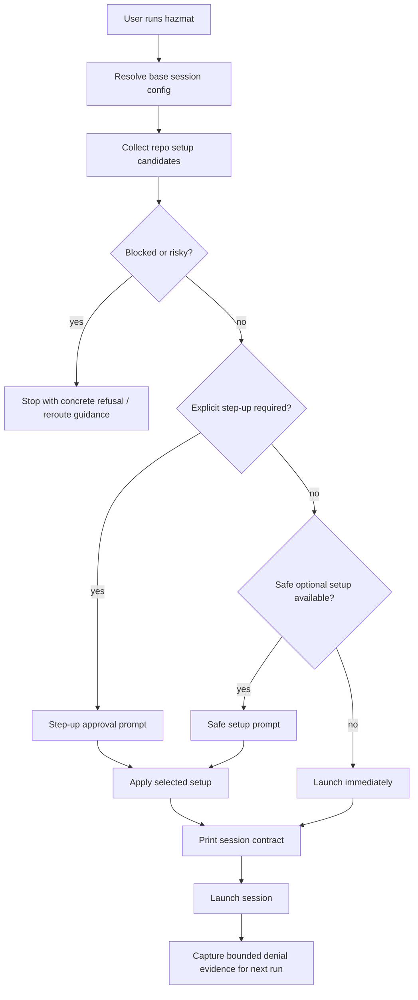

# Capability-First Repo Onboarding

**Status:** design draft for `sandboxing-xn9x`
**Date:** 2026-04-24

## Problem

Hazmat's current integration UX is correct in one important way: the effective
contract stays path-based and explicit. The weak point is coverage. A user
working in a language or toolchain Hazmat does not name explicitly can easily
get the impression that Hazmat "does not support" their repo, even when the
real missing piece is only a safe read-only path or a snapshot exclude.

Renaming integrations to capabilities does not solve that by itself. A
"read-only toolchain path detector" is still domain knowledge. If Hazmat ships
only a shallow set of named rules, the unsupported-stack problem remains.

The onboarding model should therefore combine two mechanisms:

1. **Generic heuristics plus named presets** for smooth first-run setup in
   common cases.
2. **Reactive recovery from real sandbox denials** so unknown stacks degrade
   into a guided approval flow rather than a dead end.

The user-facing model should be repo setup, not integration taxonomy. Hazmat
may still use named integrations internally as curated bundles of detectors,
resolvers, and hints, but the host approves concrete effects.

## Goals

- Make any repo feel launchable even when Hazmat has no first-class integration
  for its stack.
- Keep the trust boundary effect-based and explicit: exact read-only paths,
  exact write extensions, exact snapshot excludes, exact env selectors.
- Use one approval flow for generic heuristics, repo recommendations, named
  presets, and sandbox-denial recovery.
- Remember approved repo setup and re-prompt only when the meaningful setup
  shape changes.
- Preserve Hazmat's existing "no silent widening" contract.

## Non-Goals

- General package-manager introspection.
- Generic automatic write widening.
- Generic automatic credential passthrough.
- Turning every denied path into a permanent recommendation without
  normalization or review.
- Solving Linux capability bootstrapping in this design. This proposal is for
  the current macOS product surface.

## Recommended Model

Hazmat should treat repo onboarding as a host-owned **repo setup profile**
composed of concrete capability effects:

- read-only path grants
- snapshot exclude patterns
- passive env selectors
- explicit write grants
- explicit service access
- Docker routing decisions

The profile is produced from four inputs:

1. **Existing host config**
   manual `-R`, `-W`, `hazmat config access`, pinned integrations, and existing
   capability approvals.
2. **Repo-owned intent**
   current `.hazmat/integrations.yaml`, and any future repo-owned setup-hint
   file.
3. **Generic preflight heuristics**
   stack-agnostic probes such as "binary on PATH resolves outside the repo",
   "cache dir repeatedly used by a tool invoked from the repo", or "known
   reproducible artifact dir exists beside a lockfile."
4. **Reactive denial evidence**
   sandbox denials and launch-time failures that clearly indicate a missing
   safe capability.

Named integrations remain useful, but as acceleration. They should be one
possible source of candidate effects, not the user's required mental model.

## Capability Classes

Every candidate effect belongs to one of four classes:

### 1. Safe optional

These may be suggested inline during launch because they do not widen the core
trust boundary:

- read-only toolchain or cache paths
- snapshot excludes
- passive env selectors from Hazmat's allowlist

### 2. Explicit step-up

These change the authority of the session and therefore require a separate
approval decision:

- additional writable paths
- service access such as Git-over-SSH or GitHub capability
- Docker mode changes that cross backend boundaries

### 3. Blocked / risky

These are not "approvable setup"; they require a different operating mode or a
hard refusal:

- shared-daemon Docker workflows
- credentials visible inside the session contract
- unsupported backend combinations

### 4. Reactive recovery

This is not a separate authority class. It is the source of the suggestion.
Reactive recovery may produce either a safe optional offer or an explicit
step-up offer depending on the denied access.

## Detector Strategy

### A. Generic preflight heuristics

Hazmat should ship a small detector layer that is deliberately not tied to one
language name:

- host tool on PATH resolves to a canonical prefix outside the repo
- tool reads a stable cache or data dir under the invoking user's home
- repo markers imply a reproducible build-output dir that should be excluded
  from snapshots
- repo-owned Hazmat hint file recommends known effects

These should cover the common cases well enough that first launch is often
smooth, but they are not expected to cover every stack.

### B. Named presets

Existing built-in integrations remain as curated bundles of:

- project markers
- runtime resolvers
- Homebrew fallback rules
- warning text
- effect templates

This is the smoothness layer for well-understood stacks such as `node`,
`python-uv`, or `go`.

### C. Reactive denial recovery

After a strict or partially configured launch, Hazmat should inspect bounded
session denial evidence and convert qualifying denials into candidate effects
for the next run.

Candidate reactive inputs include:

- sandbox read denials for paths outside the approved contract
- launch-time runtime failures with high-confidence path evidence
- denied executable traversal into a known toolchain prefix

Reactive recovery is the universal fallback. It is what makes the unsupported
stack case feel like guided setup instead of "Hazmat does not know this repo."

## UX Flow

### Launch flow summary



### First launch: no candidates

Hazmat launches immediately and prints the normal session contract.

### First launch: safe optional setup available

Hazmat shows one compact prompt before the session contract:

```text
hazmat: repo setup available

This repo can launch now.
For smoother sessions, Hazmat can add:
  - 2 read-only toolchain paths
  - 1 read-only cache path
  - 3 snapshot excludes

These changes do not widen write access, expose credentials,
or change network policy.

1. Remember for this repo
2. Use once
3. Launch strict
4. Explain
```

Default interactive choice: `Remember for this repo`.
Default `--yes` choice: `Use once`.

### First launch: explicit step-up required

Hazmat separates this from the safe prompt:

```text
hazmat: additional approval required

This repo appears to need writable access to:
  - ~/.gradle

Hazmat will not add writable scope automatically.

1. Approve for this repo
2. Approve once
3. Launch without it
4. Explain
```

If both safe optional and explicit step-up candidates exist, show the step-up
prompt first. The safe prompt may follow only after the step-up decision is
resolved.

### Blocked / risky

Hazmat should refuse with an explicit route, not an approval-shaped prompt:

```text
hazmat: shared-daemon Docker workflow detected

This does not fit native containment safely.
Use a code-only session, Docker Sandbox when possible, or Tier 4.
```

### Reactive next-run recovery

If the previous launch produced qualifying denials, fold them into the same
prompt shape on the next run:

```text
hazmat: repo setup learned from the last session

Last run was denied read access to:
  - ~/.gradle/caches/modules-2

Hazmat can expose this path read-only for future sessions.

1. Remember for this repo
2. Use once
3. Keep strict
4. Explain
```

Reactive prompts should only appear when Hazmat can explain the denied path in
effect terms. Raw log spam is not user-facing UX.

## Explain Mode

`Explain` in any onboarding prompt should render:

- proposed effects grouped by class
- exact paths or env keys
- evidence source for each effect
  - repo hint
  - named preset
  - generic heuristic
  - prior denial
- whether the effect changes authority or only ergonomics

`hazmat explain` should grow the same sections so the CLI has one inspection
surface, not a separate hidden onboarding explanation path.

## State Transitions

For each canonical repo path, Hazmat maintains a host-owned profile state:

- `empty`
  no remembered repo setup
- `remembered`
  approved setup exists and matches current inputs
- `stale-safe-delta`
  current candidate set differs only by safe optional effects
- `stale-step-up-delta`
  current candidate set introduces or changes explicit step-up effects
- `blocked`
  current candidate set requires refusal or reroute

Transition rules:

1. `empty -> remembered`
   user chooses `Remember for this repo`
2. `empty -> empty`
   user chooses `Use once` or `Launch strict`
3. `remembered -> remembered`
   current effective profile hash matches stored approval hash
4. `remembered -> stale-safe-delta`
   safe-only candidate delta changes the effective profile
5. `remembered -> stale-step-up-delta`
   any explicit step-up delta changes the effective profile
6. `* -> blocked`
   blocked/risky condition detected
7. `stale-* -> remembered`
   user accepts updated remembered setup

If a previously approved effect disappears, Hazmat should silently shrink the
effective session and print a compact delta note. Shrinking authority does not
require re-approval.

## Persistence Model

Recommend a host-owned store separate from the general config file:

- path: `~/.hazmat/repo-profiles.yaml`
- keyed by canonical project path (`Abs` + `EvalSymlinks`), matching existing
  project pinning semantics

Suggested record shape:

```yaml
version: 1
repos:
  /Users/dr/workspace/my-app:
    approval_hash: "sha256:..."
    last_seen_hash: "sha256:..."
    remembered:
      read_only:
        - /Users/dr/.gradle
      snapshot_excludes:
        - build/
      env_selectors:
        - JAVA_HOME
      write:
        - /Users/dr/.m2
      services:
        - git+ssh
      docker_mode: none
    rejected_safe:
      - id: ro:/Users/dr/.cache/pip
    denial_evidence:
      - id: ro:/Users/dr/.gradle/caches/modules-2
        first_seen_at: 2026-04-24T12:00:00Z
        last_seen_at: 2026-04-24T12:05:00Z
        source: sandbox-denial
```

The store should persist three different concepts:

1. remembered approvals
2. explicit rejected safe suggestions
3. bounded denial evidence cache

Explicit step-up rejections should not be persisted as silent forever-deny
state. Hazmat should keep requiring an explicit decision when the repo still
needs that step-up.

## Profile Hash Semantics

Two hashes are needed.

### 1. `last_seen_hash`

Hash of the normalized candidate setup detected for the repo on this run,
before applying any remembered approval filter.

Purpose:

- detect candidate drift
- support "Explain what changed"
- decide whether to re-prompt

Inputs:

- normalized candidate effects, grouped by class
- source identifiers for repo-owned hint files and their content hash
- normalized reactive denial candidate ids
- profile format version

This hash must not include ephemeral launch details such as session IDs or
timestamps.

### 2. `approval_hash`

Hash of the normalized remembered effective setup after the user's decisions
have been applied.

Purpose:

- fast path for "using remembered repo setup"
- compact delta notes when the effective remembered setup changes

Inputs:

- remembered read-only effects
- remembered snapshot excludes
- remembered env selectors
- remembered write effects
- remembered services
- remembered Docker mode
- profile format version

Rules:

- Adding or removing a safe optional effect changes both hashes.
- Adding an explicit step-up effect changes `last_seen_hash`; it changes
  `approval_hash` only after approval.
- Removing an already-approved effect changes both hashes, but this should
  auto-apply as a shrink rather than trigger a blocking re-approval prompt.

## Non-Interactive Semantics

In non-interactive mode:

- remembered profile may be used automatically
- safe optional candidates without remembered approval must not be persisted
  automatically
- explicit step-up candidates must not be approved automatically
- blocked/risky conditions still fail closed

Suggested behavior:

- if remembered profile exists, apply it and continue
- else if only safe optional candidates exist, launch strict and print a note
- else if explicit step-up is required, fail with an actionable message

## Compatibility With Existing Integrations

This design does not remove `hazmat integration list/show` or
`--integration <name>`.

Instead it changes their role:

- `--integration` remains an expert override and debugging surface
- built-in integrations remain preset bundles of detection and resolution rules
- repo onboarding prompts foreground concrete effects, not preset names
- `.hazmat/integrations.yaml` continues to work as a repo-owned hint source

The user's mental model becomes "Hazmat remembers what this repo needs within a
fixed trust boundary," not "Hazmat has a named integration for my language."

## Implementation Slices

1. **Preflight classifier**
   collect candidate effects from heuristics, repo hints, existing presets, and
   prior denial evidence; classify them by authority level.
2. **Repo profile store**
   host-owned persistence for remembered approvals, rejected safe suggestions,
   denial evidence, and both hashes.
3. **Prompt and delta UX**
   implement safe prompt, step-up prompt, explain view, and remembered/delta
   summaries.
4. **Reactive denial ingestion**
   capture bounded denial evidence after a session and normalize it into future
   candidates.
5. **Existing integration migration**
   adapt current suggestion, pinning, and rejection flows to feed the repo
   profile model rather than standing alone.

## Open Questions

- Should repo-owned hints stay in `.hazmat/integrations.yaml` for v1 of this
  flow, or should Hazmat introduce a broader `.hazmat/session.yaml` once the
  effect model is stable?
- How aggressive should generic cache heuristics be before they become noisy?
- Should the denial-evidence cache be time-bounded or count-bounded, or both?
- Should `hazmat status -C <repo>` become the primary repo setup inspection
  surface, or should `hazmat explain` remain the main one?
