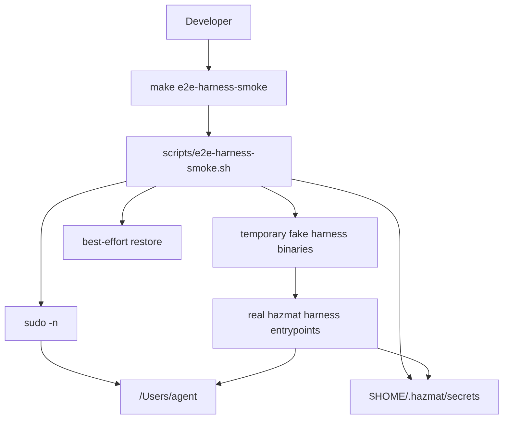
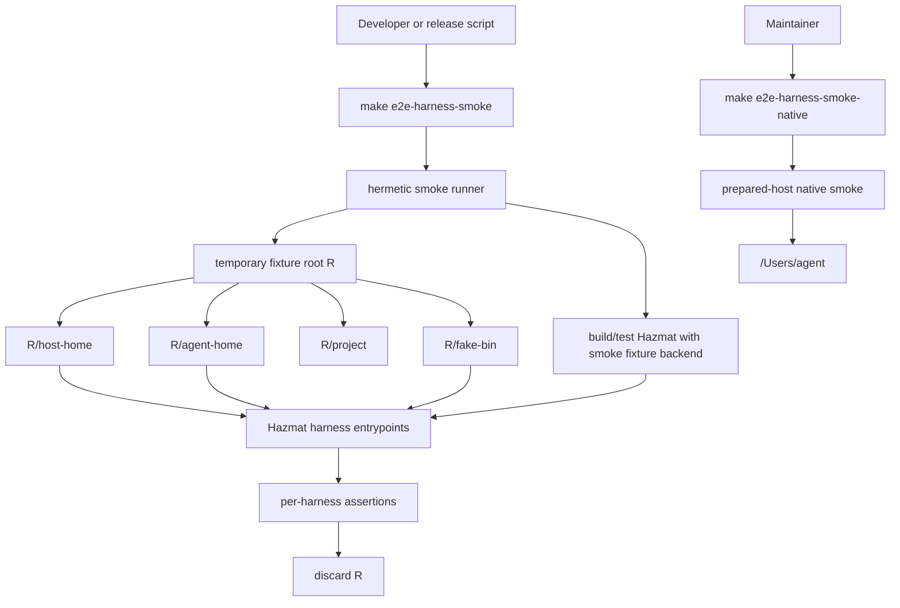
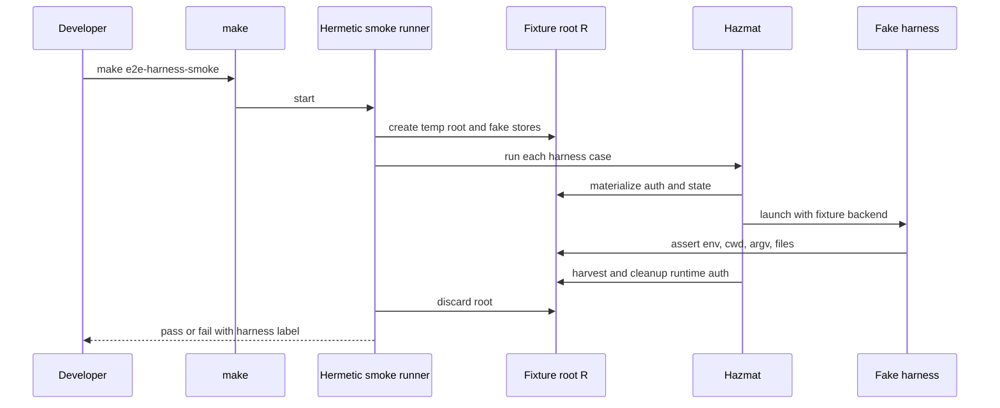
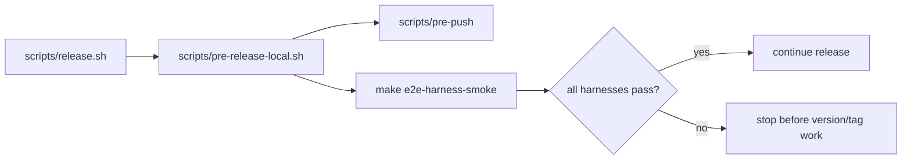
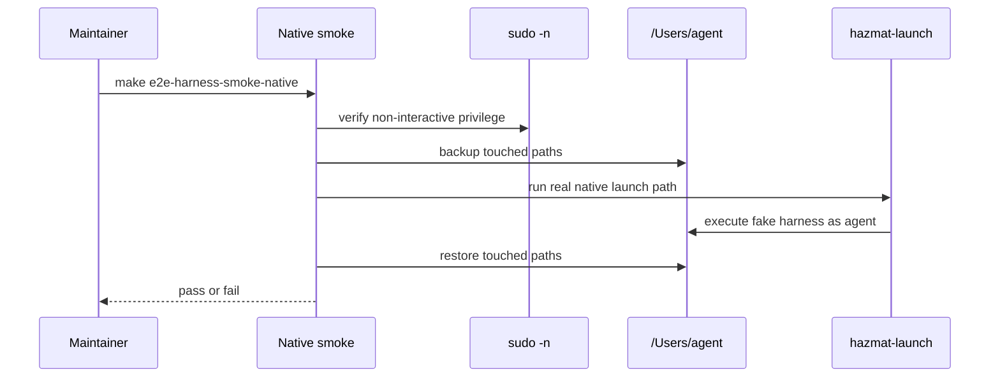
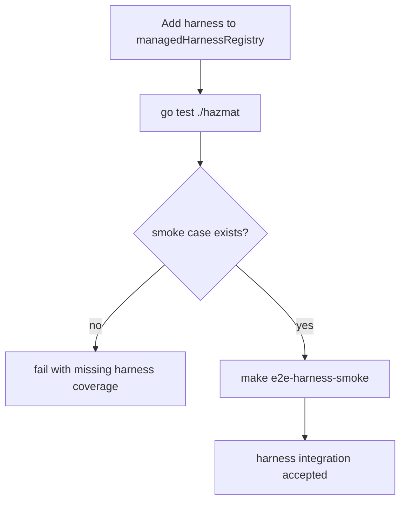
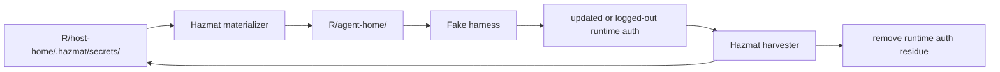
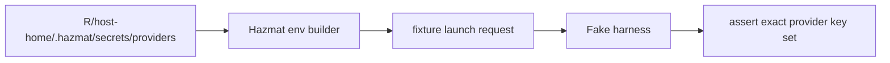
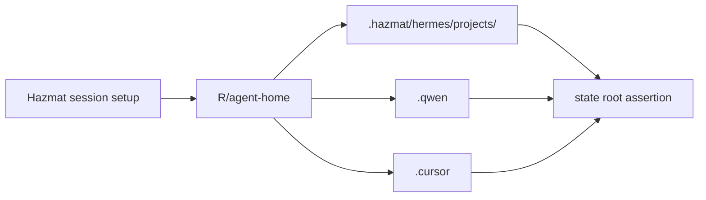

# Hermetic All-Harness Smoke Design

Status: Draft for audit
Date: 2026-06-01
Issue: sandboxing-v89x

## Purpose

The current all-harness smoke gives useful coverage, but it is a prepared-host
test. It requires a macOS host with `hazmat init` already applied, an `agent`
user, and non-interactive `sudo -n`. It also temporarily mutates `/Users/agent`
and restores the touched paths afterward.

That is the wrong default for the integration lane. The default smoke should be
hermetic: it should validate all managed harness plumbing without depending on
the developer host's sudo state, agent account, personal harness installs, or
real auth stores.

This design supersedes the operational shape in
`docs/plans/2026-05-30-harness-e2e-smoke-design.md` while preserving that
coverage as an explicit native smoke.

## Decision

Split harness smoke into two gates:

- `make e2e-harness-smoke`: hermetic, release-blocking, all managed harnesses,
  no `sudo`, no `/Users/agent` writes, no prepared host requirement.
- `make e2e-harness-smoke-native`: optional prepared-host macOS validation for
  launch-helper, real agent user, ownership, and seatbelt behavior.

`scripts/pre-release-local.sh` should call the hermetic target. The native target
may remain documented for maintainers who intentionally validate macOS
host-specific behavior.

## Design Goals

- Cover every harness in `managedHarnessRegistry`.
- Exercise real Hazmat command parsing, harness routing, session planning,
  pre-session mutation, auth materialization, auth harvest, env construction,
  argv forwarding, and cleanup.
- Make all writable state disposable and rooted in a temporary fixture root or a
  container writable layer.
- Fail if any hermetic case attempts to invoke `sudo` or touch host agent state.
- Preserve a smaller native smoke for behavior that cannot be faithfully proven
  in a fixture backend.
- Keep future harness additions fail-closed when smoke coverage is missing.

## Non-Goals

- Proving live vendor CLIs, browser OAuth, network auth, terminal UI behavior, or
  upstream package availability.
- Proving macOS seatbelt execution in the hermetic runner.
- Proving the real `hazmat-launch` helper in the hermetic runner.
- Importing real host `~/.claude`, `~/.codex`, `~/.gemini`, `~/.qwen`,
  `~/.cursor`, or other personal auth state.

## Current Flow



The current path is useful because it runs through real launch plumbing. It is
also fragile as a default because host state is a prerequisite and a mutation
target.

## Proposed Flow



The hermetic runner can be invoked directly on macOS or inside a container. The
container is an isolation boundary, not a substitute for the fixture semantics:
the runner must still root all Hazmat state under `R` and poison forbidden host
operations.

## Formal Model

### Sets

```text
H = {
  claude,
  codex,
  opencode,
  gemini,
  hermes,
  qwen,
  cursor-agent
}

ProviderEnv(claude)       = {ANTHROPIC_API_KEY}
ProviderEnv(codex)        = {OPENAI_API_KEY}
ProviderEnv(opencode)     = {}
ProviderEnv(gemini)       = {GEMINI_API_KEY}
ProviderEnv(hermes)       = {ANTHROPIC_API_KEY, OPENAI_API_KEY,
                             GEMINI_API_KEY, OPENROUTER_API_KEY}
ProviderEnv(qwen)         = {}
ProviderEnv(cursor-agent) = {}

FileAuth(claude)       = {claude.credentials, claude.state}
FileAuth(codex)        = {codex.auth}
FileAuth(opencode)     = {opencode.auth}
FileAuth(gemini)       = {gemini.oauth, gemini.accounts}
FileAuth(hermes)       = {}
FileAuth(qwen)         = {}
FileAuth(cursor-agent) = {}

ContainedState(hermes)       = {hermes.project-state}
ContainedState(qwen)         = {qwen.profile}
ContainedState(cursor-agent) = {cursor.profile}
ContainedState(other)        = {}
```

### State

A smoke run state is:

```text
S = (
  phase,
  R,
  HostStore,
  AgentStore,
  ProviderStore,
  FakeBinaryStore,
  ProjectTree,
  LaunchLog,
  Result
)
```

Where:

```text
phase in {Init, Prepared, Materialized, Launched, Harvested, Cleaned, Failed}
R is an absolute temporary root
HostStore path prefix      = R/host-home/.hazmat/secrets
AgentStore path prefix     = R/agent-home
ProviderStore path prefix  = R/host-home/.hazmat/secrets/providers
FakeBinaryStore prefix     = R/fake-bin
ProjectTree prefix         = R/project
LaunchLog prefix           = R/log
Result in {Unknown, Pass, Fail}
```

The hermetic runner may read the repository and toolchain. Its write set is
constrained:

```text
WriteSet(run) subset Paths(R) union GoBuildCache(R)
```

The preferred implementation sets `HOME`, `TMPDIR`, `XDG_CACHE_HOME`,
`GOCACHE`, and any Hazmat fixture roots under `R` so even build/test cache writes
are disposable.

### Transitions

For each `h in H`, the runner applies this transition sequence:

```text
Prepare(h):
  phase = Init
  create R, HostStore, AgentStore, ProjectTree, FakeBinaryStore
  seed ProviderStore with ProviderEnv(h)
  seed HostStore with FileAuth(h)
  install FakeBinary(h)
  phase' = Prepared

Materialize(h):
  require phase = Prepared
  Hazmat copies FileAuth(h) from HostStore to AgentStore
  Hazmat computes ProviderEnv(h)
  Hazmat computes harness argv and cwd
  phase' = Materialized

Launch(h):
  require phase = Materialized
  fixture launch backend executes FakeBinary(h)
  FakeBinary(h) observes cwd, argv, env, and materialized files
  FakeBinary(h) writes runtime auth or contained state as the case requires
  append launch request and fake output to LaunchLog
  phase' = Launched

Harvest(h):
  require phase = Launched
  Hazmat copies harvestable runtime auth from AgentStore to HostStore
  Hazmat removes runtime auth residue from AgentStore
  Hazmat preserves HostStore when runtime auth is non-harvestable
  phase' = Harvested

Cleanup(h):
  require phase in {Harvested, Failed}
  discard R unless HAZMAT_SMOKE_KEEP=1
  phase' = Cleaned
```

Any failed precondition transitions to:

```text
phase' = Failed
Result' = Fail
```

The overall run passes only if every harness case reaches `Cleaned` from
`Harvested`.

### Invariants

```text
Coverage:
  forall h in managedHarnessRegistry: h in H
  forall h in H: h in managedHarnessRegistry

NoSudo:
  forall launch request r in LaunchLog:
    basename(r.argv[0]) != "sudo"

HermeticWrites:
  forall p in WriteSet(run):
    p has prefix R or p has prefix GoBuildCache(R)

NoHostAgentMutation:
  forall p in WriteSet(run):
    p does not have prefix "/Users/agent"

HostSecretIsolation:
  forall h1, h2 in H where h1 != h2:
    Materialize(h1) cannot read HostStore entries owned only by h2

AuthCleanup:
  forall h in H, a in FileAuth(h):
    after Harvest(h), runtime path AgentStore[a] does not exist

ProviderLeastGrant:
  forall h in H, env in Launch(h):
    provider keys in env = ProviderEnv(h)

ArgTransparency:
  Launch(h).argv = HarnessSpec(h).Rewrite(userArgs)

ContainedState:
  forall h in H where ContainedState(h) != {}:
    Launch(h) may create only the contained state roots declared for h

FailClosedCoverage:
  if managedHarnessRegistry changes and H is not updated, unit tests fail
```

### Observational Equivalence

Let `NativeRun(h)` be the current prepared-host smoke behavior and
`HermeticRun(h)` be the new fixture behavior. Define:

```text
Observe(run) = (
  harnessID,
  cwd,
  argv,
  env provider projection,
  materialized auth files,
  harvested host files,
  removed runtime files,
  contained state roots,
  fake harness output markers
)
```

The hermetic smoke is sufficient for all-harness integration if:

```text
forall h in H:
  Observe(HermeticRun(h)) = Observe(NativeRun(h))
```

The following native-only fields are intentionally excluded from
`Observe(run)`:

```text
uid, gid, macOS seatbelt profile, sudo credential cache, launch-helper process
```

Those fields remain covered by `make e2e-harness-smoke-native`, targeted unit
tests, and the existing lifecycle tests.

## User Flows

### Developer Default



The developer does not need to run `sudo -v`, initialize the host, or create an
`agent` user.

### Release Gate



The release gate remains strong because it validates all managed harnesses, but
it no longer depends on a maintainer's sudo credential cache.

### Native Audit



This flow is explicit about host mutation and should not be the default release
gate.

### Adding a New Harness



The coverage policy should be driven by a single smoke matrix so shell output,
Go tests, and docs do not drift.

## Data Flows

### Auth Materialization and Harvest



Required case semantics:

- Claude receives materialized credentials and state, then writes a logged-out
  runtime credential shape. Hazmat must preserve the host-owned credentials and
  remove runtime residue.
- Codex, OpenCode, and Gemini receive materialized auth and write updated
  runtime auth. Hazmat must harvest the update to the host fixture store and
  remove runtime residue.

### Provider Environment Delivery



The fake harness must assert exact key presence for its harness. The fixture
backend should also assert no undeclared provider key is delivered.

### Contained Harness State



Hermes, Qwen, and Cursor Agent do not import host auth in this smoke. They may
create contained state under the fixture agent home only.

## Implementation Shape

### Runner

Replace the default script body with a hermetic runner:

```text
scripts/e2e-harness-smoke.sh
  creates R
  sets HOME=R/host-home
  sets TMPDIR=R/tmp
  sets XDG_CACHE_HOME=R/cache
  sets GOCACHE=R/go-build-cache
  prepends R/forbidden-bin containing a sudo poison-pill
  builds or tests Hazmat with the smoke fixture backend
  runs every smoke case
```

The current prepared-host script should move to:

```text
scripts/e2e-harness-smoke-native.sh
```

and Makefile targets should become:

```text
e2e-harness-smoke:
        bash scripts/e2e-harness-smoke.sh

e2e-harness-smoke-native:
        bash scripts/e2e-harness-smoke-native.sh
```

### Fixture Backend

The hermetic runner needs a narrow test-only backend rather than a production
mode flag. A build tag such as `hazmat_smoke_fixture` should:

- redirect host home, Hazmat secret root, agent home, temp root, and fake binary
  lookup into `R`;
- implement the launch backend interface by running the fake harness process as
  the current user with `HOME=R/agent-home`;
- record the launch request before execution;
- reject any launch request with a path outside `R` for cwd, HOME, harness
  binary, runtime auth, or contained state;
- reject any launch request that calls `sudo`;
- preserve production harness specs, command parsing, env construction,
  materialization, harvest, and cleanup code.

This backend is intentionally not installed, not used by normal builds, and not
accepted as a product runtime mode.

### Smoke Matrix

Create one declarative smoke matrix, preferably in Go so it can directly refer
to harness IDs and expected auth surfaces:

```text
SmokeCase = (
  harnessID,
  userArgs,
  hostSeeds,
  providerSeeds,
  expectedArgv,
  expectedProviderEnv,
  expectedMaterializedFiles,
  fakeRuntimeWrites,
  expectedHarvestedFiles,
  expectedRemovedRuntimeFiles,
  expectedContainedStateRoots
)
```

`--list-harnesses` should read from this matrix or from generated output derived
from the same matrix. `TestHarnessSmokeCoversEveryManagedHarness` should compare
the matrix IDs against `managedHarnessRegistry`.

### Container Entry

Containerization is useful as a second isolation layer:

```text
scripts/e2e-harness-smoke-container.sh
  docker run --rm
    --mount type=bind,src=$REPO,dst=/repo,readonly
    --workdir /repo
    hazmat-smoke-image
    bash scripts/e2e-harness-smoke.sh
```

The container must not be privileged and must not mount `/Users/agent` or the
developer's home. If Docker is unavailable, the direct hermetic runner should
still work on a developer host.

## Verification Plan

The design introduces a test backend, not a new production runtime. If
implementation only adds fixture seams and keeps production session semantics
unchanged, no TLA+ model change should be required. If implementation changes
credential delivery, harvest policy, launch request construction, setup/init,
permission repair, or other verified behavior listed in `tla/VERIFIED.md`, the
affected TLA+ model and design note must be updated before Go or shell changes.

Required verification for the implementation:

- `go test ./...`
- `make test`
- `make lint`
- `make e2e-harness-smoke` without `sudo -v` and without a host `agent` user
  prerequisite
- `bash scripts/e2e-harness-smoke.sh --list-harnesses`
- `scripts/pre-push`
- TLC for any changed verified model

## Failure Semantics

Each harness case should emit a stable phase label and fail at the first broken
invariant. Failure output should include:

```text
harness ID
phase
expected observation
actual observation
fixture root path when HAZMAT_SMOKE_KEEP=1
```

The default cleanup discards `R`. `HAZMAT_SMOKE_KEEP=1` preserves it for audit.

## Acceptance Criteria

- `make e2e-harness-smoke` passes on a clean developer machine without
  `sudo -v`, without `hazmat init`, and without an `agent` user.
- `make e2e-harness-smoke` does not invoke `sudo`; a poison-pill `sudo` earlier
  in `PATH` remains unused.
- `make e2e-harness-smoke` performs no writes outside the fixture root and its
  fixture-owned Go build cache.
- `make e2e-harness-smoke` covers Claude, Codex, OpenCode, Gemini, Hermes,
  Qwen, and Cursor Agent.
- The coverage policy test fails if a harness is in `managedHarnessRegistry` but
  missing from the smoke matrix.
- `scripts/pre-release-local.sh` uses the hermetic smoke.
- The prepared-host smoke still exists under an explicit native name and still
  documents its `sudo -n` and `/Users/agent` prerequisites.

## Risks and Mitigations

- Fixture launch can drift from native launch. Mitigation: restrict the fixture
  backend to path/env/argv/session observation and keep native smoke for uid,
  ownership, launch-helper, and seatbelt behavior.
- A test build tag can accidentally become a runtime feature. Mitigation: place
  fixture code in test-only files or a clearly named build tag and add a default
  build test proving fixture symbols are absent from normal builds.
- Container smoke can create false confidence about macOS-only behavior.
  Mitigation: document that container smoke proves harness integration
  semantics, not native Darwin enforcement.
- A shared smoke matrix can become too large for shell. Mitigation: keep the
  matrix in Go and use shell only as a thin command wrapper.

## Audit Checklist

- Does every write path derive from `R`?
- Can a missing or stale host `sudo` cache affect the hermetic result?
- Can real host auth be read accidentally?
- Are production harness specs reused rather than duplicated?
- Is fixture-only launch code impossible to select in a normal release build?
- Are native-only properties explicitly excluded from the hermetic proof and
  covered elsewhere?
- Does adding a harness fail closed until a smoke case lands?
