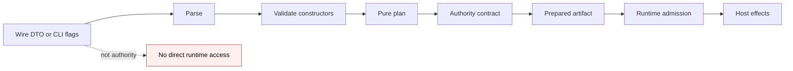
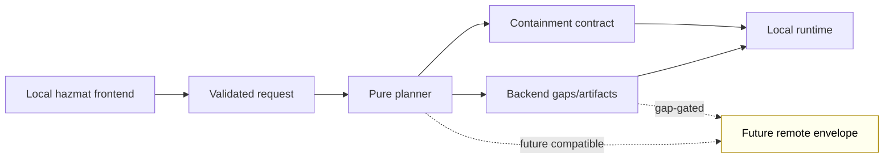
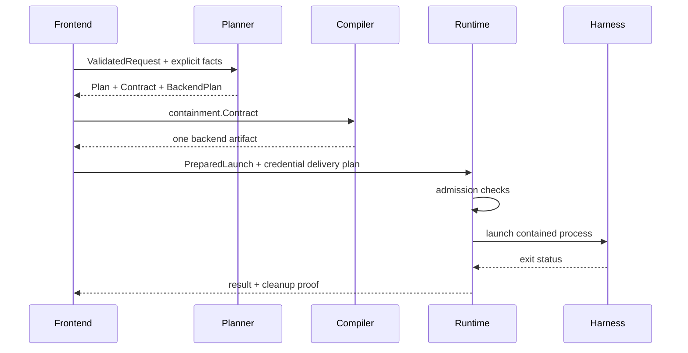
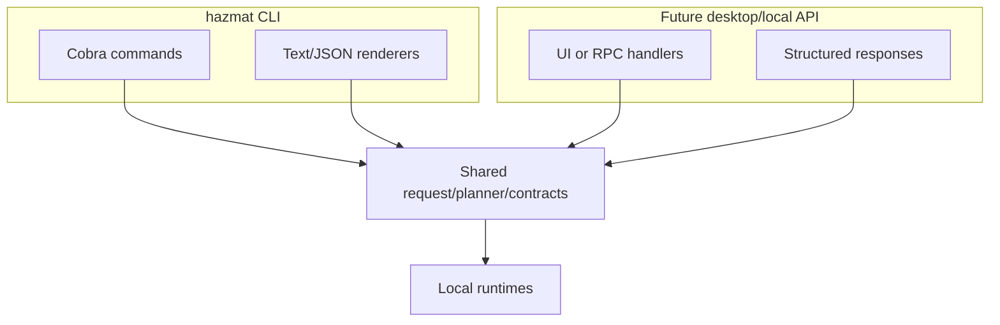

# Package Split Architecture - Audit Draft

**Date:** 2026-06-02
**Status:** audit draft; not implementation approval
**Authoring bead:** `sandboxing-le2b`
**Related docs:**
[architecture](../architecture.md),
[modular architecture direction](2026-06-02-modular-architecture-direction.md),
[remote launch envelope schema](2026-06-02-remote-launch-envelope-schema.md),
[TLA+ verified areas](../../tla/VERIFIED.md)

This document turns the modular architecture direction into a concrete Go
package split for review. The goal is to make Hazmat a set of reusable
contract, planning, and runtime libraries that multiple frontends can call:
the current `hazmat` CLI and future local frontends such as a desktop UI or
local API.

Remote/orchestrated execution is a compatibility input, not the first runtime
target. This split should define what remote may need, take the low-hanging
package choices that keep those needs reachable, and defer hard properties such
as envelope signing, worker identity, replay, worker-local path mapping,
credential handles, cleanup proofs, and control-plane records until a
remote-specific design bead.

This document does not approve moving code, changing behavior, weakening
verified invariants, adding remote execution, or expanding credential delivery.
It is written so reviewers can audit package boundaries before implementation
beads are created.

## Thesis

Hazmat is not truly modular while `package main` owns session semantics. It can
have helper packages and still be hard to reuse if the CLI owns request
validation, contract construction, credential decisions, backend selection,
launch artifact preparation, and runtime cleanup.

The target architecture separates three layers:

- **Frontends** parse input, collect user intent, render output, and preserve UX
  compatibility.
- **Contracts and planners** construct validated, redaction-safe authority
  models without side effects.
- **Runtimes** perform host effects only after receiving validated contracts and
  prepared launch artifacts.

```text
frontend input
  -> validated request
  -> pure planner
  -> backend-neutral contract
  -> backend artifact
  -> runtime admission
  -> launch / cleanup / result records
```

## Design Principles

1. **Frontends do not own security policy.** The CLI can choose defaults and
   render warnings, but package constructors own invariants.
2. **Contracts are side-effect-free.** A contract package may parse, validate,
   normalize, sort, and serialize. It must not inspect the host, prompt, run
   commands, materialize credentials, or launch processes.
3. **Runtimes are effectful but narrow.** Runtime packages may mutate or
   launch only through explicit inputs: validated request, validated contract,
   prepared backend artifact, scoped credential delivery plan, and cleanup
   policy.
4. **Wire DTOs are never authority.** JSON structs and saved plans must parse
   into validated authority types before runtime code sees them.
5. **Capability gaps are first-class.** Unsupported policy must become a
   structured gap or hard error, not a silent approximation.
6. **Verified areas keep their governance.** Any package movement across setup,
   rollback, seatbelt, credential delivery, launch fd isolation, harness
   lifecycle, or session repair boundaries must follow `tla/VERIFIED.md`.
7. **Remote-compatible shape, local-first implementation.** Versioned plans,
   explicit facts, DTO-to-validated-type boundaries, capability gaps, and
   redaction-safe descriptors are cheap now. Worker admission, remote
   credentials, replay defense, and cleanup proofs are not.

## Target Package Tree

The exact names are open for audit. The dependency direction is not.

```text
hazmat/
  cmd/
    hazmat/                    # CLI frontend
    hazmat-launch/             # native launch helper

  internal/
    frontend/cli/              # Cobra commands, rendering, prompts
    legacy/                    # temporary shims during migration
    runtime/
      darwin/                  # native launch runtime and SBPL admission
      docker/                  # Docker Sandbox runtime
      linux/                   # future Linux native runtime
    credentialruntime/         # secret store, brokers, materialization effects
    setup/
      darwin/                  # host setup/rollback runtime after model approval
    testfixtures/              # shared package test fixtures, no production imports

  sessionrequest/              # validated user/API request builders
  sessionplanner/              # pure planning facade
  sessioncontract/             # redaction-safe session plan DTOs
  sessionmeta/                 # stable mode/network/metadata labels
  hostfacts/                   # explicit host/platform facts for planners
  pathpolicy/                  # canonical paths and deny-zone grant types
  containment/                 # backend-neutral authority contract
    darwin/                    # SBPL compiler package
    linux/                     # Linux native launch spec compiler
    docker/                    # Docker Sandbox spec compiler

  sessionbackend/              # backend kinds, gaps, prepared artifact variants
  credentials/                 # pure registry and scoped descriptor contracts
  harnesses/                   # harness registry and lifecycle metadata
  integrations/                # manifest schema and pure merge/detection rules
  hostmutations/               # permission repair and repo setup plans
  hooks/                       # sensitive repo-local hook contracts; later split
  backup/                      # snapshot/restore plans and governed runtime adapters

```

### Public vs internal packages

The reusable packages above may be public Go packages inside the module. They
do not all need stable external API guarantees on day one, but their import
rules should be enforced as if another frontend will call them.

`internal/frontend/cli` and `internal/legacy` are intentionally not reusable.
They can depend on Cobra, terminal UI, compatibility shims, and command-specific
rendering. Reusable packages must never import them.

Effectful runtime and setup packages should also start under `internal/`.
They can be shared by multiple in-module frontends, but they should not become
external API until a second frontend exists and the API shape has proved stable.

## Dependency Graph

```mermaid
flowchart TB
    subgraph frontends["Frontends"]
        cli["cmd/hazmat"]
        desktop["future desktop/local API"]
    end

    subgraph contracts["Contracts and planners"]
        request["sessionrequest"]
        planner["sessionplanner"]
        contract["sessioncontract"]
        meta["sessionmeta"]
        facts["hostfacts"]
        paths["pathpolicy"]
        contain["containment"]
        backend["sessionbackend"]
        creds["credentials descriptors"]
        harness["harnesses metadata"]
        integ["integrations"]
        mutations["hostmutations plans"]
    end

    subgraph compilers["Backend compilers"]
        darwinC["containment/darwin"]
        linuxC["containment/linux"]
        dockerC["containment/docker"]
    end

    subgraph runtimes["Runtimes"]
        darwinR["internal/runtime/darwin"]
        dockerR["internal/runtime/docker"]
        linuxR["internal/runtime/linux"]
        credR["internal/credentialruntime"]
        setupR["internal/setup/darwin"]
        backupR["backup runtime"]
    end

    cli --> request
    cli --> planner
    cli --> facts
    desktop --> request
    desktop --> planner
    desktop --> facts
    request --> paths
    request --> meta
    request --> harness
    request --> integ
    planner --> facts
    planner --> contract
    planner --> backend
    planner --> contain
    planner --> creds
    planner --> mutations
    darwinC --> contain
    linuxC --> contain
    dockerC --> contain
    darwinR --> darwinC
    dockerR --> dockerC
    linuxR --> linuxC
    credR --> creds
    darwinR --> credR
    dockerR --> credR
    cli --> setupR
    cli --> backupR

    style contracts fill:#eef,stroke:#55c,color:#000
    style runtimes fill:#ffe,stroke:#a80,color:#000
```



Arrows in this diagram are import dependencies, not runtime call order. Backend
compiler packages import `containment` for the contract type; `containment`
must not import its compiler children.

## Contract vs Runtime Boundary



The runtime boundary should be a small API surface. A runtime should not accept
raw strings for project roots, raw credential bytes, unvalidated JSON, or
partially constructed backend artifacts. It should receive values that have
already passed the constructors and gap checks.

## Proposed Package Responsibilities

| Package | Current anchors | Proposed ownership |
| --- | --- | --- |
| `sessionrequest` | `session.go` `sessionConfig`, `harnessSessionOpts`, `resolveSessionConfig` | Validated request builder for project/read/write paths, harness target, network mode, integrations, backend preference, preview/launch mode. |
| `pathpolicy` | existing `pathpolicy/`, `path_policy.go` shims | Canonical path authority and deny-zone grant constructors. No frontend or runtime imports. |
| `hostfacts` | scattered globals and probes in `session.go`, `agent_user.go`, `sandbox.go`, integration and harness checks | Explicit host/platform facts collected by frontends and passed into planners. No planner should read `$HOME`, inspect Docker, probe kernels, or check harness installation directly. |
| `sessionplanner` | existing `sessionplanner/`, `explain_json.go`, `session_backend.go` | Single pure facade producing contract plan, backend plan, host mutation preview, credential descriptors, and warnings from validated request plus explicit facts. |
| `sessioncontract` | existing `sessioncontract/` | Redaction-safe plan DTOs and versioned JSON shapes for preview/output. |
| `containment` | existing `containment/`, `native_session_policy.go` | Backend-neutral authority contract, structural credential floor, grant overlap validation, comparable core policy. |
| `containment/darwin` | `session_policy_sbpl.go`, `native_session_policy.go` | SBPL compiler from `containment.Contract`; no launch execution. |
| `containment/linux` | existing `containment/linux/` | Plan-only Linux launch spec compiler until runtime is modeled and implemented. |
| `containment/docker` | `sandbox.go` launch spec/profile builders | Docker Sandbox spec compiler from contract/backend plan; no Docker CLI execution. |
| `sessionbackend` | existing `sessionbackend/` | Backend kinds, gap taxonomy, lifecycle artifact expectations, prepared artifact variants. |
| `credentials` | `credential_registry.go`, descriptor portions of `session_credentials.go`, grant/request metadata | Pure registry descriptors, support status, grant requests, scoped delivery handles, redaction contracts, and cleanup plan DTOs. No secret-store, broker, materialization, or file-copy runtime imports. |
| `internal/credentialruntime` | `secret_store.go`, effectful portions of `session_credentials.go`, `config_agent.go`, `github_capability.go`, `git_https_credentials.go`, `git_ssh.go` | Secret-store access, credential brokers, scoped materialization, file-copy delivery, and cleanup application. Consumes descriptor-package validated plans. |
| `harnesses` | `harness.go`, `harness_lifecycle.go`, `harness_assets.go`, bootstrap files | Harness registry metadata, managed artifacts, preserved artifacts, install/update/uninstall plans. Runtime install stays effectful. |
| `integrations` | existing `integrations/`, `integration_manifest.go`, `integration_resolver.go` | Manifest schema, safe merge, detection, read-dir/env validation, repo recommendations. Host tool repair plans go through `hostmutations`. |
| `hostmutations` | `session_mutation.go`, `workspace_acl.go`, `git_preflight.go`, `repo_setup.go` | Previewable host mutation plans and proof-scope metadata. Applying mutations is runtime-only. |
| `backup` | `backup.go`, `snapshots.go`, `kopia_wrapper.go`, `restore.go` | Snapshot and restore plans plus governed runtime adapters. Any split is gated by `MC_BackupSafety`, especially the prior-snapshot-before-overwrite invariant. |
| `hooks` | `hook_manifest.go`, `hook_approval.go`, `hook_runtime.go`, `hook_cli.go` | Sensitive repo-local hook contracts and approval/runtime wrappers. Do not treat as a routine extraction; `MC_GitHookApproval` governs approval, pinned hooksPath, snapshot execution, drift refusal, and rollback cleanup. |
| `internal/runtime/darwin` | `native_launch*.go`, `agent_launch.go`, `runner.go`, `cmd/hazmat-launch` interface | Native session admission, policy file lifecycle, launch-helper invocation, cleanup. |
| `internal/runtime/docker` | `sandbox.go` runtime portions | Docker Sandbox readiness, approval, creation, launch, cleanup. |
| `internal/setup/darwin` | `init*.go`, `rollback*.go`, `sudoers.go`, `native_account*.go`, `native_service*.go` | Host setup and rollback runtime after model-approved package split. |
| `internal/frontend/cli` | `main.go`, command files, rendering, prompts | CLI commands, status text, explain rendering, compatibility flags, shell completion. |

## Remote Scope For This Split

Remote/orchestrated execution is not in the first implementation wave, but the
package split should be shaped so the future remote envelope does not need to
fork Hazmat's local planning model.

The remote envelope plan in
[2026-06-02-remote-launch-envelope-schema.md](2026-06-02-remote-launch-envelope-schema.md)
names the broad future needs:

- schema versioning and producer/consumer skew rules
- canonical serialization
- integrity verification
- replay defense
- worker identity binding
- worker-local path mapping
- capability-gap admission
- credential handle lifecycle
- cleanup proof shape
- record classification

This split should take the low-hanging pieces that help both local and remote
without claiming remote execution:

| Low-hanging choice | Why it helps local Hazmat | Why it helps future remote |
| --- | --- | --- |
| Versioned plan DTOs | Makes explain/golden output explicit. | Gives envelope producers stable input shapes. |
| Explicit host facts input | Keeps planners pure and easier to test. | Lets control planes provide scheduler/worker facts later. |
| DTO-to-validated-type rule | Prevents saved JSON from bypassing constructors. | Prevents remote API JSON from becoming authority. |
| Redaction-safe descriptors | Keeps CLI JSON safe. | Keeps control-plane records from carrying raw secrets. |
| Capability-gap taxonomy | Gives CLI precise failure messages. | Gives worker admission a future shared rejection vocabulary. |
| Prepared artifact variants | Keeps local runtimes from accepting mixed artifacts. | Gives remote envelopes a future single-artifact rule. |

The first package split should not implement remote signing, worker admission,
remote credential handles, replay storage, worker cleanup proofs, or a
`runtime/remote` runner. It can reserve naming and keep `KindRemoteEnvelope`
gap-gated and non-executable. A later remote bead can then add the missing
model and runtime without changing the local planner's authority semantics.



## Frontend API Shape

The reusable API should let a frontend do this without knowing SBPL ordering,
Docker routing internals, or credential materialization details:

```go
req, err := sessionrequest.New("codex", projectRoot).
    WithReadOnly(extraDocs).
    WithNetwork(sessionmeta.NetworkDefault).
    WithIntegrationHints(hints).
    Build()
if err != nil {
    return err
}

plan, err := sessionplanner.Plan(ctx, req, facts)
if err != nil {
    return err
}

if preview {
    return renderer.Render(plan.Contract, plan.Backend)
}

prepared, err := runtime.Prepare(ctx, plan, runtimeTarget)
if err != nil {
    return err
}

return runtime.Launch(ctx, prepared)
```

`facts` must be explicit. A pure planner should not reach into `$HOME`, call
`os/user`, inspect Docker, or read global config by itself. The frontend or a
host-facts package can collect those values before calling the planner.

## Runtime Admission Shape



Admission checks differ by runtime, but the common contract is the same:

- validate the containment contract again
- verify backend/artifact kind match
- reject unaccepted capability gaps
- materialize only scoped credential grants
- build cleanup before launch
- emit only classified result and cleanup records
- fail closed on missing runtime capability

`PreparedLaunch` must become a real authority type before Phase G runtimes
consume it. Its authority-bearing fields should be unexported, with a separate
JSON DTO for rendering or persistence, so callers cannot hand-assemble multiple
artifact variants or bypass `NewPreparedLaunch` gap checks.

## Import Boundary Rules

The package split needs automated guards, not just documentation. Add a
structural import-boundary test before large movement begins.

| Package class | Forbidden imports |
| --- | --- |
| Pure contracts/planners | `os/exec`, `net/http`, Cobra, terminal UI, `sudo`, runtime packages, setup packages, backup runtime, `cmd/*`. |
| DTO/schema packages | Runtime packages, credential delivery, host mutation apply code. |
| Compilers | Frontend packages, prompts, Cobra, direct process launch. |
| Runtimes | Frontend rendering, Cobra, unvalidated DTO packages as authority. |
| Credential descriptors | Secret-store, broker, materialization, or file-copy runtime packages. |
| Frontends | No direct use of low-level compiler internals when a planner/runtime facade exists. |

The guard should use `go list -deps -json` from the start so it catches
transitive imports and aliases:

```text
scripts/check-import-boundaries.sh  # or a small Go test wrapper
  pure packages cannot import effect packages
  frontend packages cannot be imported by libraries
  compilers cannot import runtime launchers
  credential descriptor packages cannot reach secret materialization code
```

## Invariant Ownership After Split

| Invariant | Owning package after split | Governed specs/gates |
| --- | --- | --- |
| Deny-zone project/read/write rejection | `pathpolicy` + `sessionrequest` | `MC_TierPolicyEquivalence`, `MC_Tier3LaunchContainment`, path/session tests. |
| Non-omittable credential-deny floor | `containment` | `MC_SeatbeltPolicy`, containment tests, backend compiler tests. |
| SBPL section order | `containment/darwin` | `MC_SeatbeltPolicy`, SBPL goldens. |
| Native launch fd cleanup | `internal/runtime/darwin` + `cmd/hazmat-launch` | `MC_LaunchFDIsolation`, helper tests. |
| Preview-vs-launch mutation behavior | `hostmutations` | `MC_SessionPermissionRepairs`, explain/launch tests. |
| Credential descriptor/delivery mode matching | `credentials` + `internal/credentialruntime` | Specs 12/13, credential registry tests, credential-regression hook. |
| Credential descriptors cannot reach materialization | `credentials` descriptor package plus import-boundary guard | Specs 12/13, `go list -deps` import guard, credential-regression hook. |
| Harness lifecycle metadata cleanup | `harnesses` | `MC_HarnessLifecycle`, harness lifecycle tests. |
| Backend capability gaps | `sessionbackend` | backend plan goldens, `NewPreparedLaunch` tests. |
| Prepared launch artifacts cannot be forged before runtime admission | `sessionbackend` authority type plus separate DTO | `NewPreparedLaunch` tests, import/API review before Phase G. |
| Docker launch containment | `containment/docker` + `internal/runtime/docker` | `MC_Tier3LaunchContainment`, launch-spec goldens. |
| Restore never overwrites without a prior snapshot | `backup` | `MC_BackupSafety`, backup/restore tests. |
| Repo-local hook execution uses approved immutable content and pinned paths | `hooks` | `MC_GitHookApproval`, hook approval/runtime tests. |
| Remote compatibility stays non-executable | `sessionbackend` + versioned plan DTOs | `GapRemoteLaunch`; new remote model before execution. |

## Migration Strategy

This must move in small, equivalence-proved beads. Every phase must keep
package-main compatibility shims green where they exist, preserve current CLI
entrypoints until their release path is proven, and be independently revertible
without leaving package imports half-moved.

The intended sequence is:

### Phase A: Guardrails before movement

- Add the `go list -deps -json` import-boundary guard for current pure
  packages.
- Add a package dependency diagram check to docs or CI output.
- Record remote compatibility as a non-runtime constraint: versioned DTOs,
  explicit facts, redaction-safe descriptors, and gap taxonomy only.
- Keep all existing goldens green.
- No behavior changes.

### Phase B: Frontend shell split

- Move Cobra commands and renderers into `internal/frontend/cli`.
- Move the binary entrypoint to `cmd/hazmat`.
- Keep compatibility wrappers if release tooling expects the old module-root
  shape during transition.
- Update operational touchpoints that goldens do not cover: `Makefile`,
  `scripts/release.sh`, `scripts/e2e*.sh`, pre-push CLI smoke, install paths,
  and release build commands.
- No session semantics move in this phase.

### Phase C: Host facts package

- Extract explicit host/platform fact collection into `hostfacts`.
- Collect facts in the frontend or host inspection layer, then pass them into
  planners.
- Cover agent home, invoker home, Docker availability, kernel/platform probes,
  harness installed status, and integration marker facts.
- No planner may call `os.UserHomeDir`, `os/user`, Docker probes, or harness
  installation checks directly.

### Phase D: Validated request package

- Extract `sessionrequest` around existing `pathpolicy` constructors.
- Route `resolveSessionConfig` through it as a compatibility shim.
- Preserve the exact rejected-input set unless the model is updated first.
- Re-run `MC_TierPolicyEquivalence` and `MC_Tier3LaunchContainment`.

### Phase E: Planner expansion

- Expand `sessionplanner` to own the full side-effect-free plan:
  contract plan, backend plan, mutation preview, credential descriptors,
  harness requirements, and warnings.
- Ensure planner outputs are versioned and canonical enough for local goldens
  and future remote envelope inputs, without adding remote execution.
- Keep launch and explain goldens byte-identical.
- Do not move credential delivery or mutation apply code yet.

### Phase F: Backend compiler packages

- Move Darwin SBPL compilation into `containment/darwin`.
- Move Docker spec compilation into `containment/docker`.
- Keep runtime execution in `package main` or `runtime/*` adapters until
  prepared artifact boundaries are audited.
- Re-run governed specs and all goldens.

### Phase G: Prepared launch authority

- Make `PreparedLaunch` an authority type with unexported artifact fields.
- Add a separate DTO for JSON/rendering/persistence.
- Require all runtimes to receive values constructed by `NewPreparedLaunch`.
- This phase must land before any runtime package accepts `PreparedLaunch`.

### Phase H: Credentials and harnesses

- Split credential registry descriptors into `credentials` and credential
  delivery effects into `internal/credentialruntime`.
- Enforce that descriptor packages cannot import secret store, broker,
  materialization, or file-copy runtime code.
- Split harness metadata/plans from install/update/uninstall effects.
- Preserve Specs 8, 12, and 13 invariants.
- Add explicit DTO-to-validated-type tests for any serialized credential or
  harness lifecycle artifact.

### Phase I: Runtime packages

- Move effectful native and Docker launch code behind `internal/runtime/darwin`
  and `internal/runtime/docker`.
- Runtimes accept only `PreparedLaunch`, scoped credential delivery plans, and
  cleanup policy.
- Future Linux remains plan-only until separately modeled. Remote runtime is
  outside this split and needs its own design/model bead.

### Phase J: Backup and hooks

- Split backup only with `MC_BackupSafety` re-run and explicit preservation of
  "snapshot before overwrite" behavior.
- Split repo-local hooks only with `MC_GitHookApproval` re-run and explicit
  preservation of approved immutable snapshot execution, pinned `core.hooksPath`,
  drift refusal, and rollback cleanup.
- These are governed effect surfaces, not routine data-package extractions.

### Phase K: Setup and rollback

- Split setup/rollback only after a model-aware design bead. This code is
  too sensitive to move opportunistically.
- `MC_SetupRollback` and `MC_Migration` govern the move.

## Data Flow After Split

```mermaid
flowchart LR
    flags["CLI/API input"]
    request["sessionrequest.ValidatedRequest"]
    facts["Explicit host facts"]
    plan["sessionplanner.Plan"]
    contract["containment.Contract"]
    backend["sessionbackend.Plan"]
    selector["Frontend/runtime compiler selection"]
    compiler["Backend compiler"]
    prepared["sessionbackend.PreparedLaunch"]
    runtime["runtime admission"]
    result["Result + cleanup proof"]

    flags --> request
    facts --> plan
    request --> plan
    plan --> contract
    plan --> backend
    contract --> selector
    backend --> selector
    selector --> compiler
    compiler --> prepared
    backend --> prepared
    prepared --> runtime
    runtime --> result
```



## Frontend Reuse Flow



The frontend-specific code may render different output, but it should not fork
policy. The same validated request and planner APIs should determine authority.

## Package Split Risks

| Risk | Mitigation |
| --- | --- |
| Moving code hides a semantic change. | Golden fixtures, affected TLC specs, and small commits per boundary. |
| Public DTO fields let callers bypass constructors. | Separate DTOs from authority types; runtime accepts only validated types. |
| Runtimes import frontend state or globals. | Import-boundary guard and explicit runtime inputs. |
| Credential delivery leaks into planner. | `credentials` split into descriptors/plans vs delivery runtime. |
| Remote scope creeps into the local split. | Keep `GapRemoteLaunch`; define compatibility data only; model admission before runtime code. |
| Setup/rollback order changes during package movement. | Do not split setup/rollback until a model-first bead. |
| Tests pass but backend equivalence weakens. | Keep launch/SBPL/backend goldens and re-run affected TLA specs. |

## First Implementation Beads To Consider

These are proposed only after audit feedback:

1. **Import boundary guard.** Add `scripts/check-import-boundaries.sh` and CI
   coverage for pure packages. No code movement.
2. **CLI frontend shell.** Move Cobra/rendering into `internal/frontend/cli`
   while keeping behavior and command output unchanged.
3. **`sessionrequest` extraction.** Create the validated request package around
   existing `pathpolicy` constructors and compatibility shims.
4. **Compiler package split.** Move Darwin SBPL compilation to
   `containment/darwin` with byte-identical SBPL goldens.
5. **Remote-compatible DTO fixtures.** Add fixtures proving the planner emits
   versioned, redaction-safe, gap-aware data suitable for both local explain and
   future envelope production, without adding a remote runner.
6. **Credential descriptor split.** Move registry descriptors into
   `credentials` without moving materialization or secret-store writes.

## Audit Questions

- When, if ever, should internal runtime packages become public for another
  frontend?
- Should `sessionrequest` be separate, or should it live inside
  `sessioncontract` until the API stabilizes?
- Should `PreparedLaunch` become an authority type with unexported fields and a
  separate JSON DTO before any runner consumes it?
- Which package should own host fact collection: frontend, `hostfacts`, or
  runtime admission?
- Which remote-compatible choices are cheap enough for v0: versioned DTOs,
  explicit facts, redaction-safe descriptors, gap taxonomy, or canonical test
  fixtures?
- Which remote properties must stay deferred: signing, replay, worker identity,
  worker-local path mapping, credential handles, cleanup proof format, record
  classification, or all of them?
- Should setup/rollback stay in `package main` longer than other runtime code
  because it is strongly model-governed?
- What is the minimum import-boundary guard that reviewers trust before large
  movement begins?
- Where should the package API stability line be drawn for external users:
  all top-level packages, only contracts/planners, or none until v1?

## Acceptance Bar For The Split

A package movement is acceptable only when all of these are true:

- Existing CLI behavior and user-visible output are unchanged unless the bead
  explicitly declares a behavior change.
- Pure packages remain side-effect-free and cross-platform.
- Runtime packages fail closed when given invalid or gap-bearing artifacts.
- Wire DTOs are converted through parse/validate constructors before authority
  use.
- Governed specs are updated or re-run according to `tla/VERIFIED.md`.
- Golden fixtures are unchanged or the diff is reviewed line-by line.
- Documentation identifies the new invariant owner before code lands.
