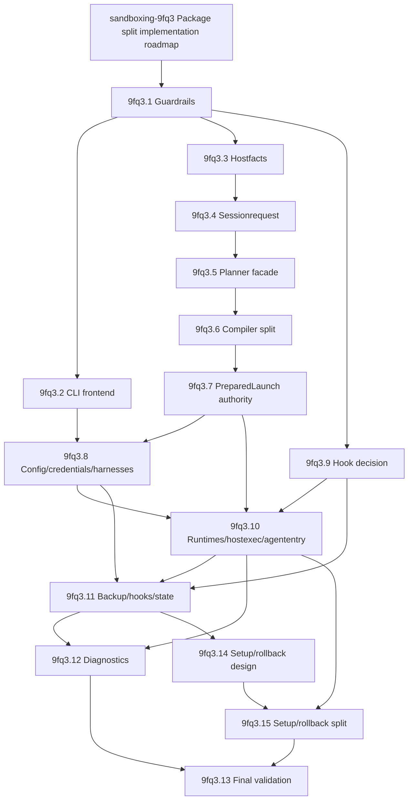

# Package Split Implementation Roadmap

**Date:** 2026-06-03
**Status:** completed epic with post-audit follow-ups
**Epic:** `sandboxing-9fq3`
**Source design:** [package split architecture](2026-06-02-package-split-architecture.md)
**Phase K design:** [setup/rollback package split design](2026-06-03-setup-rollback-package-split-design.md)

This roadmap turns the audited package split design into implementation beads.
It does not approve semantic behavior changes by itself. Each bead must keep
the current command behavior and verified invariants intact unless that bead
explicitly starts with model work.

Post-epic audit note: `sandboxing-9fq3` closed with all 15 implementation
beads complete, but "package split complete" means scaffolding, import
guardrails, and peripheral/effect-code relocation. It does not mean the core
session path has been extracted from `package main`. `session.go` and
`sandbox.go` still own `resolveSessionConfig()`, `generateSBPL()`,
`preSessionSnapshot()` ordering, Tier-2/Tier-3 planning,
`buildSandboxLaunchSpec()`, and `prepareSandboxLaunchWithPlan()`. Follow-up
beads `sandboxing-vh9q` and `sandboxing-0jp7` track the next model-first core
extraction and the specific `preSessionSnapshot()` / `generateSBPL()` placement
reconciliation.

## Operating Rules

The dominant rule is still model-first governance. Pure movement is allowed only
when equivalence tests and import-boundary guards prove the moved code has the
same behavior. Semantic changes in verified areas must start in the relevant
TLA+ model, then implementation follows the proved design.

Every phase must stay independently revertible. Compatibility shims in
`package main` remain until the replacement package and release path are proven.
Remote execution remains non-executable; versioned DTOs, explicit host facts,
redaction-safe descriptors, and capability gaps are the only remote-compatible
work in this roadmap.

## Roadmap

| Order | Bead | Scope | Depends on | Required gates |
| --- | --- | --- | --- | --- |
| 1 | `sandboxing-9fq3.1` | Add `go list -deps -json` import-boundary guardrails and dependency graph checks. No code movement. | none | Guard catches pure/effect, frontend/library, compiler/runtime, credential descriptor/materialization, and `runtime.GOOS` violations. Existing goldens stay green. |
| 2 | `sandboxing-9fq3.2` | Move Cobra commands, rendering, prompts, and CLI shell toward `internal/frontend/cli` and `cmd/hazmat`. | `sandboxing-9fq3.1` | CLI output unchanged. Makefile, release, e2e, install, and pre-push smoke paths updated. |
| 3 | `sandboxing-9fq3.3` | Extract explicit `hostfacts`: agent home, invoker home, target GOOS/platform, Docker/kernel probes, harness status, integration markers. | `sandboxing-9fq3.1` | Planners receive facts explicitly and no longer probe host state directly. |
| 4 | `sandboxing-9fq3.4` | Extract `sessionrequest` around existing `pathpolicy` constructors. | `sandboxing-9fq3.3` | Rejected-input set preserved. Re-run `MC_TierPolicyEquivalence` and `MC_Tier3LaunchContainment` if governed logic moves. |
| 5 | `sandboxing-9fq3.5` | Expand pure `sessionplanner` facade and versioned DTO fixtures. | `sandboxing-9fq3.4` | Planner remains side-effect-free. Explain and launch goldens stay byte-identical or reviewed. |
| 6 | `sandboxing-9fq3.6` | Split backend compilers into `containment/darwin`, `containment/docker`, and plan-only Linux compiler packages. | `sandboxing-9fq3.5` | Compiler packages import `containment`, never the reverse. Add Docker/linux launch-spec goldens before moving compiler code. |
| 7 | `sandboxing-9fq3.7` | Make `PreparedLaunch` an authority type and define the separate DTO disclosure scope. | `sandboxing-9fq3.6` | Artifacts are unforgeable, construction flows through `NewPreparedLaunch`, and DTOs do not automatically expose full SBPL/path details. |
| 8 | `sandboxing-9fq3.8` | Split `configmodel`, `credentials`, `internal/credentialruntime`, `harnesses`, and `internal/harnessruntime`; move `config.go` Cobra handlers into the `internal/frontend/cli` package created by `9fq3.2`. | `sandboxing-9fq3.2`, `sandboxing-9fq3.7` | `harnesses` stays pure and never imports `internal/state`. Preserve `MC_HarnessLifecycle`, `MC_GitSSHRouting`, `MC_SecretStoreRecovery`, and `MC_CredentialCapabilityLifecycle`. |
| 9 | `sandboxing-9fq3.9` | Record hook hidden-command home. | `sandboxing-9fq3.1` | Hook wrapper/dispatch/fallback stays in `internal/hookruntime`; no hookruntime/agententry edge is allowed. Graph, responsibility table, invariant table, risks, and later beads agree. |
| 10 | `sandboxing-9fq3.10` | Split launch runtimes, `internal/hostexec`, `internal/agententry`, and plan-only `internal/runtime/linux`. | `sandboxing-9fq3.7`, `sandboxing-9fq3.8`, `sandboxing-9fq3.9` | CLI invokes runtimes through a facade. `sudo*`/`asAgent*` live in hostexec. Hidden command handlers live in agententry. |
| 11 | `sandboxing-9fq3.11` | Split backup, hooks, and state under their governed specs. (Setup/rollback is split separately; see 14/15.) | `sandboxing-9fq3.8`, `sandboxing-9fq3.9`, `sandboxing-9fq3.10` | Preserve `preSessionSnapshot`, hook approval invariants, and state persistence. Re-run `MC_BackupSafety`, `MC_GitHookApproval`, `MC_HarnessLifecycle`/`MC_Migration` as the moved surface requires. |
| 12 | `sandboxing-9fq3.12` | Split diagnostics and stackcheck into `internal/diagnostics`. | `sandboxing-9fq3.10`, `sandboxing-9fq3.11` | Diagnostics import probed packages only as a client. Reusable packages never import diagnostics. Live network probes remain explicit smoke gates. |
| 13 | `sandboxing-9fq3.14` | Model-aware setup/rollback split [design](2026-06-03-setup-rollback-package-split-design.md) (model-first; no code movement). Setup/rollback is the highest-severity `AgentContained` surface and is on the "what not to move first" list. | `sandboxing-9fq3.11` | Design note names the seam against `internal/state`/`internal/hostexec`, the equivalence/test plan, and whether `MC_SetupRollback`/`MC_Migration` re-run. |
| 14 | `sandboxing-9fq3.15` | Split setup/rollback into `internal/setup` per the design bead. | `sandboxing-9fq3.10`, `sandboxing-9fq3.14` | Setup/rollback step ordering and `AgentContained` preserved; `MC_SetupRollback` and `MC_Migration` re-run per the design; goldens and pre-push green. |
| 15 | `sandboxing-9fq3.13` | Final validation and epic closure. | `sandboxing-9fq3.12`, `sandboxing-9fq3.15` | Import guard passes, graph has no undefined nodes/cycles, no contract-to-runtime violations, governed specs and Go/golden/pre-push gates pass, docs and beads are updated. |

## Dependency Graph

## Review Gates

Each bead should record the exact gates it ran in the bead close reason. The
default gate set is:

- `git diff --check`
- `go test ./... -run TestGolden`
- `go test ./...`
- affected golden fixture review
- affected TLC runs from `tla/VERIFIED.md`
- import-boundary guard after `sandboxing-9fq3.1`
- pre-push hook before merge or handoff

For governed areas, "tests pass" is not enough. The bead must name the owning
spec and either re-run TLC or state why the change is pure movement outside the
modeled semantics.

## Resolved Decisions

`sandboxing-9fq3.9` resolves hook hidden-command ownership: keep
`_git-hook-wrapper`, `_git-hook-dispatch`, `_git-hook-fallback`, and their
dispatch logic in `internal/hookruntime`. The hook path stays governed by
`MC_GitHookApproval`; no hookruntime/agententry import edge is allowed.

Remote signing, worker identity, replay storage, worker-local path mapping,
remote credential handles, cleanup proofs, and a remote runner stay outside this
roadmap.
