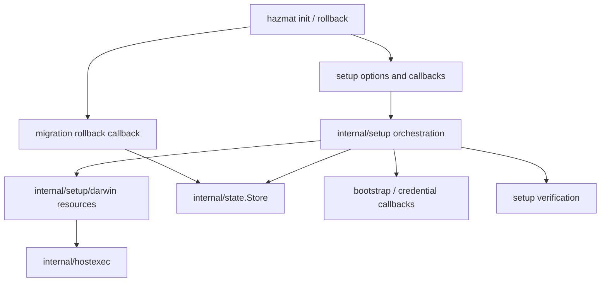
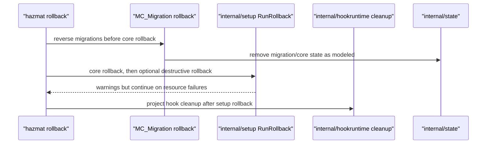

# Setup/Rollback Package Split Design

**Date:** 2026-06-03
**Status:** implementation design for `sandboxing-9fq3.14`
**Scope:** design only; no setup or rollback code movement
**Depends on:** [package split architecture](2026-06-02-package-split-architecture.md), [package split roadmap](2026-06-03-package-split-implementation-roadmap.md), [setup/rollback model](../../tla/01_setup_rollback_state_machine.md), [migration model](../../tla/04_version_migration.md), [verified ledger](../../tla/VERIFIED.md)

Phase K moves setup and rollback out of `package main` only after this
model-aware design bead. Setup/rollback owns Hazmat's highest-severity
`AgentContained` boundary: privilege must be granted last during setup and
revoked first during rollback. The split is structural unless an
implementation bead explicitly changes modeled semantics after updating TLA+.

## Design Goal

Move setup/rollback orchestration and platform resource effects behind
`internal/setup` without changing:

- setup resource order in `initSetupSteps()`
- rollback core/destructive order in `coreRollbackSteps()` and
  `destructiveRollbackSteps()`
- launch-helper verification semantics
- optional maintenance sudoers placement after containment
- rollback's default preservation of the agent user and dev group
- migration rollback ordering before core rollback
- state persistence semantics for `~/.hazmat/state.json`

The CLI stays responsible for command parsing, flags, prompts, banners, and
status rendering. The setup package owns the validated resource graph and the
effectful setup/rollback runtime.

## Current Anchors

| Surface | Current code | Governance |
| --- | --- | --- |
| Init command shell | `hazmat/init.go:runInit()` | `MC_SetupRollback`, `MC_Migration` |
| Setup resource list | `hazmat/init_steps.go:initSetupSteps()` | `MC_SetupRollback` |
| Rollback command shell | `hazmat/rollback.go:runRollback()` | `MC_SetupRollback`, `MC_Migration` |
| Rollback resource lists | `hazmat/rollback_steps.go:coreRollbackSteps()`, `destructiveRollbackSteps()` | `MC_SetupRollback` |
| Formal resource labels | `hazmat/setup_rollback_formal.go` | `MC_SetupRollback` |
| Verification probes | `hazmat/setup_verification.go`, platform variants | `MC_SetupRollback` probes |
| State persistence | `hazmat/internal/state/state.go`, `hazmat/state.go` | `MC_Migration`, `MC_HarnessLifecycle` |
| Migration rollback | `hazmat/migrate.go:runDownMigrations()` | `MC_Migration` |
| Host execution | `hazmat/internal/hostexec`, root wrappers in `hazmat/exec.go` and `hazmat/runner.go` | setup/rollback safety plus hostexec guard |
| Platform resources | `hazmat/native_account*.go`, `native_service*.go`, `acl_*.go`, `sudoers.go` | `MC_SetupRollback` |

The implementation bead must update `tla/VERIFIED.md` anchors after movement.
The existing Spec-to-Code map still names root setup/rollback functions; after
Phase K it should name the root wrappers and the moved `internal/setup`
entrypoints.

## Target Package Shape

```text
hazmat/internal/setup/
  setup.go              # RunInitSetup, RunRollback, options, resource order
  resources.go          # Resource labels matching MC_SetupRollback
  verify.go             # verification plan and coordination
  state.go              # small adapter interfaces for internal/state
  hostexec.go           # adapter interfaces for internal/hostexec/Runner-style execution
  darwin/
    account.go          # agent user and dev group resources
    acl.go              # home traverse and workspace ACL resources
    service.go          # pf, DNS, LaunchDaemon, launch helper verification
    sudoers.go          # narrow and maintenance sudoers resources
    local_repo.go       # local snapshot repository resource
    wrappers.go         # command wrappers, completions, safe.directory
    hardening.go        # umask and host credential mode repairs
```

`internal/setup` owns the resource order and orchestration. `internal/setup/darwin`
owns macOS resource implementations. Root command files stay thin and may keep
compatibility wrappers while the frontend split is incomplete.

The package must not import `internal/frontend/cli`, `internal/diagnostics`,
`internal/agententry`, runtime launch packages, hookruntime, or credential
materialization code. Credential and bootstrap steps may stay as injected
callbacks until their packages expose stable runtime APIs; their positions in
the formal setup order still remain owned by `internal/setup`.

## Required Seams

### State

Setup records successful init through `internal/state.Store.SaveVersion`.
Rollback cleanup uses `internal/state.Store.Remove` where it is removing core
state. The moved setup package must not reach for root `stateFilePath`,
`loadState()`, or `saveState()` globals directly.

Migration rollback is governed by `MC_Migration`. Phase K should prefer one of
these two equivalent shapes:

1. Root keeps `runDownMigrations(ui, runner)` before calling
   `setup.RunRollback(...)`.
2. `internal/setup.RunRollback` accepts a `BeforeCoreRollback` callback that
   root wires to `runDownMigrations`.

The first option is lower risk because it avoids mixing migration code into
the setup package during a structural split. If the implementation changes
which artifacts migration rollback removes, or when state is removed, update
`MC_Migration` first.

### Host Execution

All sudo/asAgent process creation must route through `internal/hostexec`.
Root `Runner` can remain as the terminal-aware adapter during the split, but
resource implementations should depend on a small setup-local interface such
as:

```go
type Runner interface {
    Sudo(reason string, args ...string) error
    SudoVisible(reason string, args ...string) error
    SudoWriteFile(reason, path, content string) error
    SudoAppendFile(reason, path, content string) error
    AsAgent(reason string, args ...string) error
    AsAgentVisible(reason string, args ...string) error
    Interactive(reason, name string, args ...string) error
}
```

That keeps UI/dry-run behavior at the edge while preventing setup resources
from silently constructing commands outside the hostexec guard.

### UI And Frontend

`internal/setup` may depend on a tiny output/prompt interface, not Cobra or
root command globals. CLI-only choices stay in root:

- `--dry-run`, `--verbose`, `--yes`, `--bootstrap-agent`
- interactive prompts and banner copy
- platform preflight failure rendering
- cloud backup recovery-key reminder copy

Setup may return structured results for root to render after the resource
runtime completes.

## Data Flow



Rollback should keep migration and hook cleanup as separate governed edges:



## Invariants

| Invariant | Package owner after split | Required preservation |
| --- | --- | --- |
| `AgentContained` | `internal/setup` + `internal/setup/darwin` | Sudoers and maintenance sudoers are created only after pf containment; rollback removes sudoers before pf/DNS/daemon. |
| `SudoersRequiresHelper` | `internal/setup/darwin` | `setupLaunchHelper` remains verify-only and precedes `setupSudoers`. |
| `PrivilegeRequiresAgentUser` | `internal/setup` | Any passwordless sudoers resource still requires the agent user resource. |
| `NoOrphanedArtifacts` | `internal/setup` | Core rollback removes non-destructive artifacts; destructive rollback removes agent user/group only when explicit flags are set. |
| `CanAlwaysReachClean` | `internal/setup` | Resource ordering remains model-equivalent and rollback steps continue after individual failures. |
| `RollbackClean` / `RollbackAlwaysAvailable` | root migration wrapper + `internal/state` | Reverse migrations run before core rollback and can remove state from any modeled version state. |
| Harness metadata preservation | `internal/state` + `internal/harnessruntime` | `SaveVersion` still preserves harness metadata; setup must not rewrite state by hand. |

The implementation must keep `setup_rollback_formal_test.go` or its moved
equivalent as a direct assertion that Go resource order matches
`MC_SetupRollback`.

## TLA+ Decision

Pure package movement does not require editing `MC_SetupRollback.tla` or
`MC_Migration.tla` when the resource order, optional branches, rollback
preservation/deletion semantics, and migration state transitions are identical.

The implementation bead must still re-run both specs after movement because
the governed code anchors move and the setup/state/migration seams are touched:

```bash
cd tla
./run_tlc.sh -workers auto -lncheck final -config MC_SetupRollback.cfg MC_SetupRollback.tla
./run_tlc.sh -workers auto -lncheck final -config MC_Migration.cfg MC_Migration.tla
```

Model updates are mandatory before code if Phase K does any of the following:

- adds, removes, renames semantically, or reorders a setup resource
- changes when pf, DNS, daemon, launch helper, sudoers, or maintenance sudoers appear
- adds a persistent mutation inside an existing setup step
- changes what rollback removes versus preserves
- changes destructive rollback defaults or flags
- changes version graph, migration artifact set, or rollback state removal
- changes rollback failure behavior from warn-and-continue to aborting

If only code paths and package names move, record a no-model-change rationale
in `tla/VERIFIED.md` with the TLC results.

## Implementation Sequence

1. Move `setupRollbackTLAResource` labels and formal order helpers into
   `internal/setup`, leaving root type aliases or wrappers so tests stay green.
2. Move setup and rollback orchestration into `internal/setup` with injected
   step functions. Root resource implementations still run through callbacks
   at this point.
3. Move resource implementations into `internal/setup/darwin` in small groups:
   account/group, ACL/local repo, hardening/wrappers, pf/DNS/daemon/helper,
   sudoers, then bootstrap/credential callback positions last.
4. Move setup verification coordination only after the resources it references
   have stable package homes.
5. Update `tla/VERIFIED.md` governed-code rows and Spec-to-Code map.
6. Run Go gates, import-boundary gates, hostexec guard, and both TLC specs.

Each commit should be independently revertible and keep root CLI behavior
compatible.

## Test And Gate Plan

Before code movement:

```bash
go test ./... -run 'TestInitSetupStepsMatchMCSetupRollbackResources|TestRollbackStepsMatchMCSetupRollbackResources|TestSetupVerificationStepsReferenceMCSetupRollbackResources'
go test ./...
scripts/check-import-boundaries.sh
scripts/check-hostexec.sh
git diff --check
```

After code movement:

```bash
go test ./... -run 'TestInitSetupStepsMatchMCSetupRollbackResources|TestRollbackStepsMatchMCSetupRollbackResources|TestSetupVerificationStepsReferenceMCSetupRollbackResources'
go test ./...
scripts/check-import-boundaries.sh
scripts/check-hostexec.sh
git diff --check
cd tla && ./run_tlc.sh -workers auto -lncheck final -config MC_SetupRollback.cfg MC_SetupRollback.tla
cd tla && ./run_tlc.sh -workers auto -lncheck final -config MC_Migration.cfg MC_Migration.tla
```

Pre-push remains the final local gate before handoff.

## Done Criteria For `sandboxing-9fq3.15`

- `hazmat init` and `hazmat rollback` root code is a thin frontend wrapper.
- `internal/setup` owns formal resource labels, order, orchestration, and
  setup verification coordination.
- `internal/setup/darwin` owns Darwin setup/rollback resource effects.
- Setup writes core init state only through `internal/state.Store`.
- Setup resource effects route command execution through `internal/hostexec`
  or the Runner adapter backed by it.
- Migration rollback ordering remains before core rollback.
- Hook cleanup remains outside setup unless `MC_GitHookApproval` is explicitly
  included in a later model-aware bead.
- `tla/VERIFIED.md` has no stale setup/rollback or migration code anchors.
- Go tests, import-boundary guard, hostexec guard, TLC for
  `MC_SetupRollback`, TLC for `MC_Migration`, and pre-push are green.
