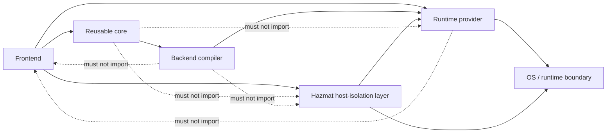
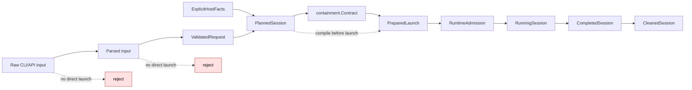
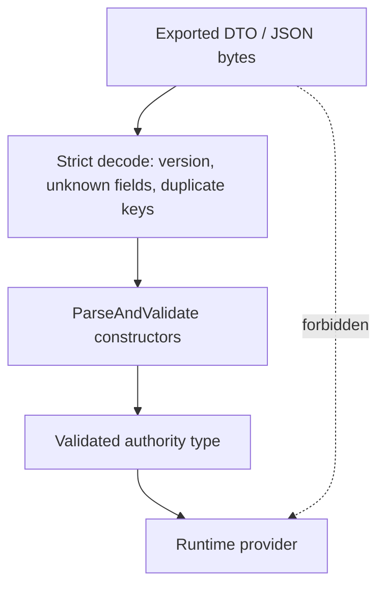
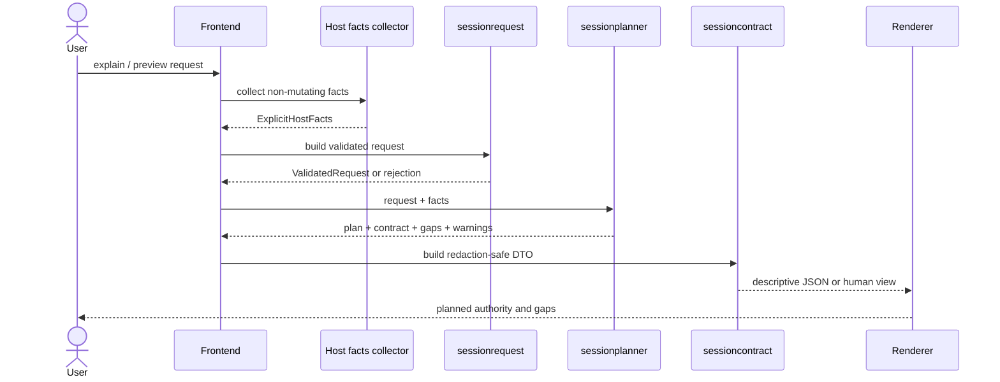
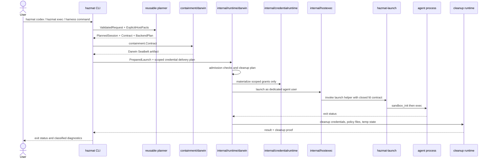
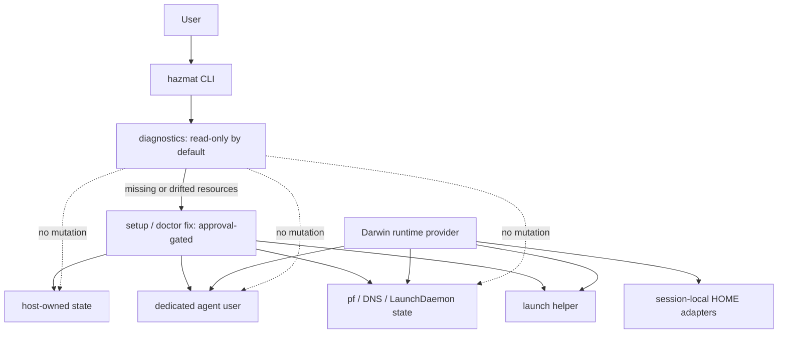
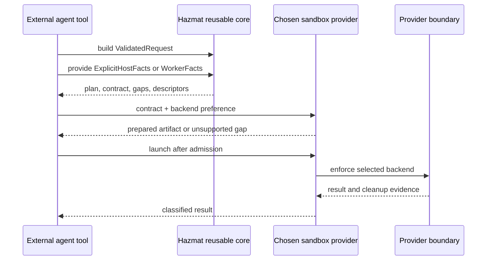
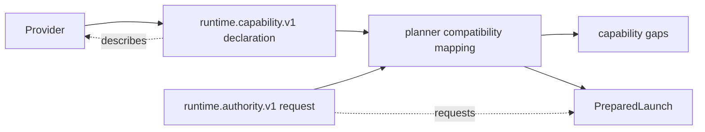
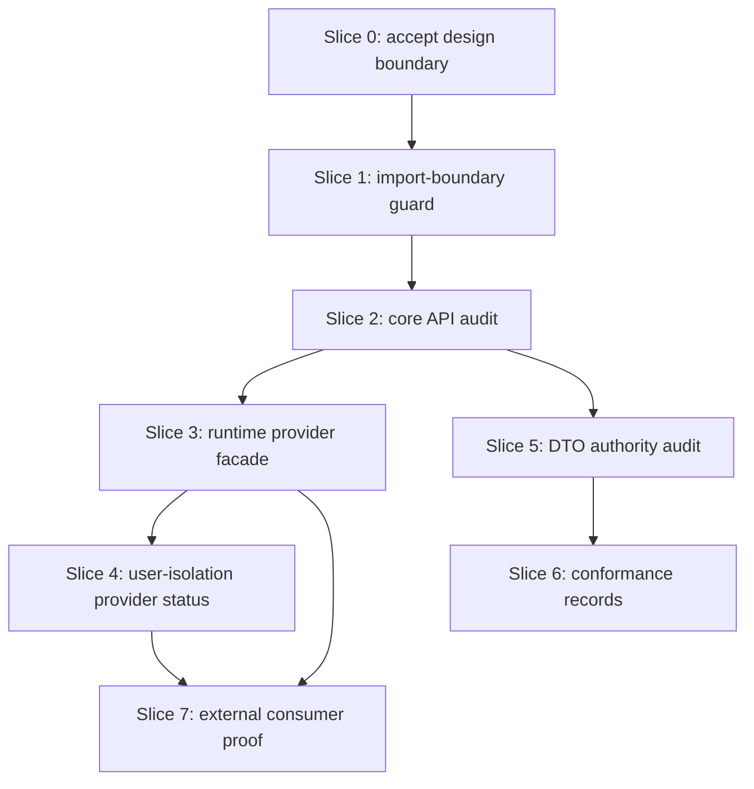

# Reusable Runtime Core And Experimental User Isolation Design

**Date:** 2026-06-27
**Status:** design for audit; not implementation approval
**Bead:** `sandboxing-qyvh`
**Related docs:**
[reusable library decomposition](2026-05-28-reusable-library-decomposition.md),
[modular architecture direction](2026-06-02-modular-architecture-direction.md),
[package split architecture](2026-06-02-package-split-architecture.md),
[core session extraction](2026-06-12-core-session-extraction-design.md),
[remote launch envelope schema](2026-06-02-remote-launch-envelope-schema.md),
[session-home typed adapters](2026-06-13-session-home-typed-adapters-design.md),
[TLA+ verified areas](../../tla/VERIFIED.md)

## Purpose

This document structures the next architectural decision: Hazmat should extract
its reusable session contract, planning, backend artifact, runtime admission,
and capability plumbing into library-shaped packages that other agentic
sandboxing systems can reuse. The macOS multi-user host plumbing should remain
a Hazmat-owned experimental layer around that core, not the core abstraction
itself.

The design is meant to be auditable. It names dependency direction, layering,
user flows, data flows, trust boundaries, failure behavior, implementation
slices, and verification evidence. It does not approve broad code movement or
behavior changes.

## Decision Summary

- The reusable center is the typed pipeline from request to plan to containment
  contract to prepared backend artifact to runtime result.
- User-level sandboxing is a valuable containment primitive, but it is a
  platform-specific runtime hardening layer with privileged setup, repair,
  rollback, diagnostics, and approval-gated validation.
- Hazmat should expose user-level sandboxing as an experimental Darwin-native
  provider layer that consumes the reusable core.
- Other consumers should be able to reuse the core without importing Cobra,
  `sudo`, `dscl`, `pfctl`, Keychain handling, setup/rollback, or host mutation
  code.
- DTOs, JSON, remote envelopes, saved plans, and UI previews remain
  descriptions. They become authority only after parse-and-validate constructors
  rebuild typed authority objects.
- Existing TLA+ governance still applies. Moving code out of `package main`
  does not relax model-first requirements for setup, rollback, seatbelt,
  credential delivery, backup ordering, launch fd isolation, Docker
  containment, Linux launch, Apple Container launch, hooks, harness lifecycle,
  service harnesses, or runtime authority.

## Non-Goals

- No code movement is approved by this document.
- No claim that user-level sandboxing alone is sufficient containment.
- No new supported remote runner.
- No new supported Linux native runner.
- No hidden fallback from a stronger backend to a weaker backend.
- No public Go API stability promise before a second consumer exists.
- No live helper-backed smoke, `hazmat check`, `hazmat doctor --fix`, or
  `git push` requirement for this design artifact.

## Approaches Considered

| Option | Shape | Benefit | Risk | Verdict |
| --- | --- | --- | --- | --- |
| Keep everything Hazmat-only | Continue thinning `package main`, but let the CLI remain the primary integration boundary. | Lowest short-term churn. | Other agentic sandboxing tools must shell out or duplicate policy. User-isolation concerns stay tangled with reusable contracts. | Not enough reuse. |
| Publish the whole Hazmat runtime | Treat setup, dedicated user, pf, launch helper, credential runtime, backup, diagnostics, and CLI behavior as one reusable runtime library. | Maximum feature exposure. | Leaks privileged macOS host assumptions into every consumer. Makes the public API too large and too dangerous too early. | Too broad. |
| Extract core plus provider layers | Stabilize typed contract/planner/artifact/capability libraries. Keep effectful runtimes behind provider boundaries. Keep multi-user macOS setup as a Hazmat experimental provider layer. | Reusable security model without forcing every consumer to inherit Hazmat host mutations. Preserves model governance and lets providers fail closed on gaps. | Requires stricter import guards and compatibility tests. | Recommended. |

## Layering

Hazmat should be a product shell plus providers around a reusable core.

```mermaid
flowchart TB
    subgraph consumers["Consumers and frontends"]
        hazmatCLI["hazmat CLI"]
        localAPI["future local API or desktop UI"]
        externalTool["other agentic sandboxing tool"]
        controlPlane["future remote control plane"]
    end

    subgraph core["Reusable core: no host mutation"]
        request["sessionrequest"]
        paths["pathpolicy"]
        facts["hostfacts schema"]
        config["configmodel"]
        integrations["integrations"]
        harnesses["harnesses metadata"]
        credentials["credentials descriptors"]
        planner["sessionplanner"]
        contract["containment.Contract"]
        backend["sessionbackend"]
        sessionDTO["sessioncontract DTOs"]
        capability["runtimecapability / runtimeauthority"]
    end

    subgraph compilers["Backend compilers: pure or narrowly effect-free"]
        darwinCompiler["containment/darwin"]
        linuxCompiler["containment/linux"]
        dockerCompiler["containment/docker"]
        appleCompiler["containment/applecontainer"]
        remoteEnvelope["future remote envelope compiler"]
    end

    subgraph providers["Runtime provider layer"]
        runtimeAPI["runtime facade"]
        darwinRuntime["internal/runtime/darwin"]
        dockerRuntime["internal/runtime/docker"]
        linuxRuntime["future internal/runtime/linux"]
        remoteWorker["future remote worker runtime"]
    end

    subgraph hazmatExperimental["Hazmat experimental host-isolation layer"]
        setupDarwin["internal/setup/darwin"]
        hostexec["internal/hostexec"]
        credentialRuntime["internal/credentialruntime"]
        backupRuntime["internal/backupruntime"]
        diagnostics["internal/diagnostics"]
        harnessRuntime["internal/harnessruntime"]
        state["internal/state"]
        sessionHome["session-home adapters"]
    end

    subgraph boundaries["Executed boundaries"]
        dedicatedUser["dedicated macOS user"]
        seatbelt["macOS Seatbelt"]
        pf["pf / DNS policy"]
        dockerSandbox["Docker Sandbox"]
        appleContainer["Apple Container"]
        linuxNative["Linux namespaces / LSMs"]
        workerBoundary["remote worker"]
    end

    hazmatCLI --> request
    localAPI --> request
    externalTool --> request
    controlPlane --> request

    request --> paths
    request --> integrations
    request --> harnesses
    request --> credentials
    request --> planner
    facts --> planner
    config --> planner
    integrations --> planner
    harnesses --> planner
    credentials --> planner
    planner --> contract
    planner --> backend
    planner --> sessionDTO
    capability --> planner

    contract --> darwinCompiler
    contract --> linuxCompiler
    contract --> dockerCompiler
    contract --> appleCompiler
    backend --> remoteEnvelope

    darwinCompiler --> darwinRuntime
    dockerCompiler --> dockerRuntime
    linuxCompiler --> linuxRuntime
    appleCompiler --> darwinRuntime
    remoteEnvelope --> remoteWorker

    hazmatCLI --> setupDarwin
    hazmatCLI --> diagnostics
    hazmatCLI --> backupRuntime
    hazmatCLI --> harnessRuntime
    darwinRuntime --> hostexec
    darwinRuntime --> credentialRuntime
    dockerRuntime --> credentialRuntime
    setupDarwin --> hostexec
    setupDarwin --> state
    diagnostics --> hostexec
    harnessRuntime --> state
    sessionHome --> credentialRuntime

    darwinRuntime --> dedicatedUser
    darwinRuntime --> seatbelt
    setupDarwin --> pf
    dockerRuntime --> dockerSandbox
    darwinRuntime --> appleContainer
    linuxRuntime --> linuxNative
    remoteWorker --> workerBoundary

    style core fill:#eaf1ff,stroke:#4567aa,color:#000
    style hazmatExperimental fill:#fff3d7,stroke:#a56a00,color:#000
    style boundaries fill:#eef9ee,stroke:#327a32,color:#000
```



The important dependency rule is simple: reusable core packages may describe
authority, but they must not perform host effects. Provider packages may perform
effects only after receiving typed authority values and prepared artifacts.
Hazmat's experimental user-isolation layer may own privileged macOS setup and
repair, but it must not become a dependency of the reusable core.

## Dependency Rules



| Package class | May depend on | Must not depend on |
| --- | --- | --- |
| Frontends | reusable core, provider facades, diagnostics, Hazmat host layer | compiler internals when a facade exists |
| Reusable core | standard library and other pure core packages | Cobra, prompts, `os/exec`, `sudo`, setup, diagnostics, runtime launchers, host mutation apply code |
| Backend compilers | `containment`, `sessionbackend`, typed policy inputs | CLI rendering, setup, `hostexec`, credential materialization, process launch |
| Runtime providers | backend artifacts, credential delivery plans, cleanup plans, host execution interfaces | raw DTOs as authority, frontend UI, policy widening |
| Hazmat host-isolation layer | hostexec, state, setup models, diagnostics, provider facades | reusable core as an effect sink, unvalidated policy strings |
| DTO/schema packages | serialization and parse/validate helpers | direct launch, materialization, setup, cleanup execution |

An import-boundary guard should make these rules executable before large
movement continues. The guard should inspect `go list -deps -json`, not only
direct imports.

## User-Level Sandboxing Position

User-level sandboxing should be treated as a containment primitive, not as the
architecture. It adds structural separation that process policy alone cannot:
the agent runs under a different Unix identity, cannot casually read the
invoking user's home directory, and can be targeted by UID-based firewall
rules. It is especially useful for agentic workloads because agents actively
probe the local environment and tool state.

It is incomplete by itself. It does not protect against world-readable host
files, shared sockets, loose group permissions, system privilege escalation,
resource exhaustion, attacks against the sandbox user's own credentials, or
unsafe durable state imported into the sandbox user. It also has heavy host
ownership: account creation, home permissions, launch helper state, firewall
state, DNS state, setup repair, rollback, live validation, and user-visible
diagnostics.

Therefore the durable architecture is:

```text
Reusable contract/runtime core
  + provider-specific enforcement
  + optional Hazmat Darwin user-isolation hardening
  = contained agent session
```

The multi-user layer should be advertised and implemented as an experimental
Hazmat provider capability until its setup, repair, rollback, diagnostics,
session-home activation, credential materialization, and live smoke evidence
are mature enough to support a stronger status label.

## Current Package Ownership Target

| Surface | Reusable core owner | Effect owner | Notes |
| --- | --- | --- | --- |
| Request validation | `sessionrequest`, `pathpolicy` | frontend collects raw inputs | Deny-zone rejection belongs in constructors, not UI warnings. |
| Host facts | `hostfacts` types | frontend or host inspection layer collects facts | Pure planners should not read `$HOME`, `runtime.GOOS`, Docker, or user state directly. |
| Planning | `sessionplanner` | none | Side-effect-free. Produces contract, backend plan, warnings, host mutation preview, credential descriptors. |
| Preview JSON | `sessioncontract` | frontend rendering | JSON is descriptive and redaction-safe, not launch authority. |
| Authority contract | `containment` | none | Owns non-omittable credential floor and backend-neutral grants. |
| Backend gaps and artifacts | `sessionbackend` | provider prepares artifact | `PreparedLaunch` must carry exactly one artifact variant. |
| Runtime authority/capability records | `runtimeauthority`, `runtimecapability` | provider signs or verifies when applicable | Useful for future agentic sandboxing and conformance evidence. |
| Credential descriptors | `credentials` | `internal/credentialruntime` | Descriptors are reusable. Secret store, brokers, and materialization are not. |
| Harness metadata | `harnesses` | `internal/harnessruntime` | Metadata and lifecycle plans are reusable. Install/update/uninstall effects are Hazmat runtime work. |
| Integrations | `integrations` | host mutation runtime applies repairs | Manifest validation must reject unsafe env/path surfaces itself. |
| Darwin compiler | `containment/darwin` | `internal/runtime/darwin` | Compiler emits SBPL artifacts; runtime owns policy file lifecycle and launch helper. |
| Docker compiler | `containment/docker` | `internal/runtime/docker` | Compiler emits spec; runtime owns backend readiness, approval, sandbox lifecycle, cleanup. |
| Linux compiler | `containment/linux` | future `internal/runtime/linux` | Plan-only until modeled runtime exists. |
| Apple Container compiler | `containment/applecontainer` | gated experimental runtime | Exec-only and explicit-gate semantics remain separate from native user isolation. |
| Setup/rollback | none | `internal/setup/darwin`, `internal/state`, `internal/hostexec` | Hazmat product layer, model-governed, not reusable core. |
| Backup/snapshot | plan package when split | `internal/backupruntime` | Snapshot-before-launch ordering remains model-governed. |
| Diagnostics | none | `internal/diagnostics` | Diagnostics may call planners/runtimes; planners must never import diagnostics. |

## Authority And Data Flow

The reusable core should keep authority moving through typed states.



Authority-bearing types should use unexported fields and constructors where
needed. Exported DTOs are allowed for JSON and rendering, but runtime code must
not accept them directly.

| State | Authority status | Allowed consumers |
| --- | --- | --- |
| Raw CLI/API input | none | parser only |
| DTO or JSON | descriptive only | renderer, parser, audit logs after classification |
| `ValidatedRequest` | requested authority | planner |
| `PlannedSession` | planned authority plus gaps | frontend, compiler selection, renderer |
| `containment.Contract` | backend-neutral runtime authority | backend compilers |
| `PreparedLaunch` | prepared backend authority | runtime provider |
| `RuntimeAdmission` | provider accepted authority | launcher |
| `RunningSession` | live boundary | monitor and cleanup |
| `CompletedSession` | result record | frontend and audit logs |
| `CleanedSession` | cleanup proof | frontend, diagnostics, future control plane |

## DTO To Authority Flow

Every serialized artifact that can affect launch must cross a parse and
validation boundary.



This rule applies to `sessioncontract.Plan`, remote envelopes, prepared launch
DTOs, runtime authority previews, runtime capability declarations, cleanup
records, and any future persisted plan. It prevents a caller from unmarshaling
JSON into public fields and bypassing path normalization, credential-floor
construction, capability-gap checks, or backend/artifact compatibility checks.

## Preview User Flow

Preview and explain flows should be side-effect-free. They may inspect explicit
facts supplied by the frontend, but they must not perform privileged setup,
repair, or launch probes.



Audit requirements:

- Explain output must clearly say it is a preview.
- Missing setup must be a diagnostic fact or capability gap, not a reason to
  run setup implicitly.
- Credential descriptors must not contain raw secret bytes, secret-store paths,
  broker socket paths, or materialized credential file paths.
- Capability gaps must be structured and stable enough for tests.

## Hazmat Native Run User Flow

The Hazmat CLI can use the reusable core and then enter the experimental
Darwin user-isolation provider path.



Fail-closed points:

- request validation rejects credential deny zones before planning;
- planner returns unsupported backend gaps rather than approximating policy;
- compiler rejects missing credential floor;
- `PreparedLaunch` rejects mixed artifact variants or unaccepted executable
  gaps;
- runtime admission rejects missing helper, stale setup, unsupported
  experimental flags, or unmaterializable credentials;
- cleanup failure is reported as cleanup failure, not hidden behind successful
  agent exit.

## Experimental User-Isolation Flow

The user-isolation layer is a setup and hardening plane around the runtime
provider. It should remain explicit and approval-gated where project policy
requires it.



This layer is not a generic library target. It is where Hazmat owns:

- macOS account and group assumptions;
- launch helper installation and validation;
- pf and DNS policy setup;
- setup, repair, rollback, and migration state;
- host execution primitives;
- session-home activation and typed adapters;
- live smoke wrappers and approval-gated validation;
- user-facing diagnostics for local host state.

Other tools can integrate with this layer through a provider protocol or CLI,
but they should not import it as their own core policy model.

## External Agentic Sandboxing Flow

A non-Hazmat consumer should be able to reuse the core without adopting the
Hazmat setup layer.



The reusable core should be useful even when the provider is not Hazmat:

- a local same-UID Seatbelt wrapper;
- a Linux Landlock/seccomp runner;
- a microVM or VM provider;
- a remote worker;
- a provider that only supports preview and gap analysis.

The core's job is to keep the authority model and failure vocabulary stable.
The provider's job is to honestly enforce or reject it.

## Runtime Capability And Authority Records

The emerging `runtimecapability` and `runtimeauthority` packages should be
treated as audit and conformance surfaces, not launch shortcuts.



Rules:

- Capability declarations can help a frontend choose or explain a provider.
- Authority requests can be previewed and mapped to Hazmat plans.
- Neither declaration nor request can bypass `sessionrequest`, `containment`,
  `sessionbackend`, or provider admission constructors.
- Signed capability declarations need verification, expiry, trust-root, and
  revocation semantics before they affect runtime routing.

## Data Classification

Every record emitted by the reusable core or provider layer should have a
classification.

| Class | Examples | Allowed destination |
| --- | --- | --- |
| Public diagnostic | backend kind, high-level gap name, command category, supported/unsupported status | normal CLI output, docs, issue comments |
| Operator-private | absolute project path, local helper path, setup drift details, cleanup artifact IDs | local logs, support bundles, operator-only UI |
| Control-plane-private | worker ID, envelope ID, worker-local path mapping, capability fingerprints | future control plane records |
| Secret-adjacent | credential env key names, broker grant IDs, secret-store labels, auth-state paths | redacted, hashed, or omitted unless explicitly scoped |
| Secret | raw tokens, private keys, credential file contents, broker socket bytes | never exported by reusable APIs |

DTOs must not automatically mirror authority objects. `PreparedLaunchDTO` and
future envelope DTOs need scope flags and golden tests for disclosure. For
example, Darwin SBPL text and resolved host paths are useful for local audit,
but they are not automatically safe for remote control-plane records.

## Capability Gaps And Errors

Errors and gaps should be typed. Free-form strings can still exist for human
copy, but launch decisions should use structured categories.

| Category | Meaning | Runtime behavior |
| --- | --- | --- |
| Validation rejection | Request cannot represent legal authority. | Stop before plan. |
| Policy rejection | Request violates Hazmat's security floor. | Stop before plan or contract. |
| Capability gap | Request is legal, but selected backend cannot enforce it. | Stop before executable launch unless explicitly non-executable or experimental. |
| Setup unavailable | Provider needs host resources that are missing or drifted. | Stop with diagnostic and exact repair path. |
| Approval pending | Effectful setup, repair, live smoke, or push gate needs explicit approval. | Stop before mutation. |
| Credential unavailable | Credential descriptor exists but delivery mode is unsupported or adapter-required. | Stop before launch. |
| Runtime failure | Provider could not prepare, launch, monitor, or clean up. | Report classified result and cleanup status. |

No backend should silently downgrade:

- native user isolation to same-UID process;
- network-none to advisory network policy;
- credential broker to env passthrough;
- session-local HOME to persistent home;
- private Docker daemon to shared host socket;
- remote worker admission to unauthenticated JSON.

## Implementation Slices



### Slice 0: Accept Design Boundary

Outcome:

- This document is reviewed and amended.
- Maintainers agree that the reusable core excludes multi-user macOS setup.
- Follow-up beads can reference this document instead of re-litigating the
  boundary.

Evidence:

- reviewed design doc;
- no code movement;
- no TLA+ model change required.

### Slice 1: Import-Boundary Guard

Outcome:

- Add an automated guard for pure packages, compilers, runtime providers,
  frontend packages, and Hazmat host-effect packages.
- The guard fails if reusable core packages import setup, diagnostics,
  hostexec, credential runtime, runtime launchers, Cobra, or process launch.

Evidence:

- package dependency test or script using `go list -deps -json`;
- CI lane or local gate named in docs;
- current exceptions documented with owners and removal criteria.

### Slice 2: Core API Audit

Outcome:

- Audit `sessionrequest`, `pathpolicy`, `sessionplanner`, `sessioncontract`,
  `containment`, `sessionbackend`, `credentials`, `harnesses`, `integrations`,
  `runtimeauthority`, and `runtimecapability` for DTO-vs-authority boundaries.
- Identify exported structs that can still represent illegal authority states.
- Produce small implementation beads for constructor hardening rather than one
  broad rewrite.

Evidence:

- table of authority types and DTO types;
- tests for defensive copies and unknown-field rejection;
- no behavior changes unless separately modeled and approved.

### Slice 3: Runtime Provider Facade

Outcome:

- Define the narrow interface between the reusable core and local runtimes:
  prepare, admit, launch, monitor, cleanup, result classification.
- Keep Darwin, Docker, Apple Container, Linux plan-only, and future remote
  providers behind the same vocabulary.

Evidence:

- fake provider tests for admission order;
- `PreparedLaunch` compatibility tests;
- existing backend compiler goldens remain equivalent;
- affected TLA+ specs are re-run if moved code touches governed behavior.

### Slice 4: User-Isolation Provider Status

Outcome:

- Make the Darwin dedicated-user hardening layer explicit as a provider
  capability with experimental status.
- Name setup prerequisites, approval-gated probes, unsupported gaps, and
  fallback rules.
- Ensure explain and plan-only paths do not imply setup mutation.

Evidence:

- diagnostics copy and JSON distinguish "core plan valid" from "host provider
  unavailable";
- no hidden `hazmat init`, `hazmat doctor --fix`, or live smoke in preview;
- session-home activation blockers stay typed and fail closed.

### Slice 5: DTO Authority Audit

Outcome:

- For every serialized artifact that can influence launch, add or verify a
  parse-and-validate boundary.
- Separate DTO disclosure scope from authority fields.

Evidence:

- tests reject unknown fields, duplicate keys where relevant, unsupported
  schema versions, missing credential floors, mixed artifacts, and unaccepted
  gaps;
- DTO golden fixtures classify sensitive fields;
- remote envelope remains non-executable until its model exists.

### Slice 6: Conformance Records

Outcome:

- Use `runtimecapability` and `runtimeauthority` as audit surfaces for provider
  capabilities and requested authority.
- Decide what fields are local-only, public diagnostic, operator-private, or
  future control-plane-private.

Evidence:

- deterministic fingerprints;
- signature verification tests where signatures are used;
- expiry/revocation behavior before records influence routing.

### Slice 7: External Consumer Proof

Outcome:

- Build a small non-Hazmat consumer or fake consumer that imports only reusable
  core packages and a fake provider.
- Prove the core can produce an auditable plan without importing Hazmat setup,
  diagnostics, or launch helpers.

Evidence:

- import graph for the consumer;
- fake-provider launch/gap tests;
- no host mutation or privileged probe in the proof.

## Verification Matrix

| Change kind | Required evidence |
| --- | --- |
| Pure doc/design change | `git diff --check`; reviewer audit. |
| Import-boundary guard | guard test/script plus current package graph fixture. |
| Request/path validation movement | unit tests plus `MC_TierPolicyEquivalence` and `MC_Tier3LaunchContainment` when behavior moves. |
| Credential floor or deny semantics | containment tests, compiler tests, SBPL/Docker/Linux goldens, `MC_SeatbeltPolicy`, credential lifecycle specs when delivery changes. |
| Darwin SBPL compilation movement | byte-identical SBPL goldens, `MC_SeatbeltPolicy`, `MC_TierPolicyEquivalence`. |
| Native launch movement | helper/fd tests, runtime admission tests, `MC_LaunchFDIsolation`. |
| Snapshot trigger movement | launch-order tests, `MC_BackupSafety`. |
| Docker runtime movement | admission order tests, mount/env rejection tests, `MC_Tier3LaunchContainment`. |
| Linux runtime execution | Linux helper model update or re-run, distro fixtures, no effectful runtime until model approval. |
| Apple Container runtime changes | `MC_AppleContainerLaunch` re-run or update, gated experimental tests. |
| Setup/rollback/user resources | `MC_SetupRollback` model first for semantic changes; setup/rollback tests. |
| Session-home activation | adapter registry tests, materializer tests, diagnostics tests, approval-gated live smoke only after non-live evidence. |
| Remote execution | new remote admission model before execution; envelope canonicalization, integrity, replay, identity, path mapping, cleanup, telemetry tests. |

Default gates should remain non-live. Live helper-backed smokes and full host
checks are approval-gated in this repository.

## Audit Checklist

Use this checklist for every follow-up bead that claims to implement part of
this design.

| Question | Expected answer |
| --- | --- |
| Does the change move behavior in a verified area? | If yes, follow `tla/VERIFIED.md` before implementation. |
| Does a pure package import an effectful package? | No, or the bead documents a temporary guarded exception. |
| Can a caller create authority by filling exported DTO fields? | No. Runtime paths require parse-and-validate or constructors. |
| Are host facts explicit inputs? | Yes. Pure planners do not inspect host state. |
| Are credential denies non-omittable? | Yes. Backend compilers fail closed if the floor is absent. |
| Are capability gaps structured? | Yes. Unsupported enforcement is not a warning-only string. |
| Does the runtime accept exactly one backend artifact? | Yes. Mixed or missing artifacts fail. |
| Is user-level sandboxing required by the core? | No. It is a provider capability, not a core dependency. |
| Can preview mutate host state? | No. Setup and repair stay separate and approval-gated when required. |
| Are records classified? | Yes. Secret and secret-adjacent fields are omitted, redacted, or scoped. |
| Are live validations separate from default tests? | Yes. Approval-gated smokes stay opt-in. |

## Open Questions

1. Should the reusable core eventually be a public Go module boundary, or remain
   public packages inside the Hazmat module until a second consumer lands?
2. Should provider integration be library-only, CLI protocol, local RPC, or all
   three with version negotiation?
3. Which fields in `runtimecapability` are stable enough to influence backend
   routing, and which remain audit-only?
4. What status vocabulary should distinguish `plan-only`, `experimental`,
   `supported`, and `unsupported` providers across Darwin, Linux, Docker,
   Apple Container, and remote?
5. What is the minimum fake external consumer proof before advertising the
   reusable core as usable outside Hazmat?

## Proposed Next Beads

Do not create these automatically from this design. They are proposed work
items for review:

| Proposed bead | Purpose |
| --- | --- |
| Add package import-boundary guard | Make dependency direction executable. |
| Audit DTO-vs-authority types | Identify exported authority states and harden constructors. |
| Define runtime provider facade | Specify prepare/admit/launch/cleanup/result interface. |
| Classify Darwin user-isolation provider status | Make experimental status and gaps explicit in docs and diagnostics. |
| Prove external core consumer | Build a fake consumer that imports only reusable core and fake provider packages. |

## Summary

Hazmat's reusable value is the typed authority model and the disciplined path
from requested work to enforceable runtime boundary. Dedicated user execution
is one strong provider hardening strategy, especially on macOS, but it carries
privileged setup and local-host lifecycle obligations. Keeping those concerns
separate lets Hazmat become both a better product and a better library source:
the core can serve agentic sandboxing broadly, while Hazmat continues to own
the high-friction Darwin multi-user experience honestly and experimentally.
