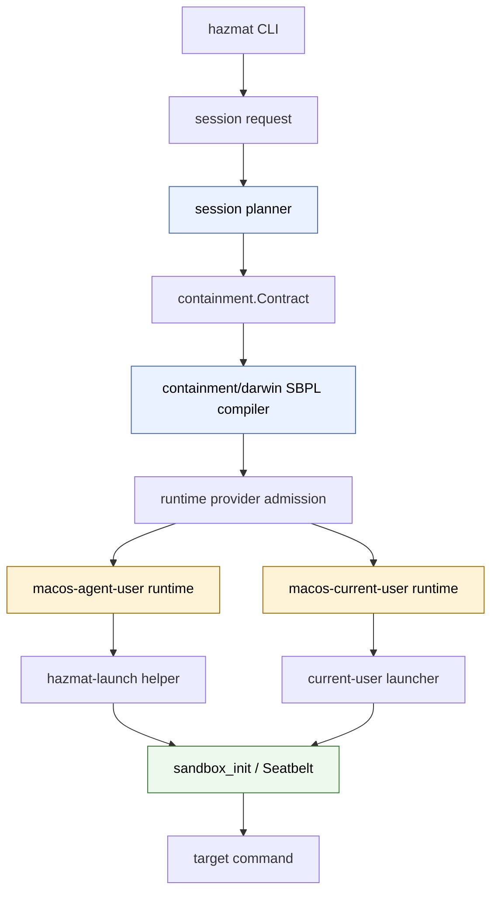
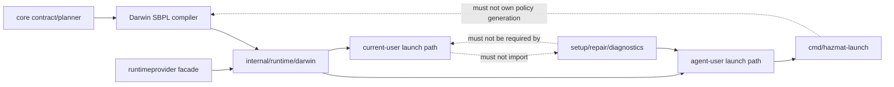
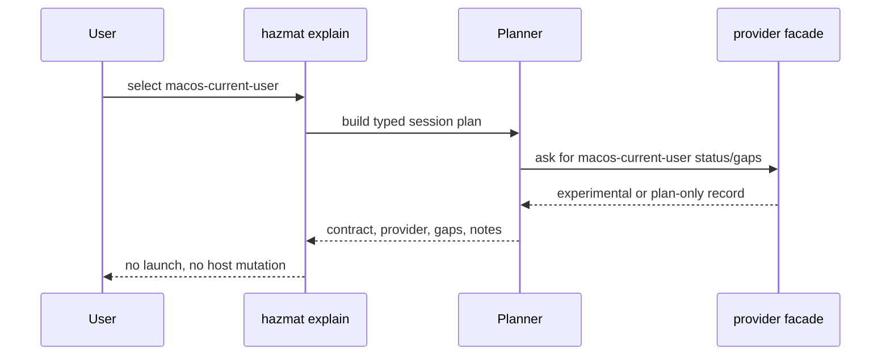
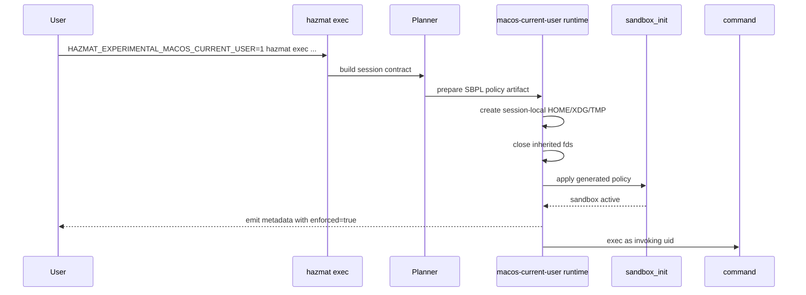
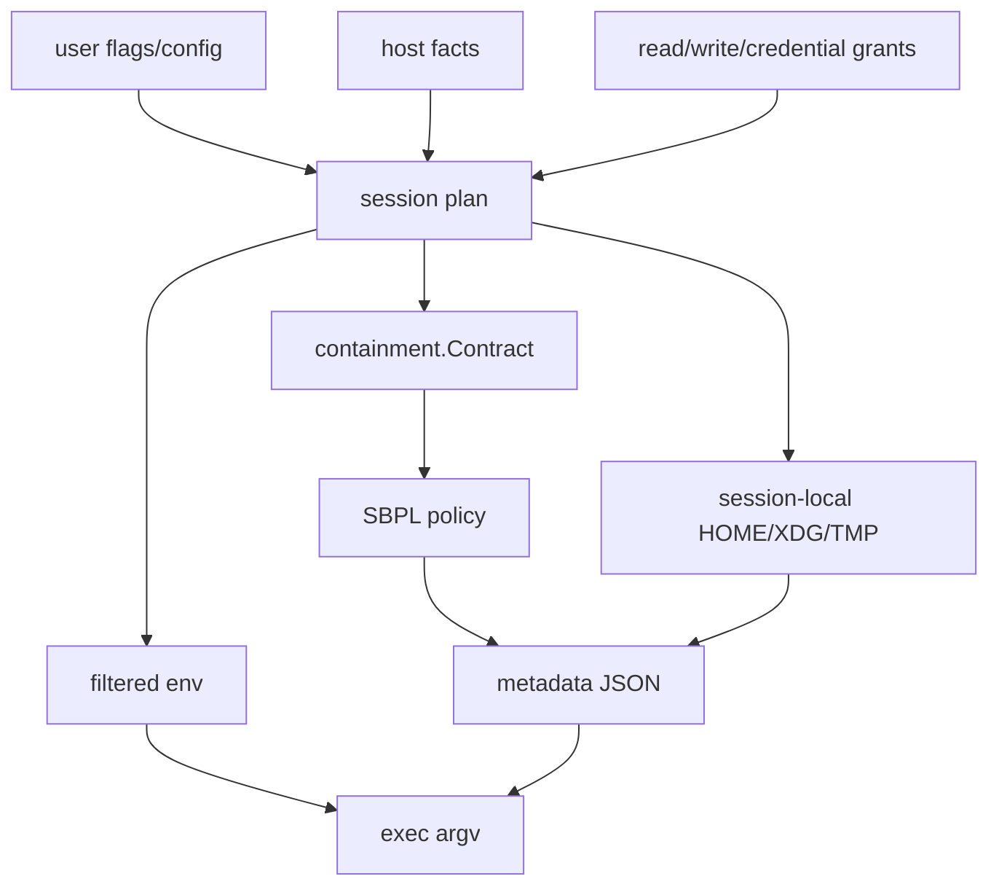

# macOS Current-User Seatbelt Provider Design

**Date:** 2026-06-29
**Bead:** `sandboxing-h1gz.1`
**Status:** design and task split; not a supported-provider claim
**Related docs:**
[runtime provider status](../runtime-provider-status.md),
[architecture](../architecture.md),
[reusable runtime core and user isolation design](2026-06-27-reusable-runtime-core-user-isolation-design.md),
[Linux support two-lane design](2026-06-27-linux-support-two-lane-design.md),
[TLA+ verified areas](../../tla/VERIFIED.md)

## Purpose

Hazmat currently supports macOS native containment through the
`macos-agent-user` provider: build a session contract, compile it to SBPL,
switch to the dedicated `agent` account, call `hazmat-launch`, apply
`sandbox_init`, and exec the harness.

This design adds the work plan for a separate `macos-current-user` provider.
It should run as the invoking macOS user, apply a generated Seatbelt policy,
and avoid the dedicated agent account entirely. The goal is lower-friction
current-user sandboxing and cleaner runtime modularity, not production parity
with the existing multi-user lane.

The two lanes must stay explicit:

- `macos-agent-user`: supported production lane with user isolation.
- `macos-current-user`: initially experimental, same-uid Seatbelt lane.

Neither lane may silently fall back to the other.

## Decision Summary

- Implement `macos-current-user` as a distinct runtime provider over the
  existing `darwin-native` backend.
- Keep the first executable scope to `hazmat exec`; broader harness support
  comes only after state, credentials, and auth flows are proven for same-uid
  sessions.
- Require an explicit experimental gate, proposed as
  `HAZMAT_EXPERIMENTAL_MACOS_CURRENT_USER=1`.
- Add an explicit provider or identity selector instead of overloading
  backend names. The backend is still `darwin-native`; the provider lane is
  `macos-current-user`.
- Refactor Darwin launch code so policy preparation, Seatbelt application,
  inherited-fd closure, metadata emission, env construction, and exec are
  reusable across identity lanes.
- Preserve the existing `sudo -u agent hazmat-launch` path and its helper
  validation unchanged for `macos-agent-user`.
- Use session-local HOME/XDG/TMP roots for current-user launch. Do not inherit
  host HOME, ambient credential env, provider state, or shell startup files.
- Keep docs honest: same uid plus Seatbelt is weaker than dedicated-user
  containment. It reduces authority only if policy generation, fd closure,
  env filtering, and credential absence all hold.

## Non-Goals

- No claim that current-user Seatbelt equals the existing agent-user boundary.
- No automatic fallback from failed current-user launch to agent-user launch.
- No broad harness support in the first slice.
- No new setup, sudoers, account, keychain, pf, or DNS mutation for this lane.
- No use of `sandbox-exec` as the long-term runtime interface; use the same
  direct `sandbox_init` posture as `hazmat-launch`.
- No relaxation of TLA+ governance for verified areas.

## Provider Comparison

| Provider | Backend | Identity | Status target | Setup | First executable scope |
| --- | --- | --- | --- | --- | --- |
| `macos-agent-user` | `darwin-native` | dedicated `agent` user | `supported` | required | all supported native harnesses |
| `macos-current-user` | `darwin-native` | invoking user | `experimental` | none | `hazmat exec` only |

The same session contract can feed both providers, but the runtime admission
must prove that the selected provider can enforce the requested authority.

## Layering

Reusable contract and compiler code must stay independent of the identity lane.
Provider admission decides whether the prepared artifact is executable for the
requested identity.

## Dependency Rules

Rules:

- Core packages describe authority; they do not run processes.
- SBPL compiler packages compile typed contracts; they do not know about
  `sudo`, the `agent` account, or CLI flags.
- Darwin runtime packages own prepared policy artifacts and launch command
  shapes.
- Agent-user code may depend on setup/helper assumptions.
- Current-user code must not depend on setup, sudoers, agent home, or
  `hazmat-launch` policy-file ownership rules that require `SUDO_UID`.

## User Flow

### Preview

Preview must remain read-only and must not probe through sudo or the agent
account.

### Live Exec

Metadata claiming enforcement may be emitted only after `sandbox_init`
succeeds.

## Data Flow

Raw host credential values, host secret-store paths, and broad host environment
variables must not enter the policy artifact or metadata. Typed credential
grants may be materialized only under session-local state and must be cleaned
up after the command exits.

## Runtime Shape

The Darwin runtime should expose identity-neutral pieces:

- prepare a policy artifact from `containment.Contract`;
- validate generated SBPL contains the deny-default floor;
- define launch env from typed session state;
- close inherited descriptors before applying Seatbelt;
- apply Seatbelt with `sandbox_init`;
- emit metadata only after Seatbelt succeeds;
- direct-exec the target command.

Then each identity lane composes those pieces:

| Piece | Agent-user | Current-user |
| --- | --- | --- |
| Identity switch | `sudo -u agent` | none |
| Launcher binary | `hazmat-launch` | current-user launcher path |
| HOME | `/Users/agent` or session home | session-local only |
| Setup dependency | agent account, helper, ACLs | none |
| Credential boundary | UID isolation plus Seatbelt | absence plus Seatbelt |
| Network firewall | existing pf/DNS setup | no pf/DNS claim |

The current-user launcher may live as a package-owned executable path or a
shared helper mode, but it must not require `SUDO_UID` policy ownership
validation because it is not crossing a sudo boundary. It still needs strict
policy path/content validation and fd-closure tests.

## Failure Modes

| Failure | Required behavior |
| --- | --- |
| Experimental gate missing | Refuse live launch; explain how to enable. |
| Current-user selected for unsupported harness | Refuse with scope guidance; do not fall back. |
| SBPL compile failure | Refuse before process launch. |
| `sandbox_init` failure | Refuse before metadata says `enforced=true`. |
| Host HOME/env would be inherited | Refuse in admission or replace with session-local state. |
| Credential grant overlaps deny floor | Refuse during planning. |
| Cleanup failure | Report bounded warning; do not hide command result. |
| Agent-user path regression | Tests fail if supported path changes unexpectedly. |

## Rollout Gates

### Gate 1: Design And Beads

Output: this design plus child beads.

Required evidence:

- dependency, layering, user-flow, and data-flow diagrams;
- explicit same-uid threat model;
- task dependencies and acceptance criteria;
- docs references.

### Gate 2: Refactor Without Behavior Change

Output: identity-neutral Darwin runtime pieces.

Required evidence:

- `go test ./...` from the Go module;
- existing `macos-agent-user` argv/helper tests unchanged or updated with
  equivalent assertions;
- import-boundary tests still pass.

### Gate 3: Experimental Exec

Output: gated `macos-current-user` `hazmat exec`.

Required evidence:

- no-sudo/no-agent-user unit test;
- generated SBPL golden includes deny-default and credential deny floor;
- metadata emitted only after Seatbelt success;
- session-local HOME/XDG/TMP env test;
- negative test for missing experimental gate.

### Gate 4: Live Smoke

Output: approval-gated local smoke documented in `docs/testing.md`.

Required evidence:

- command can write project path;
- command cannot read representative host credential paths;
- command cannot write outside granted roots;
- `--network none` either works with honest metadata or is refused with a
  structured gap;
- cleanup removes session-local state.

### Gate 5: Broader Harness Review

Output: decision beads for each harness family.

Required evidence:

- auth/session state mapped to session-local HOME or typed adapters;
- no reliance on `/Users/agent`;
- no ambient provider env;
- user-facing docs explain weaker current-user boundary.

## Task Beads

| Bead | Depends on | Scope | Acceptance summary |
| --- | --- | --- | --- |
| `sandboxing-h1gz.1` | epic | Design | Commit this design with diagrams and gates. |
| `sandboxing-h1gz.2` | `.1` | Provider admission | Distinct provider status, gaps, and no fallback. |
| `sandboxing-h1gz.3` | `.2` | Darwin runtime split | Shared Seatbelt runtime pieces; no agent-user regression. |
| `sandboxing-h1gz.4` | `.2`, `.3` | CLI selection | Explicit current-user preview and gated exec. |
| `sandboxing-h1gz.5` | `.3`, `.4` | Session state and credentials | Session-local HOME/env and typed grants only. |
| `sandboxing-h1gz.6` | `.3`, `.5` | Verification | No-sudo, SBPL, metadata, denial, cleanup gates. |
| `sandboxing-h1gz.7` | `.4`, `.6` | Docs/status | Runtime status, usage, testing, compatibility updates. |

## Open Decisions

1. Name the user-facing selector: `--provider`, `--identity`, or another
   explicit authority-lane flag.
2. Decide whether the current-user launcher is a new helper mode, a separate
   executable, or package-owned child process path.
3. Decide whether `--network none` can be enforced by Seatbelt alone for this
   lane or must start as unsupported.
4. Decide whether any harness besides `exec` is safe enough for the first
   experimental release.

## Recommended First Implementation Slice

Do the smallest executable slice:

1. Keep `macos-current-user` status `plan-only` while refactoring.
2. Split Darwin runtime helpers without changing agent-user behavior.
3. Add preview support for current-user provider with structured gaps.
4. Add gated `hazmat exec` current-user launch.
5. Promote `macos-current-user` to `experimental` only when no-sudo,
   no-agent-user, SBPL, session-home, metadata, and cleanup tests pass.

This keeps the refactor auditable and avoids turning same-uid sandboxing into a
quiet downgrade of the existing production lane.
