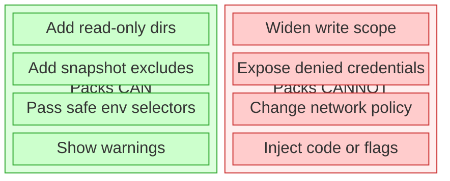
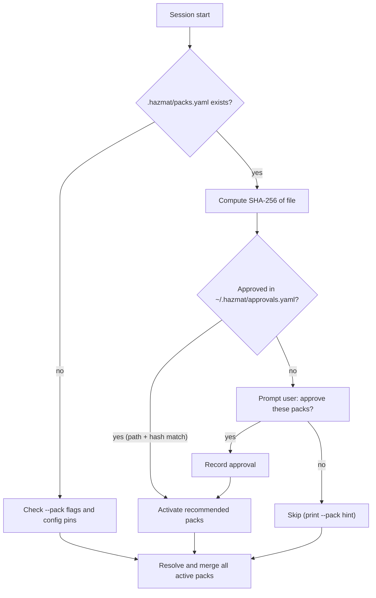

# Stack Packs

Stack packs are optional ergonomics overlays for common technology stacks.
They let Hazmat carry a small amount of stack-specific convenience into a
session without weakening the containment model.

## What Packs Can Do

- Add read-only directories that are useful for a stack, such as toolchains or caches
- Add snapshot exclude patterns for reproducible build artifacts
- Pass through a small safe set of environment selectors and path pointers from the invoker environment
- Show warnings or suggested commands for the stack

## What Packs Cannot Do

- Widen project write scope
- Bypass the seatbelt credential deny list
- Change network policy
- Inject arbitrary flags or preload-style environment variables
- Reconfigure Claude/OpenCode runtime settings



This is the core design rule: packs may reduce friction, but they may not
weaken Hazmat's trust boundary.

## Inspecting Packs

```bash
hazmat pack list
hazmat pack show node
```

`hazmat pack list` shows built-in packs, user-installed packs under
`~/.hazmat/packs/`, and any project pinning currently configured.

`hazmat pack show <name>` shows the pack's detect files, read-only paths,
env passthrough keys, snapshot excludes, warnings, and command hints.

## Activating Packs

Activate a pack for a single session:

```bash
hazmat claude --pack node
hazmat opencode --pack go
hazmat shell --pack rust
hazmat exec --pack python-poetry poetry run pytest
```

If no packs are active, Hazmat may suggest built-in packs based on files in the
project directory, such as `go.mod`, `package.json`, or `Cargo.toml`.

## Project Pinning

Pin packs so they auto-activate for a specific project:

```bash
hazmat config set packs.pin "~/workspace/my-app:node,go"
hazmat config set packs.unpin ~/workspace/my-app
```

Hazmat canonicalizes the project path (`Abs` + `EvalSymlinks`) before storing
the pin. At session start, the session's project path is resolved the same way
and compared for exact equality. This means `~/workspace/my-app` and
`/Users/dr/workspace/my-app` both resolve to the same canonical pin. Re-running
`packs.pin` for the same project replaces the existing pin set.

## Built-In Packs

| Pack | Detects | Read dirs | Env passthrough | Snapshot excludes |
|------|---------|-----------|-----------------|-------------------|
| `go` | `go.mod` | — | `GOPATH`, `GOPROXY`, `GOPRIVATE`, `CGO_ENABLED` | `vendor/` |
| `node` | `package.json` | `/opt/homebrew/lib/node_modules` | `NODE_ENV` | `node_modules/`, `.next/`, `.turbo/`, `.nuxt/`, `out/`, `.vercel/` |
| `python-poetry` | `pyproject.toml`, `poetry.lock` | `~/.local/share/pypoetry` | `VIRTUAL_ENV` | `.venv/`, `__pycache__/`, `.pytest_cache/`, `.mypy_cache/`, `.ruff_cache/`, `*.pyc`, `dist/`, `*.egg-info/` |
| `rust` | `Cargo.toml` | `~/.cargo/registry`, `~/.rustup/toolchains` | `RUSTUP_HOME`, `CARGO_HOME`, `CARGO_TARGET_DIR` | `target/` |
| `terraform-plan` | `main.tf`, `terraform.tf` | — | — | `.terraform/`, `*.tfstate`, `*.tfstate.backup` |
| `tla-java` | `MC_*.cfg` files | `/opt/homebrew/opt/openjdk`, `/Library/Java` | `JAVA_HOME` | `tla/states/`, `*.dot` |

Packs influence three parts of session setup:

1. **Read-only access** — toolchain and cache directories
2. **Pre-session snapshot excludes** — reproducible build artifacts
3. **Safe environment passthrough** — passive selectors from the invoker's environment

Hazmat prints pack-derived read-only paths, snapshot excludes, registry redirect
keys, and warnings at session start so the behavior stays visible.

## Safe Environment Passthrough

Packs may only request env keys from Hazmat's allowlist. The intent is to allow
passive selectors and path pointers, not code-injection knobs.

Examples of allowed keys:

- `GOPATH`
- `GOPROXY`
- `RUSTUP_HOME`
- `CARGO_HOME`
- `VIRTUAL_ENV`
- `JAVA_HOME`

Examples of intentionally forbidden keys:

- `NODE_OPTIONS`
- `PYTHONPATH`
- `GOFLAGS`
- `LD_PRELOAD`
- `DYLD_INSERT_LIBRARIES`
- credential variables such as `AWS_ACCESS_KEY_ID` or `GITHUB_TOKEN`

Registry redirect keys like `GOPROXY` and `NPM_CONFIG_REGISTRY` are allowed but
surfaced explicitly at session start because they change where downloads come
from.

## Repo-Recommended Packs

A repo can declare which packs it needs in `.hazmat/packs.yaml`:

```yaml
packs:
  - go
  - tla-java
```

This file is pure data: a list of existing pack names. No inline definitions,
no custom paths, no env keys, no executable hooks.

**Repo owns intent; host owns trust.** Hazmat reads the file as a hint, not
authority.



On first encounter, it prompts:

```
hazmat: this repo recommends packs: go, tla-java
hazmat: source: /Users/dr/workspace/hazmat/.hazmat/packs.yaml
hazmat: approve these packs for this repo? [y/N]
```

Approval is stored outside the repo in `~/.hazmat/approvals.yaml`, keyed by
canonical project path + SHA-256 of the file contents:

- Same repo + same file = no prompt (approved)
- File changes (pack added or removed) = re-approve
- Repo cloned to a different path = re-approve

If the user declines, packs are not activated. They can still use `--pack`
manually.

## For Project Maintainers

To recommend packs for your repo, add `.hazmat/packs.yaml`:

```yaml
packs:
  - go
  - node
```

The file only lists names of existing built-in or user-installed packs. It
cannot define custom packs, paths, env vars, or any session config inline.

Tell your contributors which packs the repo needs, and note any prerequisites
(runtimes, tools) in the project README. When a contributor runs `hazmat claude`
for the first time, they'll see the approval prompt with the exact pack list.

If your project needs a pack that doesn't exist as a built-in, contributors
can create a matching user pack on their machines (see below). The `.hazmat/packs.yaml`
should still reference the pack name — it will resolve through the user pack
loader.

## User Packs

User-installed packs live in:

```text
~/.hazmat/packs/<name>.yaml
```

Hazmat resolves pack names by checking built-ins first, then user packs. This
means you can extend or replace a built-in by creating a user pack with the
same name, or create entirely new packs for stacks that hazmat doesn't ship.

### When to create a user pack

- A built-in pack is close but your environment differs (e.g., SDKMAN Java
  instead of Homebrew, or a custom Cargo registry)
- Your project uses a stack that has no built-in pack
- You need read-only access to a toolchain path specific to your machine

### Writing a user pack

A pack manifest is YAML with strict field validation. Unknown fields are
rejected at load time.

```yaml
pack:
  name: java-sdkman
  version: 1
  description: Java via SDKMAN (instead of Homebrew)

detect:
  files: [pom.xml, build.gradle]

session:
  read_dirs:
    - ~/.sdkman/candidates/java
  env_passthrough: [JAVA_HOME]

backup:
  excludes:
    - .gradle/
    - build/
    - target/
    - "*.class"

warnings:
  - "Using SDKMAN Java. Ensure JAVA_HOME points to the correct version."

commands:
  build: ./gradlew build
  test: ./gradlew test
```

**Fields reference:**

| Field | Required | Description |
|-------|----------|-------------|
| `pack.name` | yes | Lowercase alphanumeric + hyphens |
| `pack.version` | yes | Must be `1` |
| `pack.description` | no | One-line description |
| `detect.files` | no | Filenames (no paths) that suggest this pack |
| `session.read_dirs` | no | Paths added read-only (`~` expands to invoker home) |
| `session.env_passthrough` | no | Env var names from the safe allowlist only |
| `backup.excludes` | no | Glob patterns for snapshot exclusion |
| `warnings` | no | Messages shown at session start |
| `commands` | no | Name-to-command hints (informational, not executed) |

**Validation rules:**

- Read-only paths are canonicalized (`Abs` + `EvalSymlinks`) and checked
  against the credential deny list. Paths that resolve to `~/.ssh`, `~/.aws`,
  or other denied zones are rejected.
- Env passthrough keys must be in the safe set (passive pointers like `GOPATH`,
  `JAVA_HOME`, `VIRTUAL_ENV`). Keys that accept arbitrary flags or preload code
  (`NODE_OPTIONS`, `PYTHONPATH`, `GOFLAGS`, `LD_PRELOAD`) are rejected.
- No negation in exclude patterns.
- Manifest size limit: 8KB.

If any validation fails, hazmat rejects the entire pack rather than partially
applying it.

### Combining multiple packs

Activate multiple packs in one session:

```bash
hazmat claude --pack node --pack python-poetry
```

Or pin a combination:

```bash
hazmat config set packs.pin "~/workspace/fullstack:node,python-poetry"
```

Packs merge additively. Read dirs, excludes, env passthrough, and warnings are
unioned and deduplicated. If two packs add the same read dir or exclude, it
appears once.

## Self-Hosting: Developing Hazmat Under Hazmat

Hazmat's own repo includes `.hazmat/packs.yaml` recommending `go` and
`tla-java`. On first `hazmat claude` in this repo, approve the recommended
packs and the session gets Go toolchain support plus Java paths for TLC model
checking.

Prerequisites:
- Go installed locally
- Java 17+ installed locally (Homebrew: `brew install openjdk`)
- `~/workspace/tla2tools.jar` downloaded (see `tla/VERIFIED.md`)
- `~/workspace` as the sole entry in `session.read_dirs`
