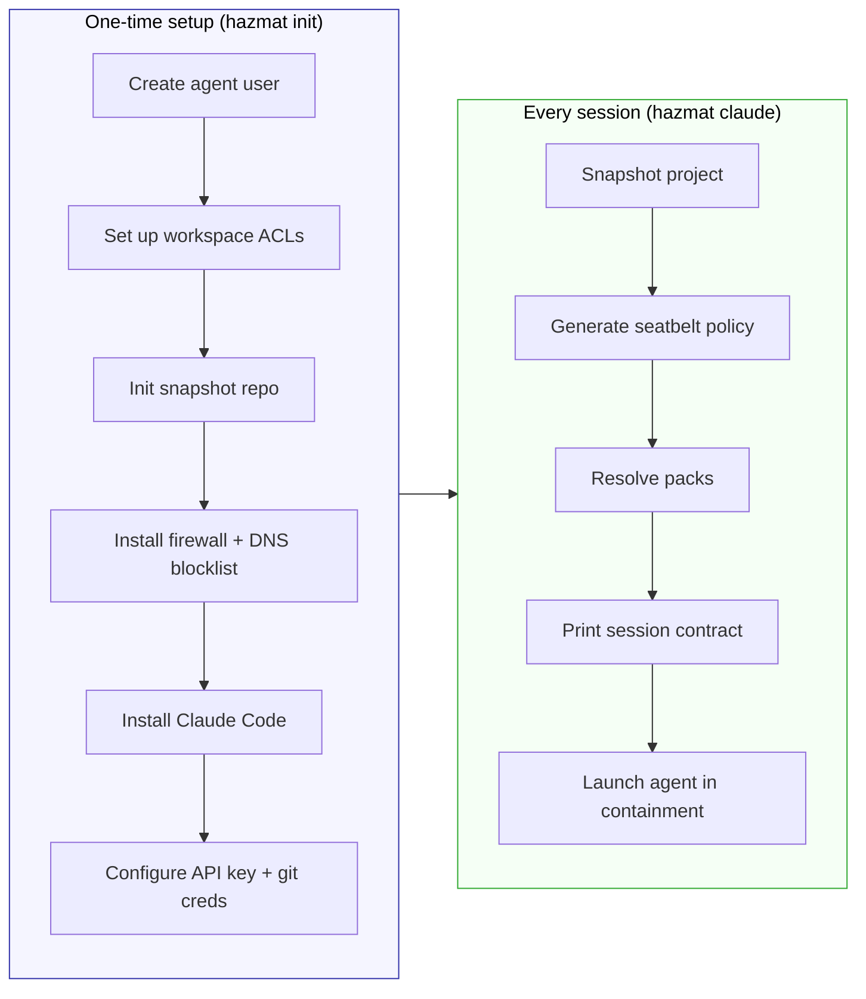

# Using Hazmat

Hazmat runs AI agents on your Mac with full permissions — inside containment. Every session prints a contract telling you exactly what the agent can do, which mode was selected, and why.

## Quick Start

Two commands:

```bash
hazmat init       # one-time setup (~10 min, needs sudo)
hazmat claude     # launch Claude Code in containment
```

That's it. `init` creates a contained environment, installs Claude Code, asks for your API key and git credentials, and can optionally import portable basics from your existing Claude setup. After that, you just use `hazmat claude` every day.



## What `hazmat init` Does

When you run `hazmat init`, it:

1. Creates a hidden `agent` macOS user (separate from yours)
2. Adds the host-side access needed for contained sessions to reach the selected project directories
3. Initializes the local Kopia repository for automatic pre-session snapshots
4. Installs a firewall that blocks the agent from SMTP, IRC, FTP, Tor, and other exfiltration protocols
5. Adds a DNS blocklist for tunnel and paste services (ngrok, pastebin, etc.)
6. Installs Claude Code for the agent user
7. Asks for your Anthropic API key and git credentials
8. Optionally imports portable Claude basics such as sign-in state, commands, and skills

Everything is interactive — it explains each step and asks for confirmation. To preview without making changes:

```bash
hazmat init --dry-run
```

## The Session Contract

Every session starts with a plain-language summary of what the agent can and can't do:

```
hazmat: session
  Mode:                 Native containment
  Why this mode:        using native containment because no Docker requirement was detected
  Project (read-write): /Users/dr/workspace/my-app
  Extra read-only:      /Users/dr/go/pkg/mod
  Packs:                go
  Service access:       none
  Pre-session snapshot: on
  Snapshot excludes:    vendor/
```

Each line maps to a concrete boundary:

- **Mode** — Native containment (kernel sandbox + user isolation) or Docker Sandbox (private Docker daemon in an isolated runtime)
- **Why this mode** — what triggered the mode selection (Docker files detected, `--sandbox` flag, or default)
- **Project (read-write)** — the only directory the agent can modify
- **Extra read-only** — additional directories visible to the agent (via `-R` or config)
- **Packs** — active stack packs and what they add
- **Service access** — external services the agent can authenticate to
- **Pre-session snapshot** — whether a rollback point was created
- **Snapshot excludes** — patterns skipped by the snapshot (from packs)

Preview any session without running it:

```bash
hazmat explain                      # preview current project
hazmat explain --sandbox            # preview Docker Sandbox mode
hazmat explain --pack node          # preview with a pack
```

## Daily Usage

```bash
cd ~/workspace/my-project
hazmat claude
hazmat opencode
```

This generates a per-session security policy, switches to the agent user, and launches the agent inside containment. When you exit, the session is cleaned up.

### Giving the Agent Read Access to Other Directories

By default, the agent can only write to the project directory (your current directory). To let it *read* other directories:

```bash
hazmat claude -R ~/workspace              # read all of ~/workspace
hazmat claude -R ~/code/lib -R ~/docs     # cherry-pick specific dirs
```

Read directories are strictly read-only — the agent cannot modify them.

### Stack Packs

Packs let you carry stack-specific ergonomics into a session without weakening
Hazmat's trust boundaries:

```bash
hazmat pack list
hazmat pack show node
hazmat claude --pack node
hazmat config set packs.pin "~/workspace/my-project:node,go"
```

Today packs can:

- add read-only toolchain or cache directories
- add snapshot excludes for reproducible build artifacts
- pass through a small safe set of environment selectors such as `GOPATH` or `VIRTUAL_ENV`

They cannot widen write access, expose blocked credentials, or change firewall
policy.

Repos can ship a `.hazmat/packs.yaml` listing recommended packs. On first use,
hazmat prompts once for approval; after that, packs activate automatically.
Write your own packs in `~/.hazmat/packs/` for stacks or environments that
built-ins don't cover. Full reference: [stack-packs.md](stack-packs.md).

### Docker Projects

When Hazmat detects Docker files (Dockerfile, compose.yaml, etc.) in the
project, it automatically routes into Docker Sandbox mode. The agent runs
inside an isolated sandbox with its own private Docker daemon — it can build
and run containers without accessing your host Docker daemon.

```bash
hazmat claude                       # auto-routes if Docker files detected
hazmat claude --sandbox             # force Docker Sandbox mode
hazmat claude --ignore-docker       # stay in native mode despite Docker files
```

If `.devcontainer/` is the only Docker-related directory, Hazmat stays in
native containment unless the devcontainer.json positively indicates Docker
is needed (e.g., it contains `image`, `dockerFile`, or `dockerComposeFile`).

For setup details, network policy, and Compose hardening guidance, see
[tier3-docker-sandboxes.md](tier3-docker-sandboxes.md).

### Specifying a Different Project Directory

```bash
hazmat claude -C ~/workspace/other-project
```

### Resuming a Conversation Inside the Sandbox

When you start a conversation as yourself (`claude`) and later want to continue it inside containment, `--resume` and `--continue` work seamlessly:

```bash
# Start a conversation as yourself (no containment)
cd ~/workspace/my-project
claude

# Later, resume that same conversation inside containment
hazmat claude --resume              # interactive picker — shows your sessions
hazmat claude --continue            # resume the most recent session
hazmat claude --resume <session-id> # resume a specific session by ID
```

**How it works:** Hazmat detects `--resume` or `--continue` in the forwarded flags and copies the matching host Claude session transcripts into the agent user's local Claude session directory before launch.

- `hazmat claude --resume` copies the project's available sessions so Claude can show its picker UI
- `hazmat claude --continue` copies only the latest session
- `hazmat claude --resume <session-id>` copies one specific session
- Existing agent-local files are not overwritten, so contained continuations stay independent once they diverge

**Security note:** The sandbox does not get direct access to your host `~/.claude/projects/` directory. Hazmat stages copies into the agent-owned Claude store instead.

### Continuing a Hazmat Session Outside the Sandbox

When a conversation started inside containment and you want to continue it as your normal user, export the hazmat session into your host Claude session store and then resume it:

```bash
# Continue the latest hazmat Claude session for the current project
claude --resume "$(hazmat export claude session)" --fork-session

# Continue a specific hazmat session
claude --resume "$(hazmat export claude session <session-id>)" --fork-session

# Export from a different project directory
claude --resume "$(hazmat export claude session -C ~/workspace/other-project)" --fork-session
```

**What `hazmat export claude session` does:**

- Defaults to the latest hazmat Claude session for the current project
- Accepts an optional session ID to export a specific session
- Copies the transcript and session sidecar directory from the agent user's `~/.claude/projects/...`
- Updates your host Claude `sessions-index.json`
- Prints the Claude resume ID on stdout for scripting

`--fork-session` is recommended so your host-side continuation cleanly diverges from the contained hazmat session. The export is a point-in-time handoff, not a live sync. If the hazmat session advances later, run the export again before resuming.

### Running Other Commands in Containment

```bash
hazmat shell                    # interactive shell as the agent user
hazmat exec npm install         # run a single command
hazmat exec -C ~/workspace/proj npm test
hazmat opencode -C ~/workspace/proj
```

## Checking Status

```bash
hazmat                          # shows setup progress checklist
hazmat status                   # same thing
hazmat check               # run full verification suite
hazmat check --full        # include live network probes
```

## Backup and Restore

### Local project snapshots

Hazmat automatically snapshots the current project directory before every
session:

```bash
hazmat snapshots
hazmat diff
hazmat restore
hazmat restore --session=2
```

These snapshots cover only the selected project directory, not the entire
workspace and not the extra read-only directories you pass via `-R`.

Default excludes live in `hazmat config`, and packs can add stack-specific
snapshot excludes such as `node_modules/` or `target/` for the active session.

### Cloud backup (encrypted, incremental)

```bash
hazmat init cloud              # one-time: configure S3 credentials
hazmat backup --cloud          # incremental encrypted snapshot
hazmat restore --cloud         # restore latest snapshot
```

## Updating Credentials

```bash
hazmat config agent            # re-enter API key, git name/email
```

## Importing Portable Claude Basics

```bash
hazmat config import claude
hazmat config import claude --dry-run
hazmat config import claude --overwrite
hazmat config import claude --skip-existing
```

Hazmat treats this as a curated import, not a full Claude migration. It can copy sign-in state, git identity, commands, and skills into the agent environment. Hazmat keeps its own runtime settings, hooks, MCP configuration, plugins, and safety controls.

Detailed scope, symlink behavior, conflict handling, and MCP migration guidance live in [claude-import.md](claude-import.md).

## Running OpenCode

```bash
hazmat bootstrap opencode
hazmat opencode
hazmat opencode -p "summarize this repo"
```

This is a prototype harness path alongside Claude. It uses the same containment, project preflight, and snapshot flow, but OpenCode keeps its own config and session state.

## Importing Portable OpenCode Basics

```bash
hazmat config import opencode
hazmat config import opencode --dry-run
hazmat config import opencode --overwrite
hazmat config import opencode --skip-existing
```

Hazmat treats this as a curated import, not a full OpenCode migration. It can copy sign-in state, git identity, commands, agents, and skills into the agent environment. Hazmat keeps its own runtime settings, plugins, project-local `.opencode` directories, and safety controls separate.

Detailed scope, symlink behavior, and migration guidance live in [opencode-import.md](opencode-import.md).

## Uninstalling

```bash
hazmat rollback                              # remove all system config
hazmat rollback --delete-user --delete-group  # also delete agent account
```

Your project files are not deleted. Back them up first if needed.

## What the Agent Can and Can't Do

**Can:**
- Read and write files in your project directory
- Read directories you expose with `-R`
- Make HTTPS requests to any host
- Run any command available to the agent user
- Access `/private/tmp` for temporary files
- Build and run Docker containers (Docker Sandbox mode only)

**Can't:**
- Read your SSH keys, AWS credentials, GPG keys, or Keychain
- Send email (SMTP blocked), use IRC, FTP, Tor, or VPN protocols
- Access the host Docker daemon (socket locked to your user only)
- Read files outside the approved directories
- Use `sudo`

For the current import policy and non-goals, see [claude-import.md](claude-import.md) and [opencode-import.md](opencode-import.md).
