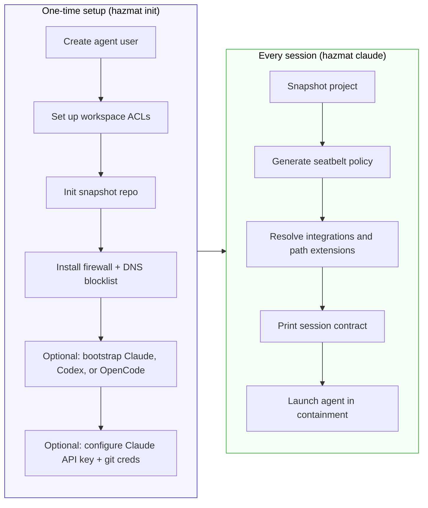

# Using Hazmat

Hazmat runs AI agents on your Mac with full permissions — inside containment. Every session prints a contract telling you exactly what the agent can do, which mode was selected, and why.

## Quick Start

Install:

```bash
# Homebrew
brew install dredozubov/tap/hazmat

# Or GitHub releases (downloads, verifies checksum, installs)
curl -fsSL https://raw.githubusercontent.com/dredozubov/hazmat/master/scripts/install.sh | bash
```

Then two commands:

```bash
hazmat init --bootstrap-agent claude   # one-time setup (~10 min, needs sudo)
hazmat claude     # launch Claude Code in containment
```

That's it. `init` creates a contained environment and lets you choose whether to bootstrap Claude Code, Codex, OpenCode, or skip agent installation for now. When you bootstrap Claude during init, Hazmat can also ask for your API key, git credentials, and optionally import portable Claude basics from your existing setup.



## What `hazmat init` Does

When you run `hazmat init`, it:

1. Creates a hidden `agent` macOS user (separate from yours)
2. Adds the host-side access needed for contained sessions to reach the selected project directories
3. Initializes the local Kopia repository for automatic pre-session snapshots
4. Installs a firewall that blocks the agent from SMTP, IRC, FTP, Tor, and other exfiltration protocols
5. Adds a DNS blocklist for tunnel and paste services (ngrok, pastebin, etc.)
6. Optionally bootstraps a supported AI coding agent for the agent user
7. If you choose Claude, offers to configure your Anthropic API key and git credentials
8. If you choose Claude, can optionally import portable Claude basics such as sign-in state, commands, and skills

Everything is interactive — it explains each step and asks for confirmation. To preview without making changes:

```bash
hazmat init --dry-run
```

## The Session Contract

Every session starts with a plain-language summary of what the agent can and can't do:

```
hazmat: session
  Mode:                 Native containment
  Why this mode:        using native containment because no Docker requirement was detected
  Project (read-write): /Users/dr/workspace/my-app
  Integrations:         go
  Host changes:          project ACL repair
  Auto read-only:       /Users/dr/go/pkg/mod
  Read-only extensions: /Users/dr/reference-docs
  Read-write extensions: /Users/dr/.venvs/my-app
  Service access:       none
  Pre-session snapshot: on
  Snapshot excludes:    vendor/
```

Each line maps to a concrete boundary:

- **Mode** — Native containment (kernel sandbox + user isolation) or Docker Sandbox (private Docker daemon in an isolated runtime)
- **Why this mode** — what triggered the mode selection (`--docker=sandbox`, project config, private-daemon Docker detection, or default)
- **Project (read-write)** — the only directory the agent can modify
- **Integrations** — active stack integrations and what they add automatically
- **Host changes** — persistent host-side mutations Hazmat may apply before launch, such as project ACL repair, agent Git safe-directory trust, or a bounded toolchain permission fix. Permission-repair classes are modeled in TLA+; non-permission host changes are governed by tests and documentation.
- **Auto read-only** — read-only directories that Hazmat resolved on your behalf
- **Read-only extensions** — explicit additional read-only directories from `-R` or config
- **Read-write extensions** — explicit additional writable directories from `-W` or config
- **Service access** — external services the agent can authenticate to
- **Pre-session snapshot** — whether a rollback point was created
- **Snapshot excludes** — patterns skipped by the snapshot (often from integrations)

Preview any session without running it:

```bash
hazmat explain                      # preview current project
hazmat explain --json               # machine-readable preview for automation
hazmat explain --docker=sandbox     # preview Docker Sandbox mode
hazmat explain --docker=none        # preview code-only native mode
hazmat explain --integration node   # preview with an integration
```

`hazmat explain` previews these changes but does not apply them. A real session
may execute the listed host mutations before launch if they are still needed at
that point. The verified TLA+ model covers the permission-repair subset of that
preview-vs-launch split and the current non-reverting rollback contract for
those repairs; non-permission host changes are covered by tests and docs.

`hazmat explain --json` emits the same prepared session state in a stable
machine-readable form, including suggested integrations, active integrations,
resolved integration sources and details, planned host changes,
read-only access, snapshot excludes, and routing notes.

## Daily Usage

```bash
cd ~/workspace/my-project
hazmat claude
hazmat opencode
```

This generates a per-session security policy, switches to the agent user, and launches the agent inside containment. When you exit, the session is cleaned up.

### Giving the Agent Access to Other Directories

By default, the agent can only write to the project directory (your current
directory). To let it read or write other directories explicitly:

```bash
hazmat claude -R ~/workspace              # read all of ~/workspace
hazmat claude -R ~/code/lib -R ~/docs     # cherry-pick specific dirs
hazmat claude -W ~/.venvs/my-app          # add another writable root
hazmat config access add -C ~/workspace/my-project --read ~/docs --write ~/.venvs/my-app
```

Read directories are strictly read-only. Write directories are explicit
extensions to the writable contract and show up separately in the session
summary.

### Session Integrations

Integrations let you carry stack-specific ergonomics into a session without
weakening Hazmat's trust boundaries:

```bash
hazmat integration list
hazmat integration show node
hazmat claude --integration node
hazmat claude --integration python-uv
hazmat config set integrations.pin "~/workspace/my-project:node,go"
```

Today integrations can:

- add auto-resolved read-only toolchain or cache directories
- add snapshot excludes for reproducible build artifacts
- pass through a small safe set of environment selectors such as `GOPATH` or `VIRTUAL_ENV`

They do not widen write access, expose blocked credentials, or change firewall
policy. Explicit extra writable scope is handled separately through `-W` or
`hazmat config access`, not through integrations.

Built-in integrations may also plan narrowly-scoped host permission repairs for
known local toolchains when the current host permissions would otherwise block
the agent user. These changes are shown under `Host changes` before launch,
are never applied by `hazmat explain`, and the permission-repair subset shares
the same TLA+ state-machine coverage as the other modeled session mutation
classes.

Repos can still ship a `.hazmat/integrations.yaml` listing recommended integrations.
On first use, hazmat prompts once for approval; after that, the approved
integrations activate automatically until the file changes. Write your own
integration manifest in `~/.hazmat/integrations/` for environments that
built-ins do not cover. Full reference: [integrations.md](integrations.md).

For mixed-stack repos, prefer declaring the full set explicitly. Example:

```yaml
integrations:
  - python-uv
  - node
  - tla-java
```

### Docker Projects

Hazmat treats Docker routing as a daemon-boundary question, not just "does this
repo have Docker files?"

- If the repo looks compatible with a **private Docker daemon**, Hazmat
  auto-routes into Docker Sandbox mode.
- If the repo appears to depend on a **shared host daemon** (for example via
  external Docker networks or Traefik Docker labels), Hazmat stops and asks you
  to make an explicit choice.

```bash
hazmat claude                       # auto-route only for private-daemon fits
hazmat claude --docker=sandbox      # force Docker Sandbox mode
hazmat claude --docker=none         # code-only native session
hazmat config docker none -C ~/workspace/my-project
```

Today Docker Sandbox sessions are surfaced through `hazmat claude`,
`hazmat shell`, and `hazmat exec`. OpenCode and Codex can still use
`--docker=none` for code-only native sessions in Docker-marked repos.

If `.devcontainer/` is the only Docker-related directory, Hazmat stays in
native containment unless the devcontainer.json positively indicates Docker
is needed (e.g., it contains `image`, `dockerFile`, or `dockerComposeFile`).

`--docker=none` is a fallback for code editing against externally managed local
services. Docker commands still fail inside the session. If the agent must
restart containers, inspect logs, run `docker exec`, or debug the live Docker
topology, Tier 4 is the right fit.

For setup details, network policy, and Compose hardening guidance, see
[tier3-docker-sandboxes.md](tier3-docker-sandboxes.md). For shared-daemon
projects and the code-only fallback, see
[shared-daemon-projects.md](shared-daemon-projects.md).

### Specifying a Different Project Directory

```bash
hazmat claude -C ~/workspace/other-project
```

### Running Commands With Flags

`hazmat exec` forwards the command after Hazmat parses its own flags. When the
forwarded command has flags of its own, insert `--` before it:

```bash
hazmat exec -- make test
hazmat exec -- /bin/zsh -lc 'uv run pytest -q'
hazmat exec --docker=none -C ~/workspace/app -- /bin/zsh -lc 'cd frontend && npm run build'
```

### Resuming a Conversation Inside Native Containment

When you start a conversation as yourself (`claude`) and later want to continue it inside **native containment**, `--resume` and `--continue` work seamlessly:

```bash
# Start a conversation as yourself (no containment)
cd ~/workspace/my-project
claude

# Later, resume that same conversation inside containment
hazmat claude --resume              # interactive picker — shows your sessions
hazmat claude --continue            # resume the most recent session
hazmat claude --resume <session-id> # resume a specific session by ID
```

**How it works:** Hazmat detects `--resume` or `--continue` in the forwarded flags and copies the matching host Claude session transcripts into the agent user's local Claude session directory before launch.

- `hazmat claude --resume` copies the project's available sessions so Claude can show its picker UI
- `hazmat claude --continue` copies only the latest session
- `hazmat claude --resume <session-id>` copies one specific session
- Existing agent-local files are not overwritten, so contained continuations stay independent once they diverge

**Security note:** The sandbox does not get direct access to your host `~/.claude/projects/` directory. Hazmat stages copies into the agent-owned Claude store instead.

**Current limitation:** Docker Sandbox mode uses sandbox-local Claude history.
Host transcript sync is not applied there yet.

### Continuing a Hazmat Session Outside the Sandbox

When a conversation started inside containment and you want to continue it as your normal user, export the hazmat session into your host Claude session store and then resume it:

```bash
# Continue the latest hazmat Claude session for the current project
claude --resume "$(hazmat export claude session)" --fork-session

# Continue a specific hazmat session
claude --resume "$(hazmat export claude session <session-id>)" --fork-session

# Export from a different project directory
claude --resume "$(hazmat export claude session -C ~/workspace/other-project)" --fork-session
```

**What `hazmat export claude session` does:**

- Defaults to the latest hazmat Claude session for the current project
- Accepts an optional session ID to export a specific session
- Copies the transcript and session sidecar directory from the agent user's `~/.claude/projects/...`
- Updates your host Claude `sessions-index.json`
- Prints the Claude resume ID on stdout for scripting

`--fork-session` is recommended so your host-side continuation cleanly diverges from the contained hazmat session. The export is a point-in-time handoff, not a live sync. If the hazmat session advances later, run the export again before resuming.

### Running Other Commands in Containment

```bash
hazmat shell                    # interactive shell as the agent user
hazmat exec npm install         # run a single command
hazmat exec -C ~/workspace/proj npm test
hazmat opencode -C ~/workspace/proj
```

## Checking Status

```bash
hazmat                          # shows setup progress checklist
hazmat status                   # same thing
hazmat check               # run full verification suite
hazmat check --full        # include live network probes
```

`hazmat check` validates the current local Hazmat install and containment
behavior. It is not the full repo test suite. For lifecycle e2e, self-hosting,
repo-matrix, VM-backed verification, and CI mapping, see [testing.md](testing.md).

## Backup and Restore

### Local project snapshots

Hazmat automatically snapshots the current project directory before every
session:

```bash
hazmat snapshots
hazmat diff
hazmat restore
hazmat restore --session=2
```

These snapshots cover only the selected project directory, not the entire
workspace and not the extra read-only directories you pass via `-R`.

Default excludes live in `hazmat config`, and integrations can add stack-specific
snapshot excludes such as `node_modules/` or `target/` for the active session.

### Cloud backup (encrypted, incremental)

```bash
hazmat init cloud              # one-time: configure S3 credentials
hazmat backup --cloud          # incremental encrypted snapshot
hazmat restore --cloud         # restore latest snapshot
```

## Updating Credentials

```bash
hazmat config agent            # re-enter Claude API key, git name/email
```

## Importing Portable Claude Basics

```bash
hazmat config import claude
hazmat config import claude --dry-run
hazmat config import claude --overwrite
hazmat config import claude --skip-existing
```

Hazmat treats this as a curated import, not a full Claude migration. It can copy sign-in state, git identity, commands, and skills into the agent environment. Hazmat keeps its own runtime settings, hooks, MCP configuration, plugins, and safety controls.

Detailed scope, symlink behavior, conflict handling, and MCP migration guidance live in [claude-import.md](claude-import.md).

## Running OpenCode

```bash
hazmat bootstrap opencode
hazmat opencode
hazmat opencode -p "summarize this repo"
```

This is a prototype harness path alongside Claude. It uses the same containment, project preflight, and snapshot flow, but OpenCode keeps its own config and session state.

## Running Codex

```bash
hazmat bootstrap codex
hazmat codex
hazmat codex -p "review the recent changes"
```

Codex uses the same containment and project preflight model. It keeps its own
auth and runtime state under the agent user's home directory.

## Importing Portable OpenCode Basics

```bash
hazmat config import opencode
hazmat config import opencode --dry-run
hazmat config import opencode --overwrite
hazmat config import opencode --skip-existing
```

Hazmat treats this as a curated import, not a full OpenCode migration. It can copy sign-in state, git identity, commands, agents, and skills into the agent environment. Hazmat keeps its own runtime settings, plugins, project-local `.opencode` directories, and safety controls separate.

Detailed scope, symlink behavior, and migration guidance live in [opencode-import.md](opencode-import.md).

## Uninstalling

```bash
hazmat rollback                              # remove all system config
hazmat rollback --delete-user --delete-group  # also delete agent account

# Remove binaries (choose one):
brew uninstall hazmat                        # if installed via Homebrew
sudo rm /usr/local/bin/hazmat /usr/local/libexec/hazmat-launch  # if installed via script
```

Your project files are not deleted. Back them up first if needed.

## What the Agent Can and Can't Do

**Can:**
- Read and write files in your project directory
- Read directories you expose with `-R`
- Make HTTPS requests to any host
- Run any command available to the agent user
- Access `/private/tmp` for temporary files
- Build and run Docker containers (Docker Sandbox mode only)

**Can't:**
- Read your SSH keys, AWS credentials, GPG keys, or Keychain
- Send email (SMTP blocked), use IRC, FTP, Tor, or VPN protocols
- Access the host Docker daemon (socket locked to your user only)
- Read files outside the approved directories
- Use `sudo`

For the current import policy and non-goals, see [claude-import.md](claude-import.md) and [opencode-import.md](opencode-import.md).
