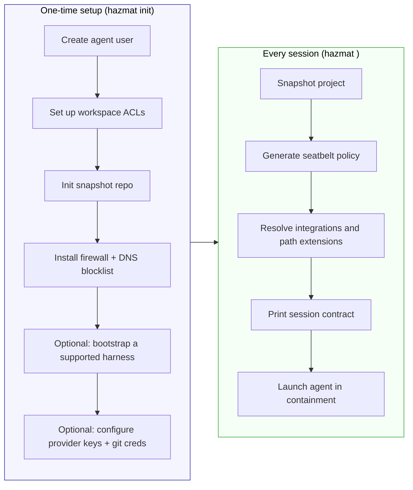

# Using Hazmat

Hazmat runs AI agents on your Mac with full permissions — inside containment. Every session prints a contract telling you exactly what the agent can do, which mode was selected, and why.

> **Picking which agent to install?** [docs/harnesses.md](harnesses.md) is the per-harness setup matrix — tested versions, auth paths, and verification commands for claude, codex, opencode, gemini, experimental hermes, qwen, and cursor-agent.
>
> **Verifying a fresh install or a release candidate?** [docs/manual-testing.md](manual-testing.md) is the human-driven checklist with preconditions, per-harness flows, regression scenarios, and recovery moves.

## Quick Start

Install:

```bash
# Homebrew
brew install dredozubov/tap/hazmat

# Or GitHub releases (downloads, verifies checksum, installs)
curl -fsSL https://raw.githubusercontent.com/dredozubov/hazmat/master/scripts/install.sh | bash
```

The release installer targets the current host by default and currently
publishes only `darwin/arm64` and `darwin/amd64` artifacts. Linux is
compile-only until its setup and rollback resources are modeled and implemented.

Then two commands:

```bash
hazmat init --bootstrap-agent claude   # one-time setup (~10 min, needs sudo)
hazmat claude     # launch Claude Code in containment
```

That's it for the Claude path. If you use another supported harness, substitute
the harness name:

```bash
hazmat init --bootstrap-agent codex
hazmat codex

hazmat init --bootstrap-agent qwen
hazmat qwen

hazmat init --bootstrap-agent cursor-agent
hazmat cursor-agent -- --version
```

`init` creates a contained environment and lets you choose whether to bootstrap
Claude Code, Codex, OpenCode, Gemini, Hermes, Qwen, Cursor Agent, or skip agent
installation for now. When you bootstrap an agent during init, Hazmat can also
ask for reusable provider API keys and git credentials. Import prompts are
offered only for harnesses with a supported host-profile import path; Hermes,
Qwen, and Cursor Agent do not import host profile state in v1.


```mermaid
flowchart LR
    subgraph once ["One-time setup (hazmat init)"]
        direction TB
        I1[Create agent user] --> I2[Set up workspace ACLs]
        I2 --> I3[Init snapshot repo]
        I3 --> I4[Install firewall + DNS blocklist]
        I4 --> I5["Optional: bootstrap a supported harness"]
        I5 --> I6["Optional: configure provider keys + git creds"]
    end
    subgraph daily ["Every session (hazmat <harness>)"]
        direction TB
        D1[Snapshot project] --> D2[Generate seatbelt policy]
        D2 --> D3[Resolve integrations and path extensions]
        D3 --> D4[Print session contract]
        D4 --> D5[Launch agent in containment]
    end
    once --> daily

    style once fill:#f5f5ff,stroke:#33a,color:#000
    style daily fill:#f5fff5,stroke:#3a3,color:#000
```

## What `hazmat init` Does

When you run `hazmat init`, it:

1. Creates a hidden `agent` macOS user (separate from yours)
2. Adds the host-side access needed for contained sessions to reach the selected project directories
3. Initializes the local Kopia repository for automatic pre-session snapshots
4. Installs a firewall that blocks the agent from SMTP, IRC, FTP, Tor, and other exfiltration protocols
5. Adds a DNS blocklist for tunnel and paste services (ngrok, pastebin, etc.)
6. Optionally bootstraps a supported AI coding agent for the agent user
7. If you choose a provider-backed harness, offers to configure reusable provider API keys and git credentials
8. If the harness supports import, can optionally import portable basics such as sign-in state, commands, and skills

Everything is interactive — it explains each step and asks for confirmation. To preview without making changes:

```bash
hazmat init --dry-run
```

## The Session Contract

Every session starts with a plain-language summary of what the agent can and can't do:

```
hazmat: session
  Mode:                 Native containment
  Why this mode:        using native containment by default (Docker routing: none)
  Project (read-write): /Users/dr/workspace/my-app
  Integrations:         go
  Host changes:          project ACL repair
  Auto read-only:       /Users/dr/go/pkg/mod
  Read-only extensions: /Users/dr/reference-docs
  Read-write extensions: /Users/dr/.venvs/my-app
  Service access:       none
  Credential env grants: none
  Pre-session snapshot: on
  Snapshot excludes:    vendor/
```

Each line maps to a concrete boundary:

- **Mode** — Native containment (kernel sandbox + user isolation) or Docker Sandbox (private Docker daemon in an isolated runtime)
- **Why this mode** — what triggered the mode selection (`--docker=sandbox`, `--docker=auto`, project config, or the default native mode)
- **Project (read-write)** — the only directory the agent can modify
- **Integrations** — active stack integrations and what they add automatically
- **Host changes** — persistent host-side mutations Hazmat may apply before launch, such as bounded project ACL startup repair, agent Git safe-directory trust, or a bounded toolchain permission fix. Permission-repair classes are modeled in TLA+; non-permission host changes are governed by tests and documentation.
- **Auto read-only** — read-only directories that Hazmat resolved on your behalf
- **Read-only extensions** — explicit additional read-only directories from `-R` or config
- **Read-write extensions** — explicit additional writable directories from `-W` or config
- **Service access** — external services the agent can authenticate to
- **Credential env grants** — redacted environment-delivered credentials granted explicitly for this session
- **Pre-session snapshot** — whether a rollback point was created
- **Snapshot excludes** — patterns skipped by the snapshot (often from integrations)

Preview any session without running it:

```bash
hazmat explain                      # preview current project
hazmat explain --json               # machine-readable preview for automation
hazmat explain --docker=sandbox     # preview Docker Sandbox mode
hazmat explain --docker=auto        # preview marker-based Docker routing
hazmat explain --for qwen           # preview a non-Claude harness
hazmat explain --integration node   # preview with an integration
hazmat explain --github             # preview explicit GitHub API access

# Plan-only Apple Container backend preview (cannot launch yet):
hazmat explain --backend=apple-container --image ghcr.io/example/hazmat-codex:latest --for codex
```

The `--backend=apple-container` preview compiles the session contract into an
Apple Container launch spec — image, deterministic container name, non-root
guest identity, bind mounts, network policy, and cleanup obligations — and
lists the remaining capability gaps. The launch boundary is proved in
`tla/MC_AppleContainerLaunch`.

An **experimental** executable path exists for `hazmat exec` only, behind an
explicit gate:

```bash
HAZMAT_EXPERIMENTAL_APPLE_CONTAINER=1 \
  hazmat exec --backend=apple-container --image alpine:latest -- uname -a
```

Be clear about what this backend is: Linux VM-per-session execution with
Hazmat-planned host mounts. Host file IO occurs as the **invoking macOS
user** (the `container` CLI is per-user-session and cannot run as the agent
user). Host account isolation is **not** provided by this backend; use
native containment for that. The strict mount plan is the boundary: no home
mount, no credential paths or parents, no sockets, no SSH forwarding, no
host env inheritance, always a non-root guest user. Only `--network
default` is supported (honestly reported as outbound-allowed; host services
bound to 0.0.0.0 are reachable from the guest VM network). Requires macOS
26 on Apple silicon with apple/container >= 1.0.0 running.

`hazmat explain` previews these changes but does not apply them. A real session
may execute the listed host mutations before launch if they are still needed at
that point. The verified TLA+ model covers the permission-repair subset of that
preview-vs-launch split and the current non-reverting rollback contract for
those repairs; non-permission host changes are covered by tests and docs.

`hazmat explain --json` emits the same prepared session state in a stable
machine-readable form, including suggested integrations, active integrations,
resolved integration sources and details, planned host changes,
read-only access, snapshot excludes, and routing notes.

## Daily Usage

```bash
cd ~/workspace/my-project
hazmat claude
hazmat codex
hazmat opencode
hazmat gemini
hazmat hermes -- --version
hazmat qwen
```

This generates a per-session security policy, switches to the agent user, and launches the agent inside containment. When you exit, the session is cleaned up.

Harness code can be inspected, refreshed, or removed without deleting auth and
profile state:

```bash
hazmat harness status
hazmat harness status codex
hazmat harness update codex
hazmat harness uninstall codex --dry-run
```

The older `hazmat bootstrap <harness>` commands remain compatible aliases for
install/update. `hazmat harness uninstall <harness>` removes only declared
Hazmat-owned code artifacts and selected Hazmat metadata by default; auth,
profile roots, sessions, provider keys, and imported basics are preserved.

### Denying Network Egress for One Native Session

Native sessions allow outbound network by default so harnesses can reach their
model provider, package registries, and other explicit services. For offline
review harnesses, pass `--network none` to remove outbound network authority
from that one Seatbelt policy:

```bash
hazmat claude --network none --metadata-json -p "review this packet offline"
hazmat codex --network none --metadata-json exec "review this packet offline"
hazmat opencode --network none --metadata-json run "review this packet offline"
hazmat gemini --network none --metadata-json -p "review this packet offline"
hazmat hermes --network none --metadata-json -- --version
hazmat qwen --network none --metadata-json -p "review this packet offline"
hazmat exec --network none --metadata-json -- /bin/zsh -lc 'make test'
hazmat explain --network none --json
```

`--network none` is native-only. It omits the `network-outbound` Seatbelt grant
and the DNS resolver mach lookup, so outbound IPv4, outbound IPv6, and DNS
resolution fail closed for the sandboxed process tree. Hazmat does not install
or remove per-session `pf` rules for this mode; concurrent default sessions keep
their normal network behavior, and there is no network cleanup artifact after
normal exit, timeout, or signal.

Threat boundary: this mode blocks network egress, including provider API calls,
package downloads, Git remotes, DNS, and loopback outbound dials. It is not a
VM boundary and does not make already-visible local files secret from the
harness. Local inbound listener support remains in the profile for tools that
bind preview servers, but it is not an outbound path.

`--metadata-json` emits one compact JSON line to stderr after the native helper
has applied the Seatbelt policy. The child harness stdout is left untouched, so
non-interactive callers can still capture structured stdout while verifying:

```json
{"kind":"hazmat.session","network_policy":{"requested":"none","effective":"none","enforced":true}}
```

### Giving the Agent Access to Other Directories

By default, the agent can only write to the project directory (your current
directory). To let it read or write other directories explicitly:

```bash
hazmat claude -R ~/workspace              # read all of ~/workspace
hazmat claude -R ~/code/lib -R ~/docs     # cherry-pick specific dirs
hazmat claude -W ~/.venvs/my-app          # add another writable root
hazmat config access add -C ~/workspace/my-project --read ~/docs --write ~/.venvs/my-app
```

Read directories are strictly read-only. Write directories are explicit
extensions to the writable contract and show up separately in the session
summary.

### Session Integrations

Integrations let you carry stack-specific ergonomics into a session without
weakening Hazmat's trust boundaries:

```bash
hazmat integration list
hazmat integration show node
hazmat claude --integration node
hazmat claude --integration python-uv
hazmat config set integrations.pin "~/workspace/my-project:node,go"
```

Today integrations can:

- add auto-resolved read-only toolchain or cache directories
- add snapshot excludes for reproducible build artifacts
- pass through a small safe set of environment selectors such as `GOPATH` or `VIRTUAL_ENV`

They do not widen write access, expose blocked credentials, or change firewall
policy. Explicit extra writable scope is handled separately through `-W` or
`hazmat config access`, not through integrations.

Built-in integrations may also plan narrowly-scoped host permission repairs for
known local toolchains when the current host permissions would otherwise block
the agent user. These changes are shown under `Host changes` before launch,
are never applied by `hazmat explain`, and the permission-repair subset shares
the same TLA+ state-machine coverage as the other modeled session mutation
classes.

Repos can still ship a `.hazmat/integrations.yaml` listing recommended integrations.
On first use, hazmat prompts once for approval; after that, the approved
integrations activate automatically until the file changes. Write your own
integration manifest in `~/.hazmat/integrations/` for environments that
built-ins do not cover. Full reference: [integrations.md](integrations.md).

For mixed-stack repos, prefer declaring the full set explicitly. Example:

```yaml
integrations:
  - python-uv
  - node
  - tla-java
```

### Repo-local Git Hooks

Hazmat also supports a narrow repo-local Git hook flow for the common cases:
`pre-commit`, `commit-msg`, and `pre-push`.

The repo declares intent in tracked files under `.hazmat/hooks/`. The host owns
activation. Hazmat only runs hook code after approval, and it runs the approved
snapshot bytes from host-owned storage rather than the live repo copy. Hook
bundles can also include tracked auxiliary files under `.hazmat/hooks/` such as
scanner config; those files are hashed, approved, and snapshotted alongside the
declared hook entrypoints.

```bash
hazmat hooks status
hazmat hooks review
hazmat hooks install
hazmat hooks install --chain-existing  # preserve an existing local core.hooksPath owner
hazmat hooks install --replace         # take over an existing local core.hooksPath owner
hazmat hooks uninstall
```

On the next session launch, Hazmat can also surface the same approval/install
flow automatically. The prompt is manifest-driven: hook type, purpose,
interpreter, and required binaries, plus a calm drift summary when the repo
bundle changes.

V1 scope is intentionally narrow:

- repo-local hooks only
- `pre-commit`, `commit-msg`, `pre-push` only
- explicit install / uninstall through Hazmat
- refusal when another local `core.hooksPath` owner already exists unless you
  pass `hazmat hooks install --chain-existing` to preserve it or
  `hazmat hooks install --replace` to take over

`--chain-existing` is the coexistence path for repos where another tool already
owns a repo-relative hooks path such as `.beads/hooks`. Hazmat leaves
`core.hooksPath` pointing there, inserts a Hazmat-managed block into the
declared hook files, records the resulting file hashes in host-owned approval
state, and refuses later if that block drifts. The other tool's hook body still
runs as that tool's responsibility; Hazmat's approval only covers the
Hazmat-declared snapshot.

V1 does **not** support global hooks, `init.templateDir`, package-manager
auto-install, `post-*` hooks, or server-side hooks.

If that flow feels stricter than normal Git hooks, see
[git-hooks.md](git-hooks.md) for the threat model, attack vectors, and the
specific risks Hazmat is trying to close.

### Docker Projects

Hazmat treats Docker routing as an explicit daemon-boundary choice, not just
"does this repo have Docker files?"

- By default, sessions use native containment with Docker disabled, even when
  Docker files are present.
- Use `--docker=sandbox` to force Docker Sandbox mode for a private-daemon
  workflow.
- Use `--docker=auto` or `hazmat config docker auto` when you want Hazmat to
  inspect Docker markers and route private-daemon fits automatically.
- If auto mode sees **shared host daemon** signals (for example external Docker
  networks or Traefik Docker labels), Hazmat stops and asks you to use native
  code-only mode or move the workflow to Tier 4.

```bash
hazmat claude                       # native code-only session
hazmat claude --docker=sandbox      # force Docker Sandbox mode
hazmat claude --docker=auto         # marker-based Docker routing
hazmat config docker auto -C ~/workspace/my-project
```

Docker Sandbox sessions are available through every harness entrypoint:
`hazmat claude`, `hazmat codex`, `hazmat opencode`, `hazmat gemini`,
`hazmat hermes`, `hazmat qwen`, `hazmat shell`, and `hazmat exec`.
`--docker=auto` keeps the default native path for code-only repos and routes
Docker-heavy private-daemon fits into the matching harness automatically.

If `.devcontainer/` is the only Docker-related directory, Hazmat stays in
native containment unless the devcontainer.json positively indicates Docker
is needed (e.g., it contains `image`, `dockerFile`, or `dockerComposeFile`).

Native code-only mode is the default for editing against externally managed
local services. Docker commands still fail inside the session. If the agent must
restart containers, inspect logs, run `docker exec`, or debug the live Docker
topology, Tier 4 is the right fit.

For setup details, network policy, and Compose hardening guidance, see
[tier3-docker-sandboxes.md](tier3-docker-sandboxes.md). For shared-daemon
projects and the code-only fallback, see
[shared-daemon-projects.md](shared-daemon-projects.md).

### Specifying a Different Project Directory

```bash
hazmat claude -C ~/workspace/other-project
```

### Running Commands With Flags

`hazmat exec` forwards the command after Hazmat parses its own flags. When the
forwarded command has flags of its own, insert `--` before it:

```bash
hazmat exec -- make test
hazmat exec -- /bin/zsh -lc 'uv run pytest -q'
hazmat exec --docker=none -C ~/workspace/app -- /bin/zsh -lc 'cd frontend && npm run build'
```

### Resuming a Conversation Inside Native Containment

When you start a conversation as yourself (`claude`) and later want to continue it inside **native containment**, `--resume` and `--continue` work seamlessly:

```bash
# Start a conversation as yourself (no containment)
cd ~/workspace/my-project
claude

# Later, resume that same conversation inside containment
hazmat claude --resume              # interactive picker — shows your sessions
hazmat claude --continue            # resume the most recent session
hazmat claude --resume <session-id> # resume a specific session by ID
```

**How it works:** Hazmat detects `--resume` or `--continue` in the forwarded flags and copies the matching host Claude session transcripts into the agent user's local Claude session directory before launch.

- `hazmat claude --resume` copies the project's available sessions so Claude can show its picker UI
- `hazmat claude --continue` copies only the latest session
- `hazmat claude --resume <session-id>` copies one specific session
- Existing agent-local files are not overwritten, so contained continuations stay independent once they diverge

**Security note:** The sandbox does not get direct access to your host `~/.claude/projects/` directory. Hazmat stages copies into the agent-owned Claude store instead.

**Current limitation:** Docker Sandbox mode uses sandbox-local Claude history.
Host transcript sync is not applied there yet.

### Continuing a Hazmat Session Outside the Sandbox

When a conversation started inside containment and you want to continue it as your normal user, export the hazmat session into your host Claude session store and then resume it:

```bash
# Continue the latest hazmat Claude session for the current project
claude --resume "$(hazmat export claude session)" --fork-session

# Continue a specific hazmat session
claude --resume "$(hazmat export claude session <session-id>)" --fork-session

# Export from a different project directory
claude --resume "$(hazmat export claude session -C ~/workspace/other-project)" --fork-session
```

**What `hazmat export claude session` does:**

- Defaults to the latest hazmat Claude session for the current project
- Accepts an optional session ID to export a specific session
- Copies the transcript and session sidecar directory from the agent user's `~/.claude/projects/...`
- Rewrites exact agent-side Claude project path prefixes inside copied JSON and JSONL metadata to the host export location
- Omits opaque Workflow/subagent sidecar files that still contain agent-only paths after export
- Updates your host Claude `sessions-index.json`
- Prints the Claude resume ID on stdout for scripting

Workflow/subagent caches are best-effort. Portable JSON/JSONL metadata is kept
and rebased, but opaque cache files that would send host Claude back to
`/Users/agent/.claude/projects/...` are deliberately dropped instead of copied
with stale paths. That means a host-side resume should not try to read
inaccessible agent-home Workflow artifacts, but Claude may rerun volatile
Workflow steps whose cache files were not portable.

`--fork-session` is recommended so your host-side continuation cleanly diverges from the contained hazmat session. The export is a point-in-time handoff, not a live sync. If the hazmat session advances later, run the export again before resuming.

### Running Other Commands in Containment

```bash
hazmat shell                    # interactive shell as the agent user
hazmat exec npm install         # run a single command
hazmat exec -C ~/workspace/proj npm test
hazmat opencode -C ~/workspace/proj
```

## Checking Status

```bash
hazmat                          # shows setup progress checklist
hazmat status                   # same thing
hazmat check                    # read-only health and repairability report
hazmat doctor                   # same diagnostics, framed as a repair plan
hazmat check --full             # include live network probes
```

`hazmat check` validates the current local Hazmat install and containment
behavior without mutating host state. It reports typed findings, repairability,
and the next command to run. `hazmat doctor` runs the same diagnostics under
repair-oriented command naming and shows the typed repair plan. Plain
`hazmat doctor` is plan-only; applying repairs requires `hazmat doctor --fix`.
Neither command is the full repo test suite. For lifecycle e2e, self-hosting,
repo-matrix, VM-backed verification, and CI mapping, see [testing.md](testing.md).

### Diagnostic and Repair Contract

`hazmat check` is always read-only. It does not accept `--fix`, does not repair
Homebrew permissions, does not edit setup files, and does not use warning text to
invent shell recipes. Its job is to report health, repairability, and evidence.

`hazmat doctor` is the repair-planning command. By default it is also
non-mutating. The plan is built from Hazmat-owned finding and repair-action IDs,
not from strings printed by checks or from repo-controlled metadata. `--json`
emits the same typed plan for automation, including authority, consent model,
proof lanes, rollback boundary, verification target, and receipt ID.

`hazmat doctor --fix` is the only diagnostics entrypoint allowed to apply typed
repairs. Interactive runs may ask for consent before applying a plan.
Non-interactive mutation requires both `--fix` and `--yes`. Hazmat will not run
arbitrary shell commands from findings, project files, or recommendation text.
Repairs that are not wired to the typed executor stay manual, optional,
unsupported, or informational.

Repair receipts name what Hazmat changed and which verification passed after the
change. A failed verification is not turned back into a generic "run init"
recommendation; the report keeps the attempted action, evidence, and next
classification so the same loop is visible and testable.

`hazmat init` remains the first-time baseline setup command. It owns creating the
agent account, shared group, network policy, launch helper, shell defaults, and
other setup resources. It should converge those resources or report a specific
blocker; it is not the generic answer to every `check` finding. After init,
use `hazmat check` or `hazmat doctor` to inspect remaining drift.

Historical project ACL backfill is explicit because it can be proportional to
repo size. Normal launches repair only a bounded shallow ACL set. To preview or
run the full recursive project repair:

```bash
hazmat repair project-acl-backfill --dry-run -C ~/workspace/my-app
hazmat repair project-acl-backfill --yes -C ~/workspace/my-app
```

The backfill command does not use sudo. It applies the collaborative project ACL
to non-symlink directories and regular files under the selected project, and it
remains outside automatic launch planning.

`hazmat rollback` removes Hazmat-owned setup state. It does not promise to erase
user data, project files, host-owned credential stores, or session-time
permission repairs that the verified session-repair contract intentionally
preserves. Rollback output should call out preserved residue rather than
implying the machine is byte-for-byte restored.

## Backup and Restore

### Local project snapshots

Hazmat automatically snapshots the current project directory before every
session:

```bash
hazmat snapshots
hazmat diff
hazmat restore
hazmat restore --session=2
```

These snapshots cover only the selected project directory, not the entire
workspace and not the extra read-only directories you pass via `-R`.

Default excludes live in `hazmat config`, and integrations can add stack-specific
snapshot excludes such as `node_modules/` or `target/` for the active session.

### Cloud backup (encrypted, incremental)

```bash
hazmat init cloud                    # one-time: store S3 endpoint and credentials
hazmat backup --cloud                # back up the current project
hazmat backup --cloud -C ~/workspace/my-app
hazmat restore --cloud               # restore latest cloud snapshot for current project
hazmat restore --cloud -C ~/workspace/my-app
```

Cloud backup keeps endpoint and bucket in `~/.hazmat/config.yaml`.
Credential material is host-owned under `~/.hazmat/secrets/cloud/`; legacy
`backup.cloud.access_key`, `backup.cloud.recovery_key`/`password`, and
`~/.hazmat/cloud-credentials` entries migrate there automatically.

Configuring cloud credentials does not upload a snapshot or initialize visible
bucket contents. The provider UI can show `0 byte` until `hazmat backup --cloud`
successfully completes for at least one project.

## Updating Credentials

```bash
hazmat config agent            # re-enter native-session API keys, git name/email
hazmat config github           # store a GitHub API token for explicit --github sessions
GH_TOKEN=... hazmat config github --token-from-env
```

`hazmat config agent` stores native-session provider API keys under
`~/.hazmat/secrets/providers/*` and injects them only into the matching native
harness. It does not persist API-key exports in `/Users/agent/.zshrc`.

`hazmat config github` stores the token under
`~/.hazmat/secrets/github/token`. Launch commands only expose it when you pass
`--github`, where it appears in the session as `GH_TOKEN` and as a redacted
`github.api-token` grant in the contract and `hazmat explain --json`. Repo
recommendations and integrations cannot activate it, and ambient
`GH_TOKEN`/`GITHUB_TOKEN` passthrough remains rejected.

`--github` gives the whole harness process GitHub API authority. A write-scoped
token can let the agent create refs, push branches through local tooling, open
or update PRs, edit issues, or otherwise change remote repository state. Use a
least-scoped token and omit `--github` when the session must not be able to
self-push or alter the review path.

Git HTTPS credentials are brokered per native session. Legacy agent-side
`/Users/agent/.config/git/credentials` entries migrate into
`~/.hazmat/secrets/git-https/credentials` on session launch, and `hazmat check`
reports any old helper or credential-store residue without printing tokens.

For the full registry inventory, run `hazmat check` and inspect the credential
section. It lists each surface by redacted registry ID, storage backend,
delivery mode, and legacy residue status.

## Managed Git SSH

A single-key project config (explicit host required):

```bash
hazmat config ssh list-keys
hazmat config ssh add -C ~/workspace/my-project \
    --name default --host github.com ~/.ssh/id_ed25519
hazmat config ssh test -C ~/workspace/my-project --host github.com
hazmat config ssh unset -C ~/workspace/my-project
```

Multi-key per project — one key for GitHub, a separate key for a remote
server:

```bash
hazmat config ssh add -C ~/workspace/my-project \
    --name github --host github.com ~/.ssh/id_ed25519
hazmat config ssh add -C ~/workspace/my-project \
    --name prod --host prod.example.com --host '*.prod.example.com' ~/.ssh/prod_key
hazmat config ssh test -C ~/workspace/my-project --host prod.example.com
hazmat config ssh remove -C ~/workspace/my-project --name prod
```

Every destination host resolves to exactly one configured key. Two keys
whose host lists overlap are rejected at config-save time. Every inline
key must declare at least one `--host` — the legacy any-host fallback
has been retired. Profile-referencing keys still inherit `default_hosts`
from the profile when they declare no hosts of their own.

This is an explicit per-project capability for Git transport only. Hazmat
resolves every key to a typed credential reference before launch. External
keys and profile keys remain explicit host-file references; provisioned
inventory keys live under `~/.hazmat/secrets/git-ssh/provisioned/<name>/`.
Hazmat routes Git through a session-scoped transport broker. The broker runs
outside the contained session, selects the matching key by destination host,
preserves supported OpenSSH routing such as `ProxyJump`, and performs only Git
transport commands. The session receives `GIT_SSH_COMMAND`, not a readable
private key or reusable `ssh-agent` socket.

### Reusable SSH profiles

Define one SSH identity that many projects share. Each profile carries
the private key, an optional known_hosts override, and an optional
`default_hosts` list that referring projects inherit unless they override:

```bash
hazmat config ssh profile add github ~/.ssh/keys/github/id_ed25519 \
    --default-host github.com --description "personal github"
hazmat config ssh profile add prod ~/.ssh/keys/prod/id_ed25519 \
    --default-host prod.example.com --default-host '*.prod.example.com'

# Attach a profile to a project. Inherits default_hosts:
hazmat config ssh add -C ~/workspace/my-project --name work --profile github

# Or override default_hosts for this project only:
hazmat config ssh add -C ~/workspace/my-project \
    --name enterprise --profile github --host enterprise.internal

hazmat config ssh profile list
hazmat config ssh profile show github
hazmat config ssh profile rename github personal-github
hazmat config ssh profile remove personal-github --force   # detaches referrers
```

A profile reference that points to an undefined profile is rejected at
config load, not at session launch. Two project keys may safely reference
the same profile; the broker still routes each destination host to exactly one
configured project key.

For guidance on how to choose and scope keys for GitHub, remote servers,
deploy keys, machine users, SSH certificates, and per-target `known_hosts`
layouts, see [ssh-key-hygiene.md](ssh-key-hygiene.md).

`hazmat config ssh test` is a host-side validation helper. It uses the selected
Hazmat key and `known_hosts`, but it also honors the host user's real OpenSSH
config for routing, so aliases and jump-host flows from `~/.ssh/config`
continue to work during the test. This includes common directives such as
`Host`, `HostName`, `User`, `Port`, `Include`, and `ProxyJump`.

Session-time alias-based Git remotes are still a separate limitation. General
SSH shells remain unsupported.

## Importing Portable Harness Basics

```bash
hazmat config import claude
hazmat config import codex
hazmat config import opencode
hazmat config import gemini

hazmat config import claude --dry-run      # preview
hazmat config import opencode --overwrite  # resolve conflicts by replacing
hazmat config import gemini --skip-existing
```

Hazmat treats imports as curated basics, not full profile migrations. Supported
imports store sign-in state in the host-owned secret store, copy a narrow set of
portable prompt/config assets, and import git identity when available. File-backed
auth is materialized into `/Users/agent` only for active sessions and is removed
or harvested on normal exit.

Claude and OpenCode have detailed import notes:
[claude-import.md](claude-import.md) and [opencode-import.md](opencode-import.md).
Codex and Gemini import scope is summarized in [harnesses.md](harnesses.md).
Hermes and Qwen do not import host `~/.hermes` or host `~/.qwen` in v1.

## Running OpenCode

```bash
hazmat bootstrap opencode
hazmat opencode
hazmat opencode run "summarize this repo"
```

OpenCode uses the same containment, project preflight, and snapshot flow as the
other harnesses, but it keeps its own provider-specific auth and runtime state.
Use `hazmat config import opencode` when you want to copy supported host basics
into Hazmat's host-owned secret store.

## Running Codex

```bash
hazmat bootstrap codex
hazmat codex
hazmat codex exec "review the recent changes"
```

Codex uses the same containment and project preflight model. Runtime state
lives under the agent user's home directory, while durable imported auth and
API keys live in Hazmat's host-owned secret store and are materialized only
for active Codex sessions.

## Running Gemini

```bash
hazmat bootstrap gemini
hazmat gemini
hazmat gemini -p "summarize this repo"
```

Gemini uses the same containment and project preflight model. File-backed auth
can be imported or harvested into `~/.hazmat/secrets/gemini/`; modern
Keychain-backed Gemini OAuth is reported as an external boundary until Hazmat
has a Keychain adapter for it. For API-key use, store `GEMINI_API_KEY` through
`hazmat config agent`.

## Running Hermes

```bash
hazmat bootstrap hermes
hazmat hermes
hazmat hermes -- --version
hazmat hermes -- chat "summarize this repo"
```

Hermes support is experimental and foreground-only. `hazmat bootstrap hermes`
verifies a manually installed `/Users/agent/.local/bin/hermes`; it does not run
an upstream installer or import host `~/.hermes`. Hermes sessions use a
project-scoped `HERMES_HOME=/Users/agent/.hazmat/hermes/projects/<project-hash>`,
receive only allowed provider API-key env vars from Hazmat's credential
registry, and reject gateway/dashboard/API, server, and cron service entrypoints
in v1. Ordinary `hazmat rollback` preserves that managed Hermes profile tree
with the rest of the agent home; after untrusted Hermes skills, MCP servers,
hooks, or cron-like experiments, the supported full reset is
`hazmat rollback --delete-user`, then `hazmat init` and
`hazmat bootstrap hermes`.

## Running Qwen Code

```bash
hazmat bootstrap qwen
hazmat qwen
hazmat qwen -p "summarize this repo"
```

Qwen Code is a contained foreground harness. Hazmat installs
`@qwen-code/qwen-code@latest` into the agent user's local prefix, prepares
`/Users/agent/.qwen`, and does not import host `~/.qwen` auth or settings in
v1. Configure Qwen auth inside the contained profile, or use Qwen-supported
API-key configuration there. Portable `QWEN.md` and `extensions/` assets can
sync from the host on launch.

## Running Cursor Agent

```bash
hazmat bootstrap cursor-agent
hazmat cursor-agent
hazmat cursor-agent -- --version
hazmat cursor-agent --print --output-format stream-json --force --trust
```

Cursor Agent support is foreground/headless and verification-only in v1.
`hazmat bootstrap cursor-agent` verifies a manually installed
`/Users/agent/.local/bin/cursor-agent`; it does not run an upstream installer,
import host Cursor IDE state, copy host `~/.cursor`, or grant `CURSOR_API_KEY`.
Run `hazmat cursor-agent -- login` or configure Cursor Agent inside the
contained agent profile. Hazmat forwards Cursor Agent flags exactly as provided,
so automation flags such as `--force` and `--trust` must be explicit.

## Uninstalling

```bash
hazmat rollback                              # remove all system config
hazmat rollback --delete-user --delete-group  # also delete agent account

# Remove binaries (choose one):
brew uninstall hazmat                        # if installed via Homebrew
sudo rm /usr/local/bin/hazmat /usr/local/libexec/hazmat-launch  # if installed via script
```

Your project files are not deleted. Back them up first if needed. Rollback does
remove Hazmat-managed repo-local Git hook state: host approval records,
approved snapshots, per-repo wrappers, and managed `.git` dispatchers. It
preserves host-owned credential stores and session-time permission repairs unless
a future receipt-aware rollback path explicitly names them for removal.

## What the Agent Can and Can't Do

**Can:**
- Read and write files in your project directory
- Read directories you expose with `-R`
- Make HTTPS requests to any host
- Run any command available to the agent user
- Access `/private/tmp` for temporary files
- Build and run Docker containers (Docker Sandbox mode only)

**Can't:**
- Read your SSH keys, AWS credentials, GPG keys, or Keychain
- Send email (SMTP blocked), use IRC, FTP, Tor, or VPN protocols
- Access the host Docker daemon (socket locked to your user only)
- Read files outside the approved directories
- Use `sudo`

For the current import policy and non-goals, see [claude-import.md](claude-import.md) and [opencode-import.md](opencode-import.md).
